# Guia passo a passo — Hackathon SAP → Microsoft Fabric
## Lab 1 — Pipeline de ingestão e transformação (Bronze → Silver → Gold)

Este guia mostra, **clique a clique e com prints reais**, como construir o pipeline de dados do SAP para o Microsoft Fabric seguindo a arquitetura **Medallion**. Cada ação a clicar está marcada nos prints com um **círculo vermelho** e um **número** que corresponde ao passo descrito no texto.

> **Como ler os prints:** o número dentro do círculo vermelho (ex.: ❶) é a ordem do clique dentro daquele passo. Caixas vermelhas destacam campos a preencher.

---

## Arquitetura da solução

```
SAP (API OData/REST)
    └─► Pipeline Fabric Data Factory (Extract & Load)
            └─► Lakehouse BRONZE (dados crus)
                    └─► Notebook / Dataflow (Transformação)
                            └─► Lakehouse SILVER (limpo, deduplicado, tipado)
                                    └─► Modelagem estrela
                                            └─► Lakehouse GOLD (fato + dimensões)
```

O Lab 2 usa a camada Gold para o Modelo Semântico + relatórios via Copilot. O Lab 3 cria o Agente de Dados no Teams.

---

## Pré-requisitos

- Assinatura do Azure com permissão para provisionar **capacidade Fabric** (trial ou F2+).
- Licença **Microsoft Fabric / Power BI Pro** (ou superior) para os integrantes.
- Licença **Microsoft 365 Copilot** (necessária nos Labs 2 e 3).
- Permissão de **Admin** no workspace para criar conexões e itens.
- Acesso à **API OData do SAP** com as credenciais abaixo.

## Conexão com o SAP (dados de teste do hackathon)

| Item | Valor |
|---|---|
| URL do serviço OData | `https://my415181-api.s4hana.cloud.sap/sap/opu/odata/sap/API_BUSINESS_PARTNER` |
| Entidade de exemplo | `A_BusinessPartner` |
| URL de teste completa | `.../API_BUSINESS_PARTNER/A_BusinessPartner` |
| Autenticação | **Basic** |
| Usuário | `HACKATON_2026` |
| Senha | `#H4ckT0n_M1croS0ft_2026` |
| Documentação da API | https://hub.sap.com/api/API_BUSINESS_PARTNER/resource/Business_Partner |

> ⚠️ **Só funcionam operações GET** (leitura).

---

## Passo 1 — Criar o workspace numa capacidade Fabric

**1.** Em `app.fabric.microsoft.com`, na barra lateral esquerda, clique em **Workspaces**.

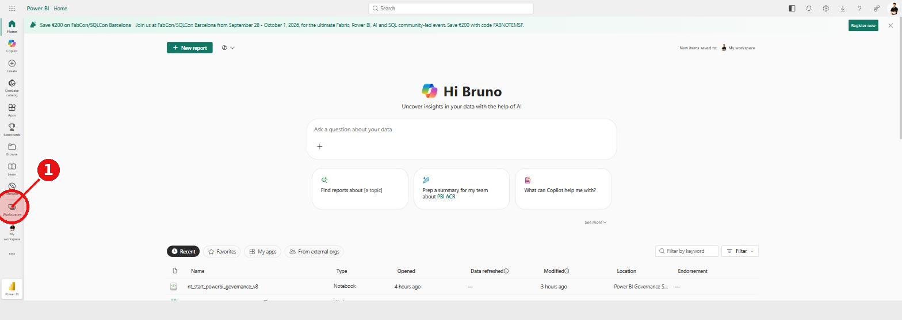

**2.** No rodapé do painel, clique em **+ New workspace**.

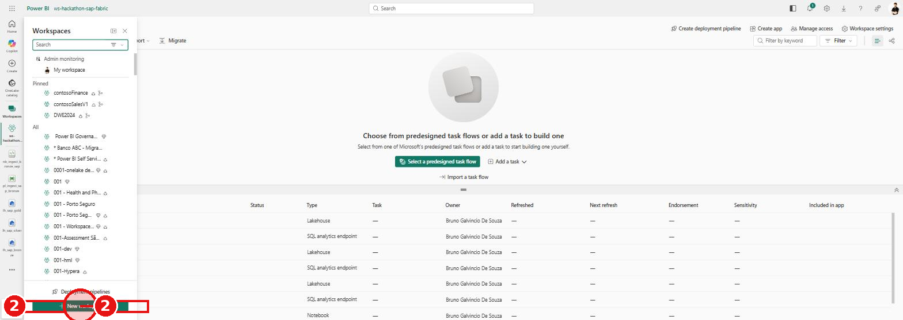

**3.** No painel *Create a workspace*, em **Name**, digite `ws-hackathon-sap-fabric`.

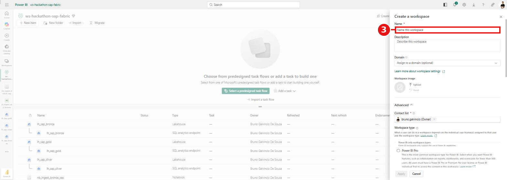

**4.** Role até **Workspace type** e, em *Fabric and Power BI workspace types*, selecione **Fabric** (garante lakehouse, pipeline e notebook na capacidade Fabric).

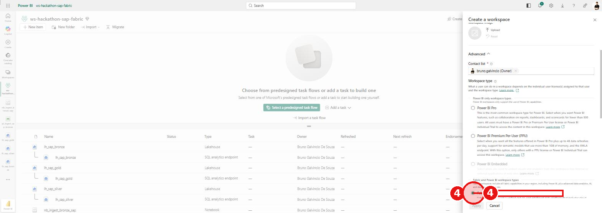

**5.** Clique em **Apply**. O workspace é criado em alguns segundos.

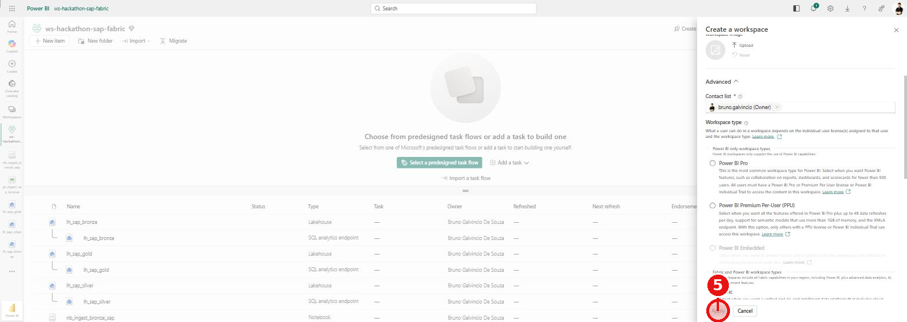

**Resultado:** workspace `ws-hackathon-sap-fabric` criado.

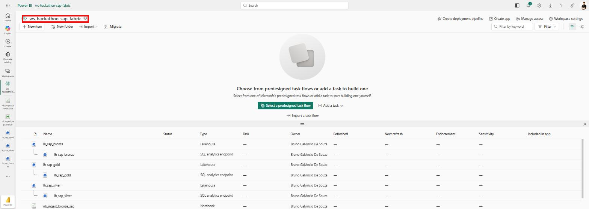

> **Atribuir papéis à equipe:** no workspace, clique em **Manage access** (canto superior direito) → **+ Add people or groups** → adicione os e-mails dos integrantes com o papel **Admin**, **Member** ou **Contributor**.

---

## Passos 2 a 4 — Criar os 3 Lakehouses (Bronze, Silver, Gold)

As três camadas Medallion são três Lakehouses:

| Lakehouse | Camada | Conteúdo |
|---|---|---|
| `lh_sap_bronze` | Bronze | Dados crus, exatamente como vêm da API SAP |
| `lh_sap_silver` | Silver | Dados limpos, deduplicados e com tipos corrigidos |
| `lh_sap_gold` | Gold | Dados modelados em esquema estrela (fato + dimensões) |

**Convenção de nomenclatura das tabelas:** prefixo `sap_` + nome da entidade de origem (ex.: `sap_business_partner`).

### Criar o `lh_sap_bronze`

**1.** No workspace, clique em **+ New item**.

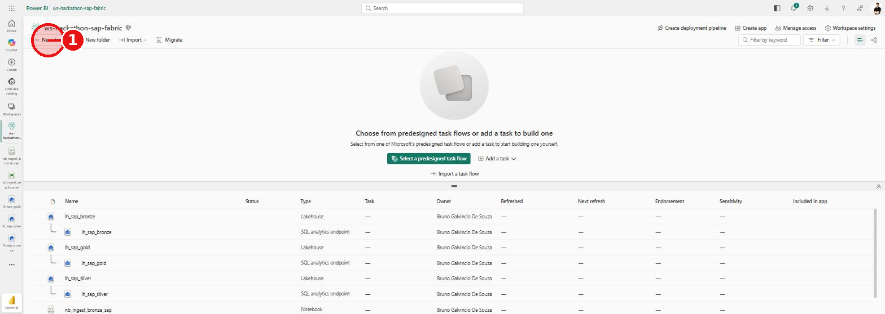

**2.** No painel *New item*, escolha o card **Lakehouse**.

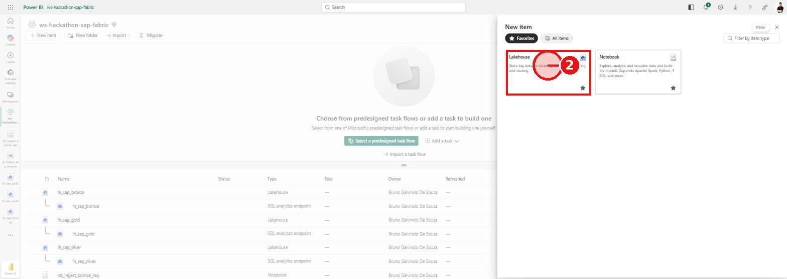

**3.** Em **Name**, digite `lh_sap_bronze`.

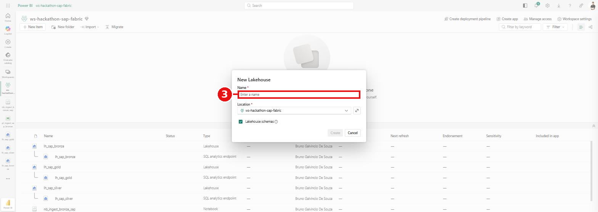

**4.** Mantenha **Lakehouse schemas** marcado (habilita o schema `dbo` e o gerenciamento de tabelas **Delta**) e clique em **Create**. Um *SQL analytics endpoint* é criado automaticamente.

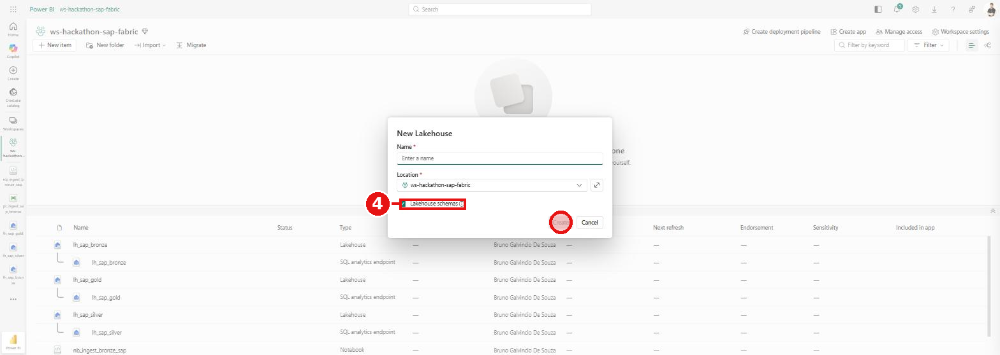

### Criar o `lh_sap_silver` e o `lh_sap_gold`

Repita exatamente os cliques **1 a 4** acima, mudando apenas o **Name** para `lh_sap_silver` e depois `lh_sap_gold`.

**Resultado:** os três lakehouses no workspace.

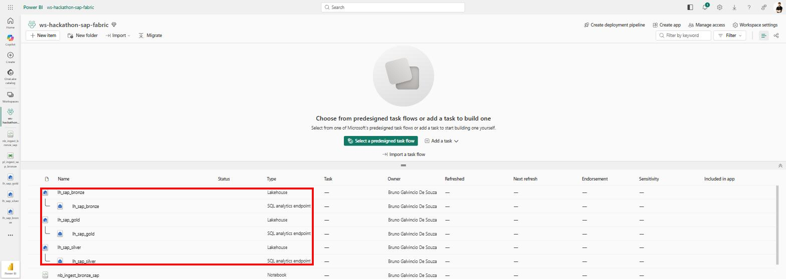

---

## Passo 5 — Pipeline de ingestão SAP → Bronze (Extract & Load)

Aqui você cria um **Pipeline do Data Factory** com uma atividade **Copy data** que lê a API OData do SAP e grava uma tabela Delta na camada Bronze.

### 5.1 — Criar o pipeline

1. No workspace, clique em **+ New item**.
2. Clique em **All items** e, no campo de filtro, digite `pipeline`. Selecione o card **Pipeline (Data pipeline)**.
3. Em **Name**, digite `pl_ingest_sap_bronze` e clique em **Create**.

### 5.2 — Abrir o assistente de cópia

No editor do pipeline, na faixa **Home**, clique na seta do botão **Copy data** e escolha **Use copy assistant**.

### 5.3 — Escolher a fonte (conector OData)

Na tela *Choose data source*, selecione o conector **OData**.

> 💡 **Alternativa mais estável:** se o serviço SAP for muito grande, o conector OData pode demorar a carregar o `$metadata`. Nesse caso use o conector **REST** apontando direto para a entidade `.../API_BUSINESS_PARTNER/A_BusinessPartner?$format=json` (não lê o metadata inteiro) — ou use o **Notebook** da seção 5.7.

### 5.4 — Configurar a conexão

Preencha os campos da tela *Connect to data source*:

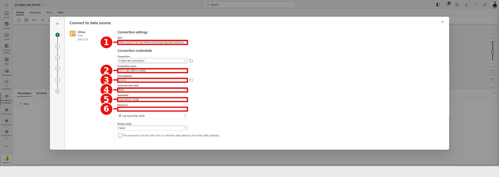

| # | Campo | Valor |
|---|---|---|
| ❶ | **URL** | `https://my415181-api.s4hana.cloud.sap/sap/opu/odata/sap/API_BUSINESS_PARTNER` |
| ❷ | **Connection name** | `conn_sap_s4hana_odata` |
| ❸ | **Data gateway** | `(none)` — a API é cloud, não precisa de gateway |
| ❹ | **Authentication kind** | `Basic` |
| ❺ | **Username** | `HACKATON_2026` |
| ❻ | **Password** | senha do hackathon (`#H4ckT0n_M1croS0ft_2026`) |

Clique em **Next**.

> ⏳ **Importante:** depois do **Next**, o Fabric baixa e interpreta o `$metadata` do serviço SAP, que é grande. **A tela pode parecer travada por até ~1 minuto — isso é normal.** Aguarde.

### 5.5 — Escolher a entidade

Na tela *Choose data*:

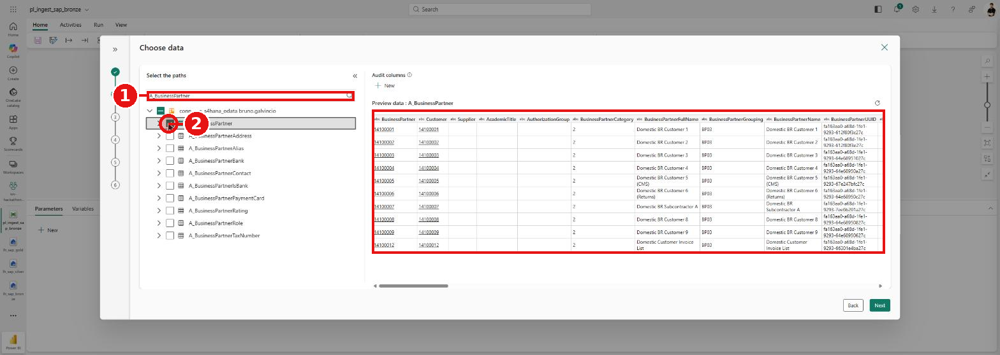

1. **❶** No campo de busca, digite `A_BusinessPartner`.
2. **❷** Marque o **checkbox** da entidade **A_BusinessPartner**.
3. O **preview** dos dados reais do SAP aparece à direita (BusinessPartner, BusinessPartnerFullName, etc.). Clique em **Next**.

### 5.6 — Escolher o destino

Na tela *Choose data destination*, em **OneLake catalog**, selecione o lakehouse **lh_sap_bronze**.

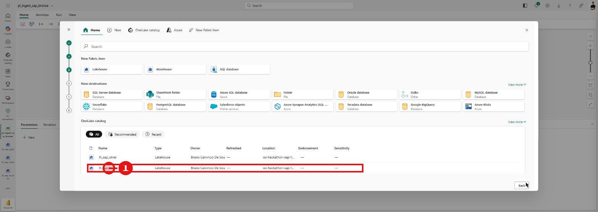

### 5.7 — Configurações da cópia

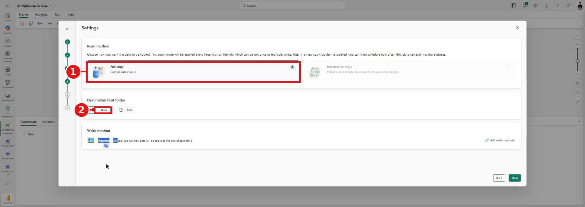

- **❶ Read method:** `Full copy` (para a 1ª carga). Para cargas incrementais, escolha *Incremental copy* — exige uma coluna de watermark (ex.: data de última modificação).
- **❷ Destination root folder:** `Tables`.
- **Write method:** `Append` (padrão).

Clique em **Next**.

### 5.8 — Mapear o destino

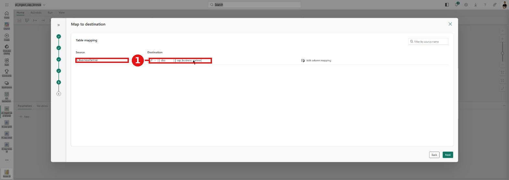

- Origem `A_BusinessPartner` → Destino `dbo.sap_business_partner`.
- **❶** Renomeie a tabela de destino para **`sap_business_partner`** (convenção `sap_`).
- *Edit column mapping* permite ajustar tipos/colunas. Clique em **Next**.

### 5.9 — Revisar e salvar

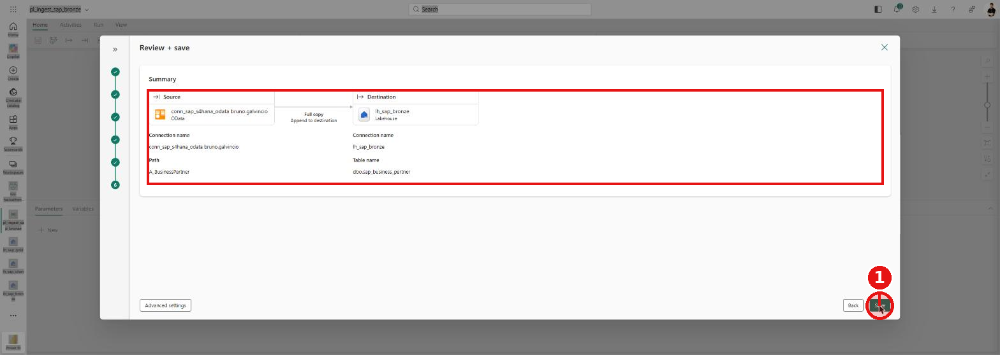

Confira o resumo (Origem OData `A_BusinessPartner` → Destino `lh_sap_bronze` / `dbo.sap_business_partner`, *Full copy*) e clique em **❶ Save**. Em seguida, na faixa **Home**, clique em **Run** para executar o pipeline e validar o número de linhas carregadas.

### 5.7 (alternativa) — Ingestão via Notebook PySpark

Se preferir (ou se o assistente do pipeline estiver instável), este notebook faz a mesma carga Bronze de forma robusta. Crie um **Notebook**, anexe o lakehouse `lh_sap_bronze` em **Add data items** e cole:

```python
import requests
import pandas as pd

sap_base = "https://my415181-api.s4hana.cloud.sap/sap/opu/odata/sap/API_BUSINESS_PARTNER"
entidade = "A_BusinessPartner"
usuario  = "HACKATON_2026"
senha    = "COLE_A_SENHA_AQUI"          # senha do hackathon

sessao = requests.Session()
sessao.auth = (usuario, senha)
sessao.headers.update({"Accept": "application/json"})

registros, url, pagina = [], f"{sap_base}/{entidade}?$format=json&$top=1000", 0
while url and pagina < 50:                # segue a paginacao do SAP (__next)
    r = sessao.get(url, timeout=60); r.raise_for_status()
    d = r.json()["d"]
    for rec in d.get("results", []):
        rec.pop("__metadata", None)
        registros.append({k: v for k, v in rec.items() if not isinstance(v, dict)})
    url = d.get("__next"); pagina += 1

print(f"Registros coletados: {len(registros)}")

pdf = pd.DataFrame(registros).astype(str)  # Bronze = dados crus (tudo string)
sdf = spark.createDataFrame(pdf)
sdf.write.format("delta").mode("overwrite").saveAsTable("lh_sap_bronze.sap_business_partner")
print("Tabela Bronze gravada:", sdf.count(), "linhas")
```

---

## Passo 6 — Transformação Silver (Notebook PySpark)

Crie um Notebook (ex.: `nb_transform_silver`), anexe `lh_sap_bronze` **e** `lh_sap_silver`, e aplique limpeza/dedup/tipos:

```python
from pyspark.sql import functions as F

bronze = spark.read.table("lh_sap_bronze.sap_business_partner")

silver = (
    bronze
    .dropDuplicates(["BusinessPartner"])                          # remove duplicidades
    .withColumn("BusinessPartner", F.col("BusinessPartner").cast("string"))
    .withColumn("NomeCompleto", F.trim(F.col("BusinessPartnerFullName")))
    .withColumn("Categoria",    F.col("BusinessPartnerCategory"))
    .withColumn("Grupo",        F.col("BusinessPartnerGrouping"))
    .withColumn("EhCliente",    F.when(F.col("Customer") != "", True).otherwise(False))
    .withColumn("EhFornecedor", F.when(F.col("Supplier") != "", True).otherwise(False))
    .na.fill("N/D")                                               # trata nulos
    .select("BusinessPartner","NomeCompleto","Categoria","Grupo","EhCliente","EhFornecedor")
)

silver.write.format("delta").mode("overwrite").saveAsTable("lh_sap_silver.sap_business_partner")
print("Silver gravado:", silver.count(), "linhas")
```

> Enriquecimento: se ingerir outras entidades do SAP (ex.: pedidos, materiais), cruze-as aqui (join por chaves de negócio) antes de gravar na Silver.

---

## Passo 7 — Modelagem Gold (esquema estrela)

Crie um Notebook (ex.: `nb_model_gold`), anexe `lh_sap_silver` e `lh_sap_gold`, e materialize dimensões e fatos:

```python
from pyspark.sql import functions as F

silver = spark.read.table("lh_sap_silver.sap_business_partner")

# Dimensão Cliente (a partir dos business partners que são clientes)
dim_cliente = (
    silver.filter(F.col("EhCliente") == True)
          .select(
              F.col("BusinessPartner").alias("ClienteId"),
              F.col("NomeCompleto").alias("Cliente"),
              F.col("Categoria"),
              F.col("Grupo")
          )
          .withColumn("SK_Cliente", F.monotonically_increasing_id())  # chave substituta
)
dim_cliente.write.format("delta").mode("overwrite").saveAsTable("lh_sap_gold.dim_cliente")

# Métricas agregadas de exemplo (ajuste conforme as entidades ingeridas)
metricas = (
    silver.groupBy("Categoria", "Grupo")
          .agg(F.countDistinct("BusinessPartner").alias("QtdParceiros"))
)
metricas.write.format("delta").mode("overwrite").saveAsTable("lh_sap_gold.agg_parceiros_por_grupo")

print("Gold: dim_cliente e agg_parceiros_por_grupo gravadas.")
```

> A **tabela fato** (ex.: `fato_vendas`) nasce de uma entidade transacional do SAP (pedidos/faturas) cruzada com as dimensões (cliente, material, tempo). Ingira essa entidade na Bronze (mesmo processo do Passo 5) e monte a fato aqui, ligando pelas chaves (`ClienteId`, etc.). As tabelas da Gold são o insumo do **Modelo Semântico** do Lab 2.

---

## Dicas e problemas comuns

- **A tela do assistente "trava" após o Next da conexão:** é o carregamento do `$metadata` do SAP (grande). Aguarde até ~1 min. Se persistir, prefira o conector **REST** (entidade única) ou o **Notebook** (Passo 5.7).
- **Editor do pipeline/notebook lento ou sem responder a cliques:** recarregue a página (F5) e reabra o item pelo workspace.
- **Erro 401 na conexão:** confira usuário/senha e que a autenticação está em **Basic**.
- **Tabela não aparece na Bronze:** confira que o *Destination root folder* é **Tables** e o nome/schema (`dbo.sap_business_partner`).

---

## Status desta execução (referência)

Nesta montagem do guia já foram **criados e validados** no tenant:

- ✅ Workspace `ws-hackathon-sap-fabric` (capacidade Fabric)
- ✅ Lakehouses `lh_sap_bronze`, `lh_sap_silver`, `lh_sap_gold`
- ✅ Conexão OData com o SAP (`conn_sap_s4hana_odata`) — **validada com preview de dados reais** do `A_BusinessPartner`
- ✅ Pipeline `pl_ingest_sap_bronze` e notebook `nb_ingest_bronze_sap` criados

*Documento gerado para a equipe do hackathon — Lab 1.*
