# Guia passo a passo — Hackathon SAP → Microsoft Fabric

## Lab 1 — Pipeline de ingestão e transformação (Bronze → Silver → Gold)

Este guia mostra, **clique a clique e com prints reais**, como construir o pipeline de ingestão de dados do SAP para o Microsoft Fabric seguindo a arquitetura **Medallion**, usando um padrão **orientado a metadados** (um único pipeline que lê a lista de entidades de um arquivo JSON e carrega **todas** de uma vez, com **Lookup + Filter + ForEach + Copy**), encadeando os notebooks de Silver e Gold e avisando no **Teams** se alguma etapa falhar.

> **Como ler os prints:** cada ação está marcada com um **círculo vermelho** e um **número** (❶, ❷, ❸…) que corresponde à ordem do clique dentro daquele passo. **Caixas vermelhas** destacam campos a preencher ou resultados a conferir.

---

## Arquitetura da solução

```
mapeamento_entidades_sap.json   (lista de entidades da API)
                                   │
SAP S/4HANA (API OData/REST)       ▼
        └──────────►  Pipeline Fabric Data Factory
                        ├─ Lookup  "Lista Origens"  (lê o JSON)
                        ├─ Filter  "HabilitaETL"    (mantém só etl = "Sim")
                        └─ ForEach "Carga Bronze"   (repete para cada entidade)
                              └─ Copy data  (REST → tabela Delta no Bronze)
                                        │
                                        ▼
                            Lakehouse BRONZE  (dados crus)
                                        │  Notebook PySpark (limpeza/dedup/tipos)
                                        ▼
                            Lakehouse SILVER  (limpo, deduplicado, tipado)
                                        │  Notebook PySpark (modelagem estrela)
                                        ▼
                            Lakehouse GOLD    (dimensões + fatos p/ análise)

   Qualquer etapa que falhe  ──►  atividade Microsoft Teams (alerta no canal)
```

O **Lab 2** usa a camada Gold para o Modelo Semântico + relatórios via Copilot. O **Lab 3** cria o Agente de Dados no Teams.

---

## Pré-requisitos

- Acesso ao **Microsoft Fabric** (`app.fabric.microsoft.com`) numa **capacidade Fabric** (Trial, F2+ — para os Labs 2/3 recomenda‑se **F16+**).
- Permissão de **Admin/Member/Contributor** no workspace para criar itens e conexões.
- Configuração de tenant habilitada: *Users can create Fabric items* e criação de Pipelines, Notebooks, Lakehouses, Conexões e Dataflows.
- Acesso de rede à **API OData do SAP** (a API do hackathon está publicada na internet, **sem restrição de IP** — não precisa de gateway).

### Conexão com o SAP (dados de teste do hackathon)

| Item                       | Valor                                                       |
| -------------------------- | ----------------------------------------------------------- |
| Base URL do serviço OData | `https://my415189-api.s4hana.cloud.sap/sap/opu/odata/sap` |
| Autenticação             | **Basic**                                             |
| Usuário                   | `HACKATON_2026`                                           |
| Senha                      | `#H4ckT0n_M1croS0ft_2026`                                 |
| Operações                | **Somente GET** (leitura)                             |

> ⚠️ **Atenção ao host da URL.** O arquivo `mapeamento_entidades_sap.json` (que o pipeline lê no loop) usa **`my415189`** em todas as 8 entidades. Instruções anteriores citavam `my415181`. **Use `my415189`** para manter a conexão consistente com o JSON. Se o ambiente do seu tenant usar outro host, ajuste apenas o campo *Base URL* da conexão.
>
> 🔒 **Senha:** digite a senha do SAP você mesmo no formulário da conexão. Por segurança, o assistente automatizado não preenche campos de senha.

### Entidades carregadas (conteúdo do `mapeamento_entidades_sap.json`)

| # | Entidade           | relativeUrl (serviço/entidade OData)                     | Tabela destino (Bronze)     | `etl`        |
| - | ------------------ | --------------------------------------------------------- | --------------------------- | -------------- |
| 1 | ACDOCA (Despesas)  | `API_JOURNALENTRYITEMBASIC_SRV/A_JournalEntryItemBasic` | `dbo.lancamento_despesas` | Sim            |
| 2 | Conta Contabil     | `API_GLACCOUNTINCHARTOFACCOUNTS_SRV/A_GLAccountText`    | `dbo.conta_contabil`      | Sim            |
| 3 | Segmento           | `API_SEGMENT_SRV/A_Segment`                             | `dbo.segmento`            | Sim            |
| 4 | Centro de Lucro    | `API_PROFITCENTER_SRV/A_ProfitCenterText`               | `dbo.centro_lucro`        | Sim            |
| 5 | Centro de Custos   | `API_COSTCENTER_SRV/A_CostCenterText`                   | `dbo.centro_custo`        | Sim            |
| 6 | Cliente/Fornecedor | `API_BUSINESS_PARTNER/A_BusinessPartner`                | `dbo.cliente_fornecedor`  | Sim            |
| 7 | Empresa            | `API_COMPANYCODE_SRV/A_CompanyCode`                     | `dbo.empresa`             | Sim            |
| 8 | Planta             | `API_PLANT_SRV/A_Plant`                                 | `dbo.Planta`              | **Não** |

Cada item do JSON traz o seu próprio `base_url` (todos apontam para `https://my415189-api.s4hana.cloud.sap/sap/opu/odata/sap`) e `schema_destino = dbo`.

> 🔑 **O campo `etl` é o interruptor de cada entidade.** É ele que o **Filter "HabilitaETL"** (Passo 8.4) avalia: só as entidades com `etl = "Sim"` seguem para a carga. Hoje a **Planta está com `"Não"`**, então uma execução completa processa **7 das 8** entidades. Para ligar/desligar uma origem, edite o JSON — o pipeline não muda.
>
> ⚠️ Três entidades usam as *views* de texto do SAP (`A_GLAccountText`, `A_ProfitCenterText`, `A_CostCenterText`), e não as entidades‑mestre (`A_GLAccountInChartOfAccounts`, `A_ProfitCenter`, `A_CostCenter`). Isso muda as colunas que chegam ao Bronze — em especial trazem `Language`/`*Name`, e podem repetir a chave por idioma. A deduplicação na Silver (Passo 10) leva isso em conta.

---

## Passo 1 — Criar o workspace numa capacidade Fabric

**❶** Em `app.fabric.microsoft.com`, na barra lateral esquerda, clique em **Workspaces**.

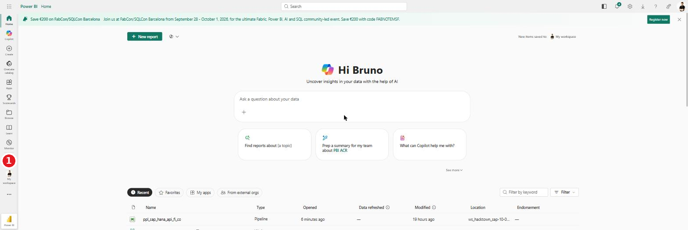

**❷** No rodapé do painel, clique em **+ New workspace**.

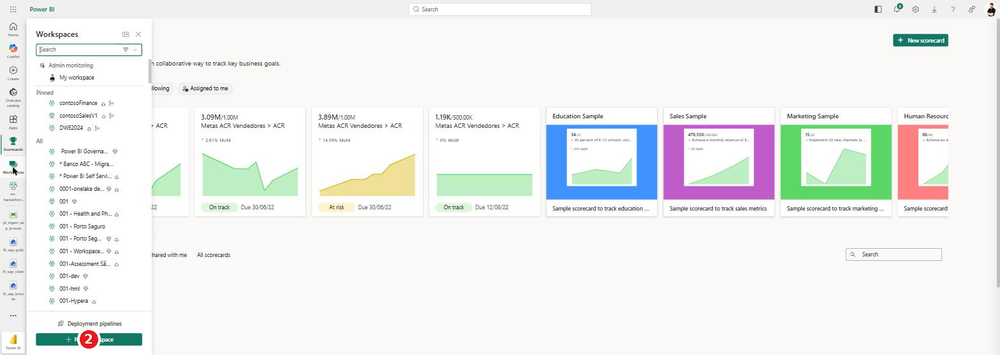

**❸** No painel *Create a workspace*, em **Name**, digite `ws-hackathon-sap-fabric`. Aguarde a mensagem *"This name is available"*.

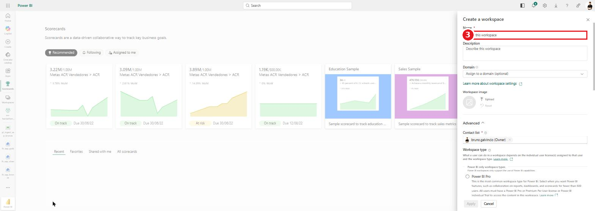

**❹** Role até **Workspace type**, expanda **Fabric and Power BI workspace types** e selecione **Fabric** (garante Lakehouse, Pipeline e Notebook na capacidade Fabric). *Se você tem capacidade Fabric, essa opção já vem marcada.*

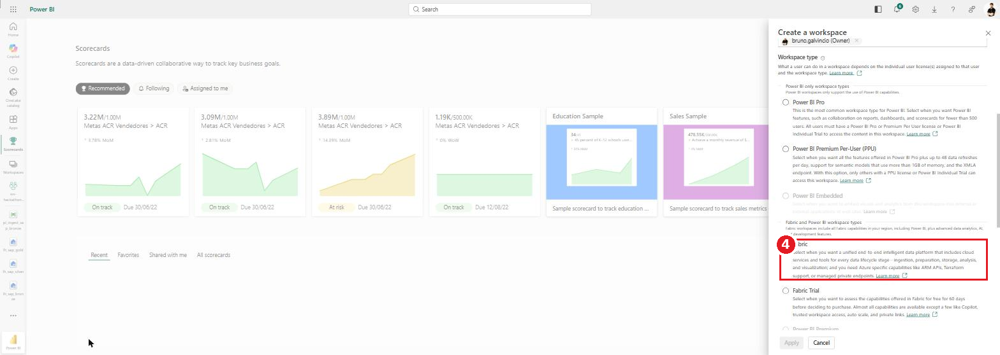

**❺** Clique em **Apply**. O workspace é criado em alguns segundos.

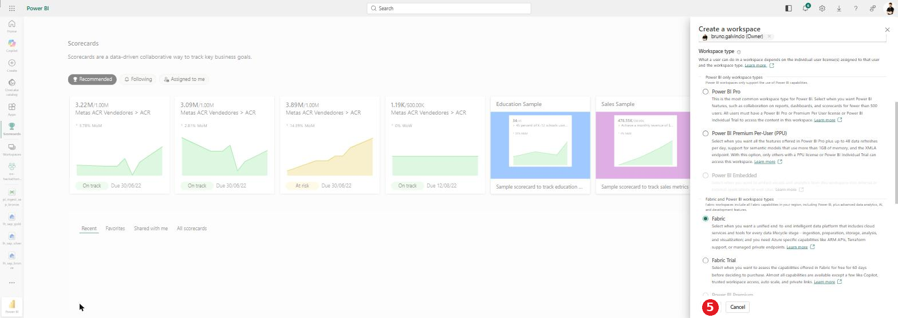

**Resultado:** workspace `ws-hackathon-sap-fabric` criado. Para atribuir papéis à equipe, use **❻ Manage access** (canto superior direito) → **+ Add people or groups** → adicione os e‑mails com o papel **Admin**, **Member** ou **Contributor**.

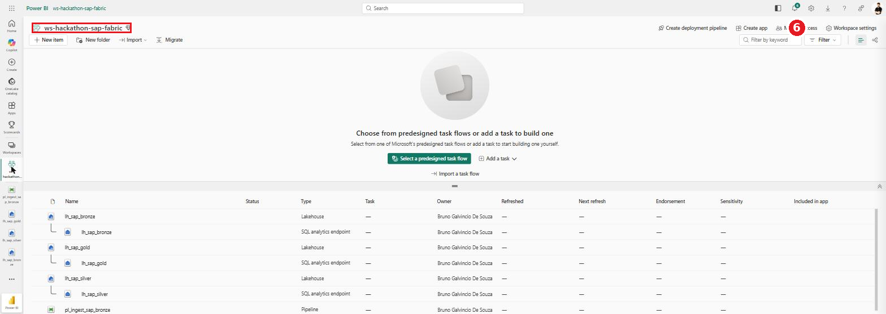

---

## Passos 2 a 4 — Criar os 3 Lakehouses (Bronze, Silver, Gold)

As três camadas Medallion são três Lakehouses:

| Lakehouse         | Camada | Conteúdo                                              |
| ----------------- | ------ | ------------------------------------------------------ |
| `lh_sap_bronze` | Bronze | Dados crus, exatamente como vêm da API SAP            |
| `lh_sap_silver` | Silver | Dados limpos, deduplicados e com tipos corrigidos      |
| `lh_sap_gold`   | Gold   | Dados modelados em esquema estrela (fato + dimensões) |

> **Convenção de nomenclatura das tabelas Bronze:** use os nomes de `tabela_destino` do JSON (ex.: `lancamento_despesas`, `conta_contabil`…), todos no schema `dbo`.

### Criar o `lh_sap_bronze`

**❶** No workspace, clique em **+ New item**.

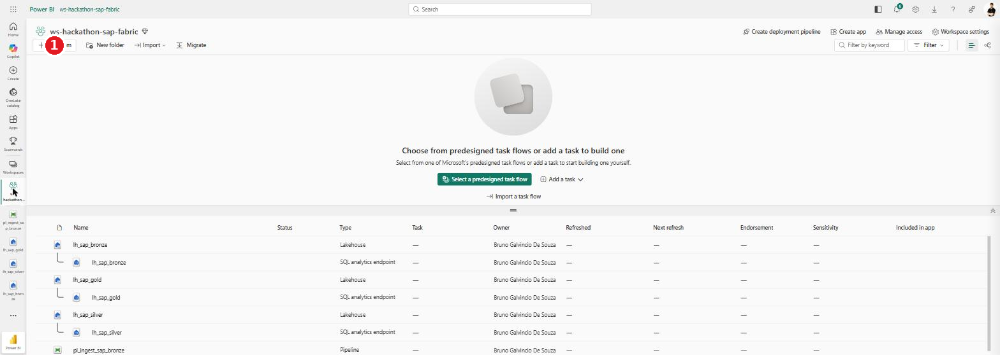

**❷** No painel *New item*, escolha o card **Lakehouse**.

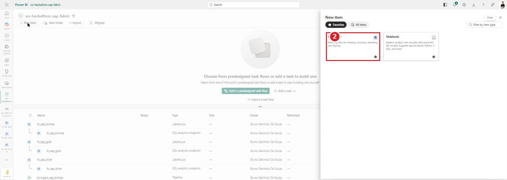

**❸** Em **Name**, digite `lh_sap_bronze`. **❹** Mantenha **Lakehouse schemas** marcado (habilita o schema `dbo` e o gerenciamento de tabelas **Delta**). **❺** Clique em **Create**.

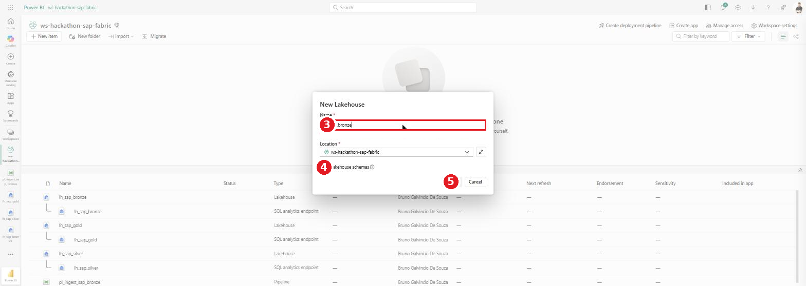

**Resultado:** o `lh_sap_bronze` abre com o schema `dbo` em **Tables** e a pasta **Files**. Um *SQL analytics endpoint* é criado automaticamente.

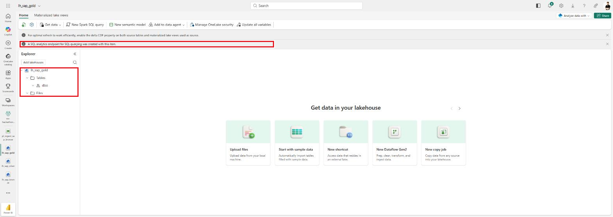

### Criar o `lh_sap_silver` e o `lh_sap_gold`

Repita exatamente os cliques **❶ a ❺** acima, mudando apenas o **Name** para `lh_sap_silver` e depois `lh_sap_gold`.

**Resultado:** os três lakehouses no workspace.

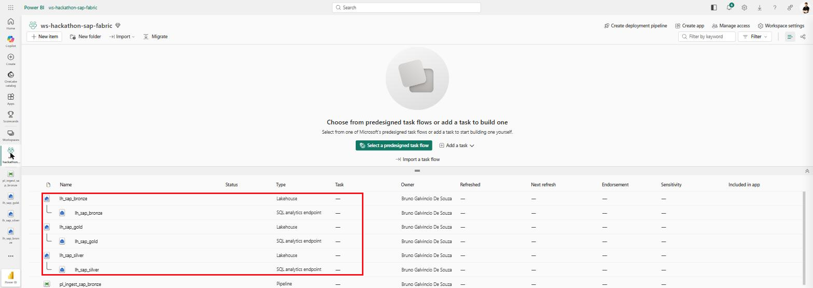

---

## Passo 5 — Criar a conexão REST para a API SAP (antes do pipeline)

A conexão guarda a URL base e as credenciais do SAP e é **reutilizável** por qualquer pipeline. Você pode criá‑la em **Manage connections and gateways** (recomendado) ou **inline** ao configurar a atividade Copy (Passo 8.5). As duas geram a mesma conexão.

**❶** No canto superior direito, clique no ícone de engrenagem **Settings** e depois em **❷ Manage connections and gateways**.

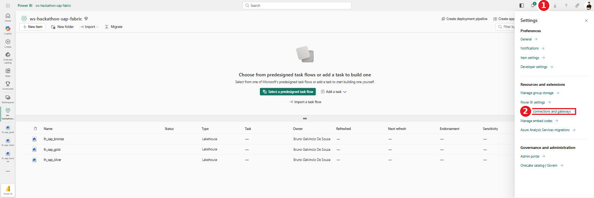

**❸** Na aba **Connections**, clique em **+ New**.

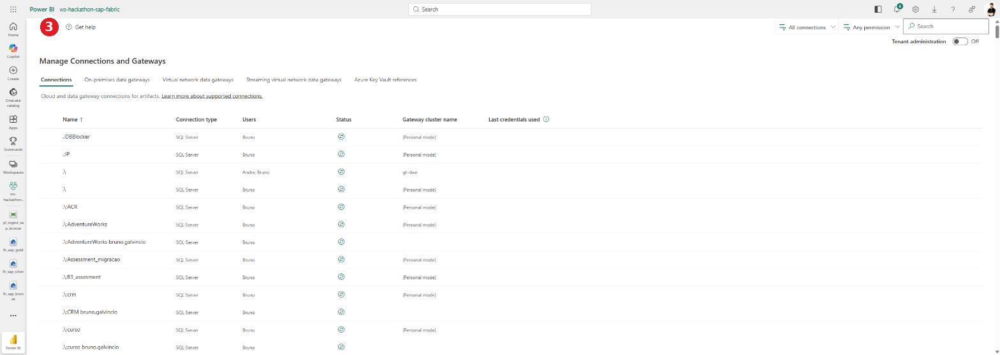

**❹ Escolher o tipo de conexão.** Abre o painel lateral **New connection**, à direita da tela. Siga os números vermelhos do print:

1. Na fileira de ícones no topo, clique em **Cloud** (o padrão vem **On-premises**; só use *On-premises / Virtual network* se o SAP estiver atrás de firewall corporativo).
2. Clique no campo **Connection type** e digite `REST`.
3. Na lista que aparece, clique em **REST**.
   - *Alternativa:* o tipo **Web** também funciona, mas atende **uma URL única** — para o loop do ForEach deste lab, use **REST**.

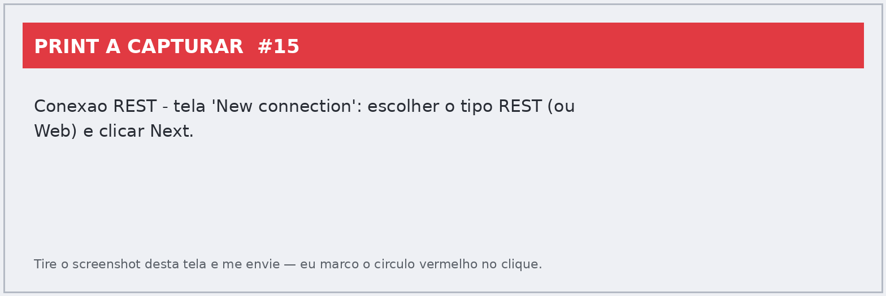

> ⚠️ Ao trocar para **Cloud**, o Fabric mostra um aviso de que conexões cloud não são suportadas por Dataflows Gen1/Datamarts. **Ignore** — o lab usa Data pipeline, não dataflow.

**❺ Preencher o formulário da conexão.** Ao selecionar **REST** o painel expande os campos. Os números da tabela são os mesmos marcados no print:

| #  | Campo                                               | Valor                                                                                                         |
| -- | --------------------------------------------------- | ------------------------------------------------------------------------------------------------------------- |
| 1  | **Connection name**                           | `conn_sap_s4hana_rest`                                                                                      |
| 2  | **Connection type**                           | `REST` (já selecionado no passo anterior)                                                                  |
| 3  | **URL Base**                                  | `https://my415189-api.s4hana.cloud.sap/sap/opu/odata/sap`                                                   |
| — | **URI da Audiência do Token**                | *deixe em branco*                                                                                           |
| 4  | **Authentication method**                     | `Basic`                                                                                                     |
| 5  | **Username**                                  | `HACKATON_2026`                                                                                             |
| 6  | **Password**                                  | `#H4ckT0n_M1croS0ft_2026` *(digite você mesmo — não cole de e‑mail/chat, evita caractere invisível)* |
| — | **Privacy level** (bloco *General*, abaixo) | `Organizational` (já vem selecionado)                                                                      |
| 7  | Botão**Create**                              | conclui a criação                                                                                           |

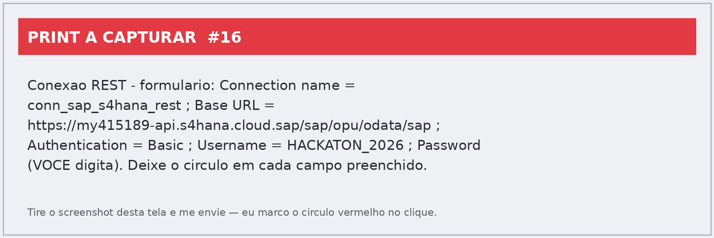

> 🔒 No print acima o campo **Password** (6) aparece vazio de propósito. Digite a senha você mesmo antes de clicar em **Create** (7) — enquanto ela estiver em branco, o botão fica desabilitado, como se vê na imagem.

Atenção a três detalhes que costumam quebrar a conexão:

- A **URL Base termina em `/sap`**, **sem barra no final** e **sem** o nome do serviço OData. O serviço e a entidade vêm depois, na atividade Copy, via `@item().relativeUrl`.
- O host tem o sufixo **`-api`** (`my415189-api...`) — é o endpoint de API, diferente do host de UI do S/4HANA.
- Deixe as duas caixas de *Allow…* **desmarcadas** (Code-First Artifacts e uso via gateway on-premises/VNet). Nenhuma das duas é necessária para este lab.

**❻ Criar.** Clique em **Create**. O Fabric valida as credenciais e fecha o painel. A conexão **`conn_sap_s4hana_rest`** passa a aparecer na lista da aba **Connections**, com **Connection type** = `REST`, **Gateway cluster name** em branco (é cloud) e **Users** = seu usuário.

Pronto — ela já fica selecionável na lista *Connection* da atividade Copy no Passo 8.5.

> ℹ️ **Se falhar:** erro **401** → usuário/senha errados ou método diferente de **Basic** (reabra a conexão em **⋯ → Settings → Edit credentials**). Erro de **host/DNS** → confira o `my415189` e o sufixo `-api` na *URL Base*. Erro **403/404** na validação → acontece em alguns tenants porque o Fabric testa a raiz `/sap`; a conexão continua válida e é confirmada na primeira execução do pipeline.

---

## Passo 6 — Subir o `mapeamento_entidades_sap.json` no Bronze (pasta Config)

Este arquivo é a **fonte de metadados** do loop: o Lookup lê a lista de entidades e o ForEach carrega cada uma.

**❶** Abra o **`lh_sap_bronze`**. No **Explorer**, passe o mouse sobre **Files** — aparece um botão **⋯** no fim da linha (1). Clique nele e escolha **New subfolder** (2).

> 💡 Botão direito **não** abre esse menu no Explorer do lakehouse; é preciso usar o **⋯** que só aparece com o mouse sobre a linha.

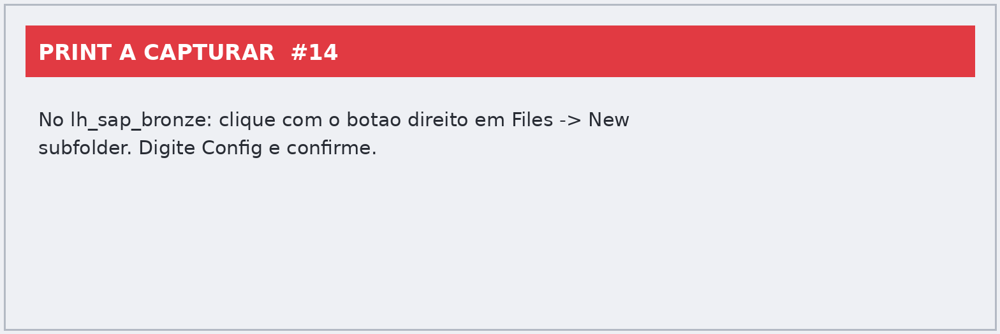

**❷** No diálogo **New subfolder**, digite `Config` em **Folder name** (1) e clique em **Create** (2).

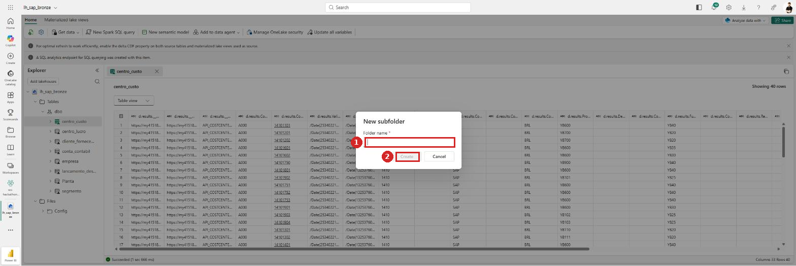

**❸** Agora na pasta **Config**: passe o mouse, clique no **⋯** (1), vá em **Upload** (2) e depois em **Upload files** (3).

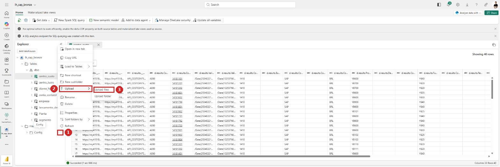

**❹** Abre o painel **Upload files** à direita, já apontando para `.../lh_sap_bronze/Files/Config/`. Clique no ícone de pasta do campo de arquivo (1), selecione o **`mapeamento_entidades_sap.json`** no seu computador e clique em **Upload** (3). O **Overwrite if files already exist** (2) só é necessário se você estiver substituindo um arquivo já enviado.

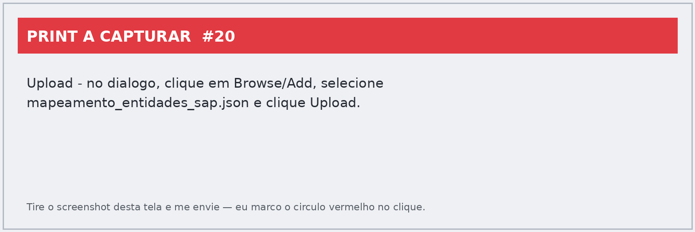

**Resultado:** o arquivo aparece em **Files › Config › mapeamento_entidades_sap.json**.

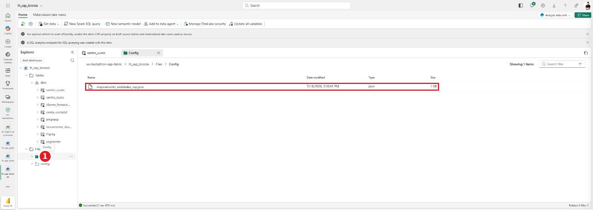

---

## Passo 7 — Importar os notebooks e apontar para os lakehouses corretos

Faça isto **antes** de montar o pipeline: as atividades Notebook do pipeline (Passo 8.6) precisam escolher os notebooks numa lista, e eles só aparecem lá depois de existirem no workspace. Importar depois obriga a voltar e reconfigurar o pipeline.

### 7.1 — Importar os dois notebooks

Os notebooks das camadas Silver e Gold vêm prontos como arquivos `.ipynb`. No workspace: **1** clique em **Import** → **2 Notebook** → **3 From this computer**.

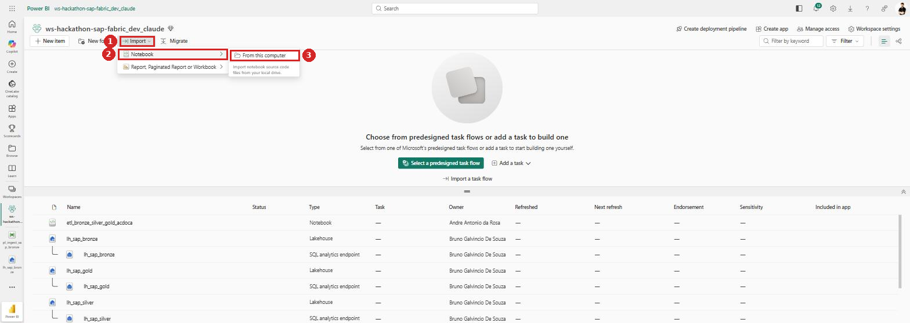

No seletor de arquivos, marque **os dois de uma vez** e confirme:

- `bronze_to_silver_dq.ipynb` → vira o notebook **Bronze → Silver** (com checagens de Data Quality)
- `silver_to_gold_star_schema.ipynb` → vira o notebook **Silver → Gold** (esquema estrela com surrogate keys)

> ℹ️ O Fabric usa o **nome do arquivo** como nome do item. Se já existirem notebooks antigos com a mesma função (`nb_transform_silver`, `nb_model_gold`), remova‑os depois de validar os novos, para não deixar duas versões do mesmo passo no workspace.

### 7.2 — Ajustar as variáveis de lakehouse

Cada notebook tem uma **célula de parâmetros** no topo, logo depois dos imports. É o único lugar a mexer para apontá‑lo aos seus lakehouses — o resto do código lê essas variáveis.

No **`bronze_to_silver_dq`**:

```python
LAKEHOUSE_BRONZE = "lh_sap_bronze"   # lakehouse de origem (dados brutos)
LAKEHOUSE_SILVER = "lh_sap_silver"   # lakehouse de destino (dados tratados)
SCHEMA_BRONZE = "dbo"
SCHEMA_SILVER = "dbo"
PREFIXO_COLUNA_BRONZE = "d.results."
```

No **`silver_to_gold_star_schema`**:

```python
LAKEHOUSE_SILVER = "lh_sap_silver"   # lakehouse de origem (dados tratados)
LAKEHOUSE_GOLD = "lh_sap_gold"       # lakehouse de destino (modelo dimensional)
SCHEMA_SILVER = "dbo"
SCHEMA_GOLD = "dbo"
SK_DESCONHECIDO = -1
VALOR_DESCONHECIDO_TEXTO = "N/A"
```

Repare no encaixe entre os dois: o **`LAKEHOUSE_SILVER` do primeiro é o `LAKEHOUSE_SILVER` do segundo**. É esse nome em comum que faz a Gold ler exatamente o que a Silver acabou de gravar.

| Se você…                                                                                              | Então…                                                                                    |
| ------------------------------------------------------------------------------------------------------- | ------------------------------------------------------------------------------------------- |
| criou os lakehouses com os nomes do Passo 2 a 4 (`lh_sap_bronze`, `lh_sap_silver`, `lh_sap_gold`) | **não precisa mudar nada** — os valores já batem                                   |
| usou outros nomes                                                                                       | troque as strings nas duas células, mantendo o nome da Silver idêntico nos dois notebooks |
| criou os lakehouses**sem** o schema `dbo`                                                       | ajuste `SCHEMA_*`; o padrão do Fabric com schemas habilitados é `dbo`                 |

> ⚠️ **O notebook precisa estar no mesmo workspace dos lakehouses.** O nome de três partes (`lh_sap_bronze.dbo.centro_custo`) resolve **dentro do workspace do notebook** — não atravessa workspaces. Se você importar os notebooks num workspace e os lakehouses estiverem em outro, a leitura falha com tabela não encontrada, mesmo com os nomes escritos corretamente.
>
> ⚠️ Não mexa no `PREFIXO_COLUNA_BRONZE`. Ele reflete como a ingestão gravou os nomes das colunas no Bronze (`d.results.CompanyCode`) — o motivo está no Passo 10.

### 7.3 — Anexar os lakehouses ao notebook (opcional)

Anexar lakehouses faz as tabelas aparecerem no **Explorer**, o que ajuda a conferir nomes de coluna enquanto você desenvolve. Abra cada notebook e use **Add data items** / **Add lakehouses**:

| Notebook                       | Lakehouses a anexar                             | Sugestão de default |
| ------------------------------ | ----------------------------------------------- | -------------------- |
| `bronze_to_silver_dq`        | `lh_sap_bronze` **e** `lh_sap_silver` | `lh_sap_bronze`    |
| `silver_to_gold_star_schema` | `lh_sap_silver` **e** `lh_sap_gold`   | `lh_sap_silver`    |

> 🔎 **Na prática isso é opcional.** Os dois notebooks endereçam todas as tabelas pelo **nome completo de três partes** (`lh_sap_bronze.dbo.centro_custo`), que não depende de lakehouse anexado — e na implementação de referência (`hack_sap`) o Explorer mostra literalmente *"No data sources added"*. Anexar serve para você **navegar nas tabelas pelo Explorer** enquanto desenvolve. Passa a ser obrigatório se você trocar o código por caminhos relativos, do tipo `spark.table("centro_custo")`.

---

## Passo 8 — Montar o pipeline end‑to‑end (Lookup → Filter → ForEach/Copy → Notebooks → alerta Teams)

O pipeline orquestra as três camadas numa execução só e avisa no Teams se qualquer etapa falhar:

```
Lookup            Filter          ForEach                Notebook            Notebook
Lista Origens ──► HabilitaETL ──► Carga Bronze     ──►   Load Bronze    ──►  Load Silver
(lê o JSON)       (etl = Sim)     └ Copy Entidades       to Silver           to Gold
      │                 │               │                     │                   │
      └────────── on fail ──────────────┴─────────────────────┴───────────────────┘
                                        ▼
                              Microsoft Teams (alerta)
```

Setas **verdes** = *On success* (fluxo normal). Setas **vermelhas** = *On failure* — todas convergem para a mesma atividade do Teams, então **qualquer** etapa que quebrar gera alerta.

> 📍 **Implementação de referência.** Este desenho está montado e funcionando no pipeline **`ppl_ingest_sap`**, workspace **`hack_sap`** — é de lá que vêm os prints deste passo. Os nomes reais das atividades são `Lista Origens`, `HabilitaETL`, `Carga Bronze` (com `Copy Entidades` dentro), `Load Bronze to Silver`, `Load Silver to Gold` e `MicrosoftTeams1`.

### 8.1 — Criar o pipeline

No workspace, clique em **+ New item** → aba **All items** → card **Data pipeline**. Na caixa *New Pipeline*: **❶** apague o nome sugerido e digite o nome do pipeline; **❷** clique em **Create**.

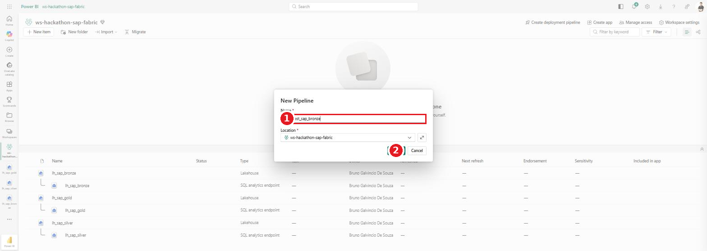

> ✅ O print acima é da criação do `pl_ingest_sap_bronze` (a versão só‑ingestão). O fluxo de criação é idêntico para o pipeline end‑to‑end — muda só o nome que você digita.

### 8.2 — Onde ficam as atividades

No editor, a faixa **Home** já traz **❷ Lookup** e **❸ Copy data**; a aba **❶ Activities** abre o catálogo completo — é de lá que saem o **Filter**, o **ForEach**, o **Notebook** e o **Microsoft Teams**.

(ainda nao arraste nada para o pipeline)

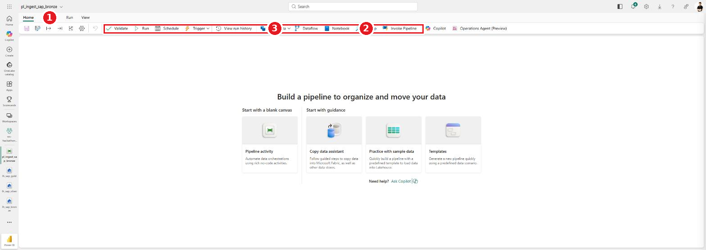

Para **ligar duas atividades**, arraste a partir do conector no lado direito da atividade de origem até a atividade de destino. O conector **✓ verde** cria a dependência *On success*; o **✗ vermelho** cria *On failure*.

Assim fica o canvas montado:

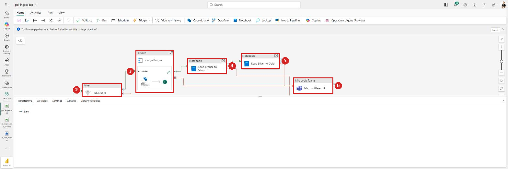

| # | Atividade no canvas                                        | Tipo            |
| - | ---------------------------------------------------------- | --------------- |
| 1 | `Lista Origens` *(fora do enquadramento, à esquerda)* | Lookup          |
| 2 | `HabilitaETL`                                            | Filter          |
| 3 | `Carga Bronze` (contém `Copy Entidades`)              | ForEach         |
| 4 | `Load Bronze to Silver`                                  | Notebook        |
| 5 | `Load Silver to Gold`                                    | Notebook        |
| 6 | `MicrosoftTeams1 (Opcional)`                             | Microsoft Teams |

Repare nos conectores: as setas **verdes** encadeiam 1→2→3→4→5, e as **vermelhas** saem de todas as etapas e convergem na atividade 6.

### 8.3 — Lookup "Lista Origens" (lê o JSON)

Clique em **Lookup** na faixa; na aba **General**, renomeie para **`Lista Origens`**. Depois selecione a atividade e abra a aba **Settings**:

| Campo                    | Valor                                                                            |
| ------------------------ | -------------------------------------------------------------------------------- |
| **Connection**     | `lh_sap_bronze` (Lakehouse)                                                    |
| **Root folder**    | `Files`                                                                        |
| **File path type** | `File path`                                                                    |
| **File path**      | `Config`  /  `mapeamento_entidades_sap.json`                                 |
| **File format**    | `JSON`                                                                         |
| **First row only** | ☐**DESMARCADO** *(essencial — sem isso volta só a primeira entidade)* |

> Saída do Lookup: `@activity('Lista Origens').output.value` — o array com as 8 entidades do JSON.

### 8.4 — Filter "HabilitaETL" (liga/desliga entidades)

Adicione um **Filter** (aba *Activities*), ligue **Lista Origens** →(*On success*)→ **Filter** e renomeie para **`HabilitaETL`**. Na aba **Settings**:

| Campo               | Valor                                       |
| ------------------- | ------------------------------------------- |
| **Items**     | `@activity('Lista Origens').output.value` |
| **Condition** | `@equals(item().etl, 'Sim')`              |

O Filter existe para que ligar ou desligar uma origem seja uma edição de **uma palavra no JSON**, sem tocar no pipeline. Com o JSON atual, ele devolve **7 itens** (a `Planta` está com `etl = "Não"`).

> ⚠️ A comparação é com a **string** `'Sim'` — o campo no JSON é texto, não booleano. `@equals(item().etl, true)` nunca casaria. E `equals` é *case‑sensitive*: `"sim"` minúsculo não passa. Se quiser tolerância, use `@equals(toLower(item().etl), 'sim')`.

### 8.5 — ForEach "Carga Bronze" + Copy (REST → Bronze)

Adicione um **ForEach**, ligue **HabilitaETL** →(*On success*)→ **ForEach** e renomeie para **`Carga Bronze`**. Na aba **Settings**:

| Campo                | Valor                                                |
| -------------------- | ---------------------------------------------------- |
| **Sequential** | ☑ marcado*(evita estourar os limites da API SAP)* |
| **Items**      | `@activity('HabilitaETL').output.Value`            |

> 🔍 Atenção à diferença: o Lookup expõe `output.value` (minúsculo) e o Filter expõe **`output.Value`** (maiúsculo). Trocar um pelo outro faz o ForEach não iterar.

Dentro do ForEach, adicione uma atividade **Copy data** e renomeie para `Copy Entidades`. Aba **Source**:

| Campo                    | Valor                                                 |
| ------------------------ | ----------------------------------------------------- |
| **Connection**     | a conexão REST do Passo 5 (`conn_sap_s4hana_rest`) |
| **Relative URL**   | `@item().relativeUrl`                               |
| **Request method** | `GET` (padrão)                                     |

Aba **Destination**:

| Campo                           | Valor                                                     |
| ------------------------------- | --------------------------------------------------------- |
| **Connection**            | `lh_sap_bronze` (Lakehouse)                             |
| **Root folder**           | `Tables`                                                |
| **Table (schema / nome)** | `@item().schema_destino`  /  `@item().tabela_destino` |
| **Table action**          | `Overwrite`                                             |

### 8.6 — Os dois notebooks, em sequência

Arraste duas atividades **Notebook** (aba *Activities*) para o canvas e ligue‑as em série, para que a Gold só rode depois da Silver ficar pronta:

**ForEach `Carga Bronze`** →(*On success*)→ **Notebook `Load Bronze to Silver`** →(*On success*)→ **Notebook `Load Silver to Gold`**

Em cada uma, aba **Settings**:

| Atividade                 | Workspace         | Notebook                       |
| ------------------------- | ----------------- | ------------------------------ |
| `Load Bronze to Silver` | o workspace atual | `bronze_to_silver_dq`        |
| `Load Silver to Gold`   | o workspace atual | `silver_to_gold_star_schema` |

> ⏱️ Cada atividade Notebook sobe uma sessão Spark. A primeira execução do dia paga o *cold start* (1–3 min); nas seguintes a sessão é reaproveitada. Encadear em série é intencional: a Gold lê o que a Silver acabou de gravar.

### 8.7 — (Opcional) Alerta no Teams quando algo falha

Adicione a atividade **Microsoft Teams** (aba *Activities*, grupo *Notify*) e renomeie para o que preferir. Ela precisa de uma **conexão própria**: clique em **Sign in**, autorize com a sua conta e escolha o **time** e o **canal** de destino.

Agora ligue **cada** etapa a ela pelo conector **vermelho (✗ On failure)**:

- `Lista Origens` ✗→ Teams
- `HabilitaETL` ✗→ Teams
- `Carga Bronze` ✗→ Teams
- `Load Bronze to Silver` ✗→ Teams
- `Load Silver to Gold` ✗→ Teams

Sugestão de mensagem, que identifica o pipeline, a execução e o erro:

```
❌ Falha no ETL SAP → Fabric

Pipeline: @{pipeline().Pipeline}
Run ID: @{pipeline().RunId}
Disparado em: @{pipeline().TriggerTime}
Workspace: @{pipeline().DataFactory}
```

> 🔔 **Por que uma atividade só, e não uma por etapa:** como todas as setas de falha apontam para a mesma atividade, basta uma para cobrir o pipeline inteiro. O custo é a mensagem não dizer *qual* etapa quebrou. Se precisar dessa precisão, duplique a atividade do Teams por etapa e escreva o nome da etapa fixo em cada mensagem — `@{activity('...')}` não funciona para "a atividade que falhou", porque essa referência não existe no contexto do Teams.
>
> ⚠️ Uma atividade de notificação que **falha** também derruba o run. Se o alerta for opcional, marque nela um número baixo de *retries* e considere deixar o pipeline tolerante a essa falha específica.

> **Colunas com prefixo `d.results.`:** a resposta OData V2 vem embrulhada em `d.results`, e o *flatten* automático do Copy gera colunas como `d.results.CostCenter`. Isso é esperado — a limpeza dos nomes é feita na camada Silver (Passo 10). Se preferir colunas já limpas no Bronze, configure na aba **Mapping** a *collection reference* `$['d']['results']` (precisa importar o schema para cada entidade — não recomendado no padrão dinâmico).

> **Mapping:** deixe **automático** (sem mapeamento explícito). Como cada entidade tem colunas diferentes, o mapeamento automático adapta o schema a cada iteração. Se alguma coluna vier como struct/aninhada, use *Import schema* e ajuste.

### Expressões‑chave — o JSON como parâmetro do pipeline

Este é o coração do padrão **reutilizável**: um único pipeline serve para qualquer quantidade de entidades. Basta editar o `mapeamento_entidades_sap.json` — nenhuma alteração no pipeline.

| Campo do JSON        | Onde entra no pipeline               | Expressão exata                                                            |
| -------------------- | ------------------------------------ | --------------------------------------------------------------------------- |
| *(todo o array)*   | Filter →**Items**             | `@activity('Lista Origens').output.value`                                 |
| `etl`              | Filter →**Condition**         | `@equals(item().etl, 'Sim')`                                              |
| *(array filtrado)* | ForEach →**Items**            | `@activity('HabilitaETL').output.Value`                                   |
| `relativeUrl`      | Copy**Source** → Relative URL | `@item().relativeUrl`                                                     |
| `tabela_destino`   | Copy**Sink** → Table name     | `@item().tabela_destino`                                                  |
| `schema_destino`   | Copy**Sink** → Schema         | `@item().schema_destino`                                                  |
| `base_url`         | *(informativo)*                    | host fixo na conexão REST — as 8 entidades usam o mesmo host `my415189` |
| `entidade`         | *(opcional, p/ logs)*              | `@item().entidade`                                                        |

> **OData V2 × V4:** as APIs SAP `API_*_SRV` deste hackathon são **OData V2** → a coleção de linhas fica em **`$.d.results`** e a paginação em **`$.d.__next`** (valores usados acima). Se algum serviço for **V4**, troque para **`$.value`** e **`$.'@odata.nextLink'`**.
>
> **Reaproveitar em outro cliente/projeto:** troque só o arquivo JSON (novas entidades/tabelas) e a conexão REST (novo host/credenciais). O pipeline continua igual.

---

---

## Passo 9 — Executar e validar

**❶** Clique em **Save** e depois em **Run** (faixa **Home**). Para acompanhar, use **View run history** → clique no run.

**❷** No detalhe do run, confira **Status: Succeeded** e, em *Activity runs*, o `Lista Origens` (15s), o `Carga Bronze` (~3min) e as 8 execuções de `Copy Entidade SAP` — todas **Succeeded**:

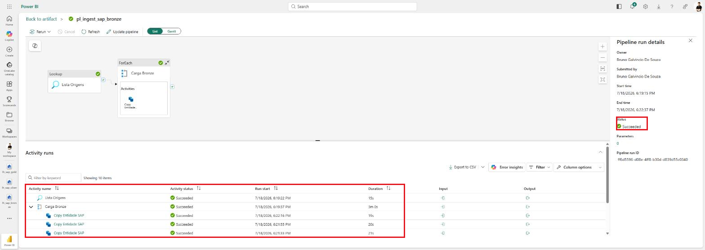

**❸** Confira no `lh_sap_bronze` → **Tables › dbo** as 8 tabelas carregadas (`centro_custo`, `centro_lucro`, `cliente_fornecedor`, `conta_contabil`, `empresa`, `lancamento_despesas`, `Planta`, `segmento`). Clique numa tabela para ver o preview com os dados reais do SAP:

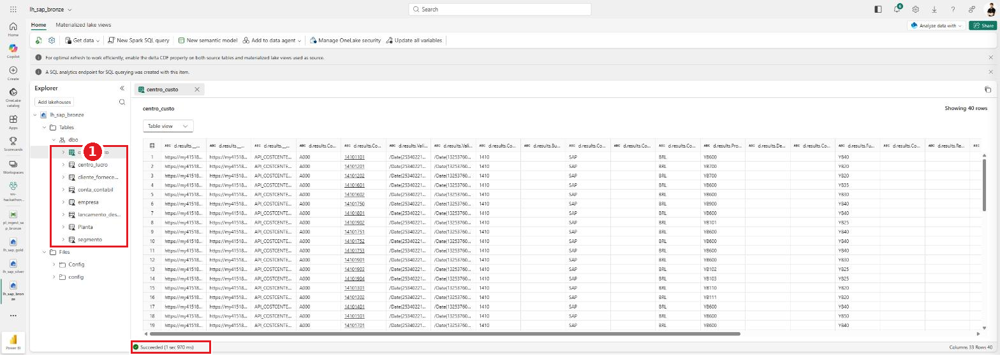

> **Carga incremental (opcional):** para não recarregar tudo, filtre por data de última modificação na `Relative URL`, ex.: `@concat(item().relativeUrl, "?$format=json&$filter=LastChangeDate gt datetime'2026-01-01T00:00:00'")`, e use *Table action = Append*.

---

---

## Passo 10 — Bronze → Silver com Data Quality (notebook `bronze_to_silver_dq`)

Este notebook lê as tabelas do Bronze, **escolhe e renomeia** as colunas úteis, aplica **duas regras de qualidade** (nulos e duplicidade) e grava o resultado na Silver. Ele é chamado pela atividade *Load Bronze to Silver* do pipeline (Passo 8.6), mas você pode abrir e rodar sozinho para entender cada etapa.

**❶** No workspace, clique no notebook **`bronze_to_silver_dq`**. Confira: **1** o nome do notebook, **2** o painel **Explorer**, **3** o botão **Run all** e **4** a célula de parâmetros.

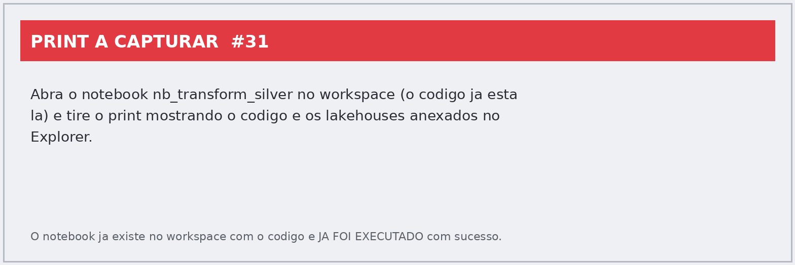

> 🔎 **Repare no "No data sources added" (2).** Na implementação de referência **nenhum lakehouse está anexado** ao notebook — ele funciona porque todas as leituras e gravações usam o **nome completo de três partes** (`lh_sap_bronze.dbo.centro_custo`), que não depende do lakehouse default. Anexar os lakehouses em **Add data items** é opcional e serve para você navegar nas tabelas pelo Explorer; se você trocar o código por caminhos relativos (`spark.table("centro_custo")`), aí passa a ser obrigatório.

### O que cada seção do notebook faz

| Seção                             | O que acontece                                                                                        | Por que importa                                                            |
| ----------------------------------- | ----------------------------------------------------------------------------------------------------- | -------------------------------------------------------------------------- |
| **Imports**                   | Carrega as funções do PySpark e cria a sessão Spark                                                | `getOrCreate()` deixa o notebook rodar também fora do Fabric            |
| **Parâmetros**               | `LAKEHOUSE_BRONZE`, `LAKEHOUSE_SILVER`, `SCHEMA_*` e `PREFIXO_COLUNA_BRONZE`                  | É o único lugar a mudar para apontar o notebook a outros lakehouses      |
| **1. `CONFIG_ENTIDADES`**   | Dicionário com, por entidade, o*de‑para* de colunas e a **chave de negócio**               | Adicionar uma entidade nova é editar o dicionário, não duplicar código |
| **2. Funções utilitárias** | `ler_bronze`, `selecionar_colunas`, `analisar_nulos`, `tratar_duplicidade`                    | Uma responsabilidade cada, o que deixa o loop principal curto              |
| **3. Loop principal**         | Para cada entidade: lê → filtra → seleciona/renomeia → mede nulos → deduplica → grava na Silver | É aqui que a Silver é construída                                        |
| **4. Relatórios de DQ**      | Grava `ctrl_dq_nulos` e `ctrl_dq_resumo`                                                          | Histórico da qualidade, execução a execução                           |

### A pegadinha do prefixo `d.results.`

Toda coluna no Bronze tem, **literalmente**, o texto `d.results.` no nome — por exemplo `` `d.results.CompanyCode` ``. Não é struct aninhada, é o nome da coluna mesmo, herdado do achatamento do JSON OData na ingestão.

Por isso todas as referências usam **crase**:

```python
col(f"`{PREFIXO_COLUNA_BRONZE}{origem}`").alias(destino)
```

Sem a crase o Spark leria `d` → `results` → `CompanyCode` como acesso a campos aninhados, não acharia nada e o notebook quebraria. Depois da renomeação, os nomes já são de negócio (`empresa`, `centro_custo`) e a crase deixa de ser necessária.

### Os filtros aplicados na leitura

Antes de selecionar as colunas, o loop aplica quatro recortes — vale saber que eles existem, porque explicam a diferença de volume entre Bronze e Silver:

| Filtro                     | Onde se aplica                     | Efeito                                                                         |
| -------------------------- | ---------------------------------- | ------------------------------------------------------------------------------ |
| `Language == "PT"`       | entidades que mapeiam `Language` | mantém só a descrição em português, evitando uma linha por idioma         |
| `CodeCompany == "1410"`  | onde a coluna existir              | restringe à empresa do exercício                                             |
| `Ledger == "0L"`         | `lancamento_despesas`            | mantém apenas o ledger principal (evita duplicar valores por ledger paralelo) |
| `plano_contas == "YCOA"` | `conta_contabil`                 | mantém um único plano de contas                                              |

### As duas regras de Data Quality

**Regra 1 — completude (`analisar_nulos`).** Para cada coluna conta os nulos e calcula o percentual sobre o total. O detalhe de implementação vale a leitura: em vez de um `count()` por coluna, monta **todas as agregações de uma vez** e faz uma única passada pelos dados.

```python
agregacoes = [spark_sum(when(col(c).isNull(), 1).otherwise(0)).alias(c) for c in df.columns]
linha_nulos = df.select(agregacoes).collect()[0].asDict()
```

**Regra 2 — unicidade (`tratar_duplicidade`).** Deduplica por **chave de negócio**, não pela linha inteira, e devolve quantas linhas entraram, quantas saíram e quantas foram removidas.

```python
df_dedup = df.dropDuplicates(subset=chave_negocio)
```

> ⚠️ `dropDuplicates` **não é determinístico**: entre duas linhas com a mesma chave, qual sobrevive é indefinido. Para as dimensões de texto do SAP isso é aceitável (as linhas diferem pouco), mas se precisar de um critério explícito — "a mais recente", por exemplo — troque por `row_number()` sobre uma janela ordenada.

### As tabelas de controle

Ao final, dois relatórios são gravados na Silver em modo **`append`** — diferente das tabelas de negócio, que usam `overwrite`:

| Tabela             | Uma linha por   | Conteúdo                                                                                                        |
| ------------------ | --------------- | ---------------------------------------------------------------------------------------------------------------- |
| `ctrl_dq_nulos`  | tabela + coluna | `qtd_total`, `qtd_nulos`, `pct_nulos`, `data_execucao`                                                   |
| `ctrl_dq_resumo` | tabela          | `chave_negocio`, `qtd_linhas_bronze`, `qtd_linhas_silver`, `qtd_duplicados_removidos`, `data_execucao` |

O `append` com `data_execucao` é o que permite comparar execuções e perceber degradação — uma coluna que começa a receber nulos, por exemplo.

**❷** Resultado: as tabelas limpas na Silver, com nomes de coluna de negócio e sem o prefixo `d.results.`.

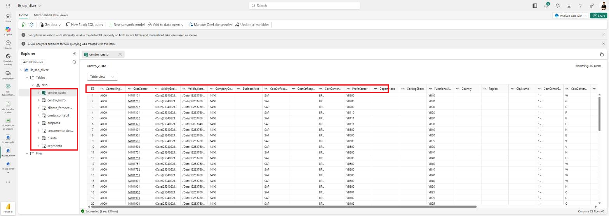

---

---

## Passo 11 — Silver → Gold, esquema estrela (notebook `silver_to_gold_star_schema`)

Este notebook transforma as tabelas da Silver num **modelo dimensional**: gera **surrogate keys** para as dimensões, monta a fato ligada a elas só por SK, cria a dimensão calendário e conta quantos lançamentos caíram no membro desconhecido. É chamado pela atividade *Load Silver to Gold* (Passo 8.6).

**❶** Abra o notebook **`silver_to_gold_star_schema`**. Ele começa com **3** o diagrama do modelo e **4** a tabela de chaves — vale ler antes de rodar.

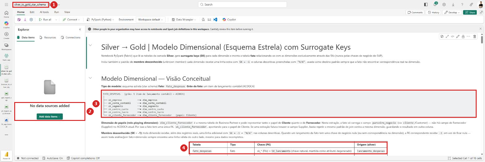

### O modelo que sai daqui

```
FATO_DESPESAS   (grão: 1 item de lançamento contábil — ACDOCA)
│
├── sk_empresa            ──► dim_empresa
├── sk_conta_contabil     ──► dim_conta_contabil
├── sk_segmento           ──► dim_segmento
├── sk_centro_custo       ──► dim_centro_custo
├── sk_centro_lucro       ──► dim_centro_lucro
└── sk_cliente_fornecedor ──► dim_cliente_fornecedor   (papel: Cliente)
```

Mais a `dim_calendario`, gerada do zero pelo próprio notebook.

### O que cada seção faz

| Seção                           | O que acontece                                                                                                      |
| --------------------------------- | ------------------------------------------------------------------------------------------------------------------- |
| **Parâmetros**             | Lakehouses de origem/destino,`SK_DESCONHECIDO = -1` e `VALOR_DESCONHECIDO_TEXTO = "N/A"`                        |
| **1. `CONFIG_DIMENSOES`** | Para cada dimensão: tabela na Silver, chave de negócio, nome da SK e nome da tabela na Gold                       |
| **2. Funções**            | `gerar_dim_com_sk` (cria a SK) e `gerar_linha_desconhecida` (monta a linha `-1`)                              |
| **3. Dimensões**           | Loop que gera cada `dim_*` com SK + membro desconhecido e grava na Gold                                           |
| **4. Fato**                 | Traz `lancamento_despesas`, faz join com cada dimensão, troca chave de negócio por SK e grava `fato_despesas` |
| **5. Calendário**          | Gera `dim_calendario` de 01/01/2026 até 31/12 do ano corrente                                                    |
| **6. Checagem**             | Conta quantas linhas da fato apontam para SK `-1`                                                                 |

### Surrogate key: por que e como

Cada dimensão recebe uma chave inteira sequencial, e a fato se liga às dimensões **só por ela** — nunca pelo código do SAP:

```python
janela = Window.orderBy(*chave_negocio)
return df.withColumn(nome_sk, row_number().over(janela))
```

> ⚠️ **Limitação assumida no notebook, e é uma decisão didática:** a SK é **recalculada a cada execução** a partir da ordenação atual. Se entrar um registro "no meio" da ordem, as SKs seguintes mudam de valor — o que invalidaria relatórios salvos apontando para SKs antigas. Em produção o padrão é uma tabela de controle de SK com `MERGE`, que atribui SK nova só a chaves inéditas e preserva as já existentes.

### O membro desconhecido (`SK = -1`)

Cada dimensão ganha **uma linha extra**: SK `-1`, colunas de texto com `"N/A"` e os outros tipos com `None`. A função monta isso **a partir do schema da própria dimensão**, então funciona automaticamente para qualquer dimensão nova:

```python
for campo in df_gold.schema.fields:
    if campo.name == nome_sk:            valores[campo.name] = SK_DESCONHECIDO
    elif isinstance(campo.dataType, StringType): valores[campo.name] = VALOR_DESCONHECIDO_TEXTO
    else:                                 valores[campo.name] = None
```

Na fato, cada FK passa por `coalesce(sk, -1)`. O efeito prático: **nenhuma FK fica nula**, e todo join fato→dimensão sempre encontra uma linha — mesmo quando o lançamento veio sem centro de custo. Sem isso, um `INNER JOIN` no relatório descartaria silenciosamente as linhas incompletas.

### A coluna de data que não existia

O ACDOCA desta extração não traz data de lançamento, só `ano_fiscal` e `periodo_fiscal` separados. O notebook constrói a data com dia fixo `01`:

```python
make_date(col("ano_fiscal"), col("periodo_fiscal"), lit(1)).alias("data_referencia")
```

Período 3 de 2026 vira `2026-03-01`. A fato é gravada **particionada por ano e mês**, o que acelera filtros por período.

> 📌 Consequência a ter em mente: como o dia é sempre `01`, análises **diárias** não fazem sentido neste modelo — a granularidade real é mensal. Para ter dia de verdade, a extração da API precisa incluir `PostingDate`/`DocumentDate`.

### A checagem final

A última célula conta, por FK, quantas linhas da fato apontam para o membro desconhecido:

```
Linhas da fato apontando para o membro desconhecido (SK = -1):
  [OK] sk_empresa: 0
  [VERIFICAR] sk_centro_custo: 128
```

`0` significa que todos os lançamentos casaram com a dimensão. Qualquer número acima de zero é um convite a investigar: ou a chave veio nula na fato, ou existe um código no lançamento que não está na dimensão — quase sempre porque a dimensão foi filtrada (lembre do `Language == "PT"` e do `plano_contas == "YCOA"` no Passo 10).

**❷** Resultado na Gold: as dimensões, a `fato_despesas` e a `dim_calendario`.

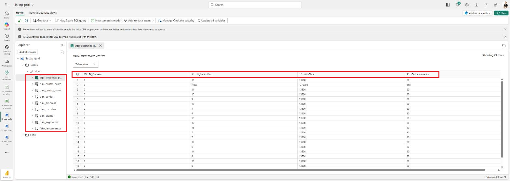

---

---

## Dicas e problemas comuns

- **Lookup só traz 1 entidade:** o **First row only** ficou marcado — desmarque.
- **ForEach não itera:** o `Items` do ForEach vem do **Filter**, então é `@activity('HabilitaETL').output.Value` — `Value` com **V maiúsculo**. Do Lookup seria `output.value`, minúsculo.
- **Filter devolve 0 itens:** a condição compara texto. Use `@equals(item().etl, 'Sim')` — com `true` ou com `'sim'` minúsculo não casa.
- **Uma entidade não carrega:** confira o `etl` dela no JSON. A `Planta` vem de fábrica como `"Não"`.
- **Notebook falha com tabela não encontrada:** confira as variáveis `LAKEHOUSE_*` da célula de parâmetros (Passo 7.2) e se o notebook está **no mesmo workspace** dos lakehouses — o nome de três partes não atravessa workspaces.
- **Alerta do Teams não chega:** a atividade precisa da própria conexão autorizada (**Sign in**) e do time/canal escolhidos; sem isso ela falha silenciosamente na validação.
- **Copy traz 1 coluna com JSON inteiro:** falta a *collection reference* `$.d.results` no Source.
- **Erro 401:** usuário/senha ou método (deve ser **Basic**).
- **Editor "trava" ou não responde a cliques:** recarregue a página (F5) e reabra o item pelo workspace.
- **Tabela não aparece no Bronze:** confira *Root folder = Tables* e `Table name = @item().tabela_destino`.

---

## Lista de prints a capturar (para completar o guia)

Prints **reais e verificados**: 01–16, 18–24, 29–35 e 38 (o pipeline foi montado e **executado com sucesso**; workspace, lakehouses, JSON no Config, canvas, run Succeeded e as 8 tabelas no Bronze estão documentados com telas reais). Faltam apenas os abaixo.

| Print | Tela / clique                                                              | Bloqueio                                                  |
| ----- | -------------------------------------------------------------------------- | --------------------------------------------------------- |
| 17    | Conexão criada na lista de**Connections**                           | senha precisa ser digitada por um humano                  |
| 36    | Seletor de arquivos do import dos `.ipynb`                               | seletor nativo do Windows, fora do alcance da automação |
| 37    | **Add lakehouses** em cada notebook (Bronze+Silver / Silver+Gold)    | depende do import dos notebooks                           |
| 38    | Canvas completo do pipeline end‑to‑end                                   | depende do import dos notebooks                           |
| 39    | Lookup "Lista Origens" →**Settings**                                | —                                                        |
| 40    | Filter "HabilitaETL" →**Settings** (`@equals(item().etl, 'Sim')`) | —                                                        |
| 41    | ForEach "Carga Bronze" →**Settings** (Sequential ✓, Items)         | —                                                        |
| 42    | Copy Entidades →**Source** (`@item().relativeUrl`)                | —                                                        |
| 43    | Copy Entidades →**Destination** (Tables, expressões, Overwrite)    | —                                                        |
| 44    | Atividades Notebook →**Settings** com cada notebook selecionado     | —                                                        |
| 45    | Atividade Microsoft Teams →**Settings** (time, canal, mensagem)     | —                                                        |

> 🗑️ Os antigos prints 24–28 (canvas e painéis da versão só‑ingestão) saíram do guia: o desenho do pipeline mudou com o Filter, os Notebooks e o Teams, e serão substituídos pelos prints 39–45.
>
> 🚧 **Por que 39–45 ainda não foram capturados.** O editor de pipeline do Fabric roda num iframe de outro domínio (`pbidpe.powerbi.com`) e não aceita clique automatizado — só captura de tela. Dá para fotografar o canvas (print 38, já feito), mas não para selecionar uma atividade e abrir a aba *Settings*. Para fechar esses prints, alguém precisa clicar em cada atividade; a captura e a anotação vêm depois.

> 📌 **Nota sobre os prints 18 e 20.** Ambos mostram o formulário **em branco**, com o alvo do clique marcado em vermelho, em vez do valor já digitado. Motivo: a pasta `Config` e o JSON **já existem** no `lh_sap_bronze`, então repetir a criação/upload de verdade geraria erro de nome duplicado (print 18) ou sobrescreveria o arquivo em produção (print 20). O passo a passo em texto traz o valor exato a digitar.
>
> Obs. 1: a conexão usada na execução do pipeline foi a já existente **"sap 2026 new"** (REST, Basic, host `my415189`). Os prints 15–17 documentam a criação de uma conexão equivalente do zero.
>
> Obs. 2: para os prints 39–45, basta abrir o **`ppl_ingest_sap`** (já montado, workspace `hack_sap`), clicar na atividade indicada e na aba **Settings** — os valores já estão preenchidos.

---

## Status desta execução

Tudo abaixo existe e **já rodou** no tenant:

| Item                                                             | Onde                                                  | Situação                                                                              |
| ---------------------------------------------------------------- | ----------------------------------------------------- | --------------------------------------------------------------------------------------- |
| Lakehouses `lh_sap_bronze`, `lh_sap_silver`, `lh_sap_gold` | `ws-hackathon-sap-fabric_dev_claude` e `hack_sap` | schema `dbo`, tabelas Delta                                                           |
| `mapeamento_entidades_sap.json`                                | `lh_sap_bronze/Files/Config`                        | 8 entidades, 7 com `etl = "Sim"`                                                      |
| Conexão REST                                                    | Manage connections and gateways                       | `sap 2026 new` (host `my415189`, Basic)                                             |
| Pipeline só‑ingestão `pl_ingest_sap_bronze`                 | `ws-hackathon-sap-fabric_dev_claude`                | Lookup → ForEach → Copy,**Succeeded** em 18/07/2026, 8/8 entidades              |
| **Pipeline end‑to‑end `ppl_ingest_sap`**               | **`hack_sap`**                                | Lookup → Filter → ForEach/Copy → 2 Notebooks → Teams — é a referência deste guia |
| Notebook `bronze_to_silver_dq`                                 | `hack_sap`                                          | executado; Silver gravada +`ctrl_dq_nulos` e `ctrl_dq_resumo`                       |
| Notebook `silver_to_gold_star_schema`                          | `hack_sap`                                          | executado; Gold com 6 dimensões +`fato_despesas` + `dim_calendario`                |

**O Lab 1 está completo de ponta a ponta: SAP → Bronze → Silver → Gold, com alerta de falha no Teams.**

Pendentes apenas os prints 39–45 (painéis *Settings* de cada atividade do pipeline). O trabalho em si já está feito.

*Documento gerado para a equipe do hackathon — Lab 1.*
