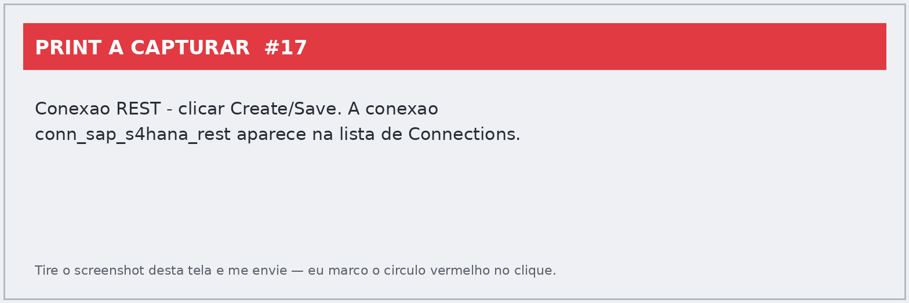
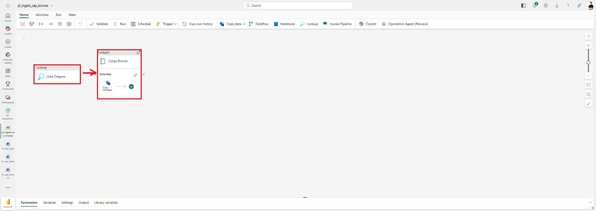
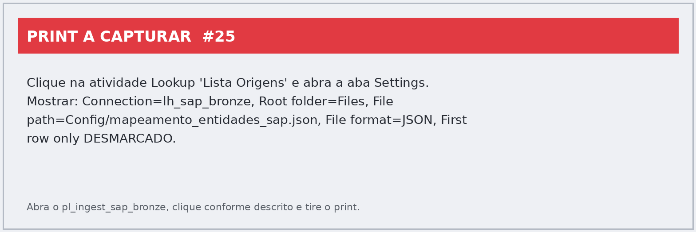
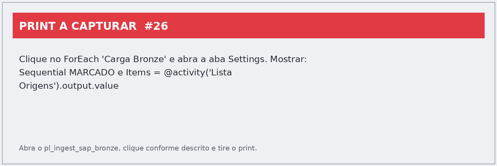
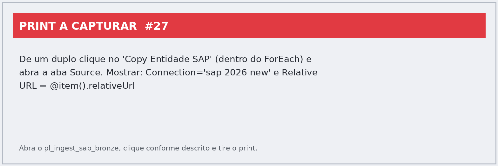
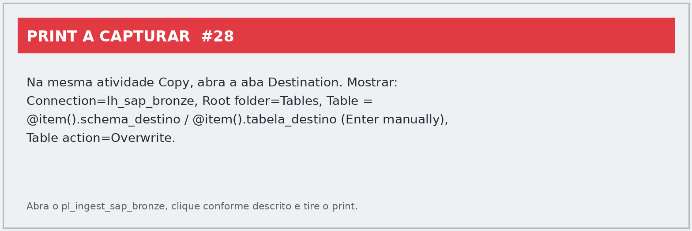

# Guia passo a passo — Hackathon SAP → Microsoft Fabric
## Lab 1 — Pipeline de ingestão e transformação (Bronze → Silver → Gold)

Este guia mostra, **clique a clique e com prints reais**, como construir o pipeline de ingestão de dados do SAP para o Microsoft Fabric seguindo a arquitetura **Medallion**, usando um padrão **orientado a metadados** (um único pipeline que lê a lista de entidades de um arquivo JSON e carrega **todas** de uma vez, com **Lookup + ForEach + Copy**).

> **Como ler os prints:** cada ação está marcada com um **círculo vermelho** e um **número** (❶, ❷, ❸…) que corresponde à ordem do clique dentro daquele passo. **Caixas vermelhas** destacam campos a preencher ou resultados a conferir.

---

## Arquitetura da solução

```
                     mapeamento_entidades_sap.json   (lista de entidades da API)
                                   │
SAP S/4HANA (API OData/REST)       ▼
        └──────────►  Pipeline Fabric Data Factory
                        ├─ Lookup  "Lista Origens"  (lê o JSON)
                        └─ ForEach "Carga Bronze"   (repete para cada entidade)
                              └─ Copy data  (REST → tabela Delta no Bronze)
                                        │
                                        ▼
                            Lakehouse BRONZE  (dados crus)
                                        │  Notebook PySpark (limpeza/dedup/tipos)
                                        ▼
                            Lakehouse SILVER  (limpo, deduplicado, tipado)
                                        │  Notebook PySpark (modelagem estrela)
                                        ▼
                            Lakehouse GOLD    (dimensões + fatos p/ análise)
```

O **Lab 2** usa a camada Gold para o Modelo Semântico + relatórios via Copilot. O **Lab 3** cria o Agente de Dados no Teams.

---

## Pré-requisitos

- Acesso ao **Microsoft Fabric** (`app.fabric.microsoft.com`) numa **capacidade Fabric** (Trial, F2+ — para os Labs 2/3 recomenda‑se **F16+**).
- Permissão de **Admin/Member/Contributor** no workspace para criar itens e conexões.
- Configuração de tenant habilitada: *Users can create Fabric items* e criação de Pipelines, Notebooks, Lakehouses, Conexões e Dataflows.
- Acesso de rede à **API OData do SAP** (a API do hackathon está publicada na internet, **sem restrição de IP** — não precisa de gateway).

### Conexão com o SAP (dados de teste do hackathon)

| Item | Valor |
|---|---|
| Base URL do serviço OData | `https://my415189-api.s4hana.cloud.sap/sap/opu/odata/sap` |
| Autenticação | **Basic** |
| Usuário | `HACKATON_2026` |
| Senha | `#H4ckT0n_M1croS0ft_2026` |
| Operações | **Somente GET** (leitura) |

> ⚠️ **Atenção ao host da URL.** O arquivo `mapeamento_entidades_sap.json` (que o pipeline lê no loop) usa **`my415189`** em todas as 8 entidades. Instruções anteriores citavam `my415181`. **Use `my415189`** para manter a conexão consistente com o JSON. Se o ambiente do seu tenant usar outro host, ajuste apenas o campo *Base URL* da conexão.
>
> 🔒 **Senha:** digite a senha do SAP você mesmo no formulário da conexão. Por segurança, o assistente automatizado não preenche campos de senha.

### Entidades carregadas (conteúdo do `mapeamento_entidades_sap.json`)

| # | Entidade | relativeUrl (serviço/entidade OData) | Tabela destino (Bronze) |
|---|---|---|---|
| 1 | ACDOCA (Despesas) | `API_JOURNALENTRYITEMBASIC_SRV/A_JournalEntryItemBasic` | `dbo.lancamento_despesas` |
| 2 | Conta Contábil | `API_GLACCOUNTINCHARTOFACCOUNTS_SRV/A_GLAccountInChartOfAccounts` | `dbo.conta_contabil` |
| 3 | Segmento | `API_SEGMENT_SRV/A_Segment` | `dbo.segmento` |
| 4 | Centro de Lucro | `API_PROFITCENTER_SRV/A_ProfitCenter` | `dbo.centro_lucro` |
| 5 | Centro de Custos | `API_COSTCENTER_SRV/A_CostCenter` | `dbo.centro_custo` |
| 6 | Cliente/Fornecedor | `API_BUSINESS_PARTNER/A_BusinessPartner` | `dbo.cliente_fornecedor` |
| 7 | Empresa | `API_COMPANYCODE_SRV/A_CompanyCode` | `dbo.empresa` |
| 8 | Planta | `API_PLANT_SRV/A_Plant` | `dbo.Planta` |

Todas usam `base_url = https://my415189-api.s4hana.cloud.sap/sap/opu/odata/sap` e `schema_destino = dbo`.

---

## Passo 1 — Criar o workspace numa capacidade Fabric

**❶** Em `app.fabric.microsoft.com`, na barra lateral esquerda, clique em **Workspaces**.


**❷** No rodapé do painel, clique em **+ New workspace**.


**❸** No painel *Create a workspace*, em **Name**, digite `ws-hackathon-sap-fabric`. Aguarde a mensagem *"This name is available"*.


**❹** Role até **Workspace type**, expanda **Fabric and Power BI workspace types** e selecione **Fabric** (garante Lakehouse, Pipeline e Notebook na capacidade Fabric). *Se você tem capacidade Fabric, essa opção já vem marcada.*


**❺** Clique em **Apply**. O workspace é criado em alguns segundos.


**Resultado:** workspace `ws-hackathon-sap-fabric` criado. Para atribuir papéis à equipe, use **❻ Manage access** (canto superior direito) → **+ Add people or groups** → adicione os e‑mails com o papel **Admin**, **Member** ou **Contributor**.


---

## Passos 2 a 4 — Criar os 3 Lakehouses (Bronze, Silver, Gold)

As três camadas Medallion são três Lakehouses:

| Lakehouse | Camada | Conteúdo |
|---|---|---|
| `lh_sap_bronze` | Bronze | Dados crus, exatamente como vêm da API SAP |
| `lh_sap_silver` | Silver | Dados limpos, deduplicados e com tipos corrigidos |
| `lh_sap_gold` | Gold | Dados modelados em esquema estrela (fato + dimensões) |

> **Convenção de nomenclatura das tabelas Bronze:** use os nomes de `tabela_destino` do JSON (ex.: `lancamento_despesas`, `conta_contabil`…), todos no schema `dbo`.

### Criar o `lh_sap_bronze`

**❶** No workspace, clique em **+ New item**.


**❷** No painel *New item*, escolha o card **Lakehouse**.


**❸** Em **Name**, digite `lh_sap_bronze`. **❹** Mantenha **Lakehouse schemas** marcado (habilita o schema `dbo` e o gerenciamento de tabelas **Delta**). **❺** Clique em **Create**.


**Resultado:** o `lh_sap_bronze` abre com o schema `dbo` em **Tables** e a pasta **Files**. Um *SQL analytics endpoint* é criado automaticamente.


### Criar o `lh_sap_silver` e o `lh_sap_gold`

Repita exatamente os cliques **❶ a ❺** acima, mudando apenas o **Name** para `lh_sap_silver` e depois `lh_sap_gold`.

**Resultado:** os três lakehouses no workspace.


---

## Passo 5 — Criar a conexão REST para a API SAP (antes do pipeline)

A conexão guarda a URL base e as credenciais do SAP e é **reutilizável** por qualquer pipeline. Você pode criá‑la em **Manage connections and gateways** (recomendado) ou **inline** ao configurar a atividade Copy (Passo 7). As duas geram a mesma conexão.

**❶** No canto superior direito, clique no ícone de engrenagem **Settings** e depois em **❷ Manage connections and gateways**.


**❸** Na aba **Connections**, clique em **+ New**.


**❹** Na tela *New connection*, selecione o tipo de conexão **REST** (se preferir uma entidade única, também serve **Web**). Clique em **Next**.


**❺** Preencha o formulário da conexão:

| Campo | Valor |
|---|---|
| **Connection name** | `conn_sap_s4hana_rest` |
| **Base URL** | `https://my415189-api.s4hana.cloud.sap/sap/opu/odata/sap` |
| **Authentication method** | `Basic` |
| **Username** | `HACKATON_2026` |
| **Password** | `#H4ckT0n_M1croS0ft_2026`  *(digite você mesmo)* |
| **Privacy level** | `Organizational` |


**❻** Clique em **Create**. A conexão `conn_sap_s4hana_rest` passa a aparecer na lista de **Connections** (e fica disponível para o pipeline).



> ℹ️ Se der erro 401, confira usuário/senha e que o método está em **Basic**. Se der erro de host/DNS, confirme o `my415189` no *Base URL*.

---

## Passo 6 — Subir o `mapeamento_entidades_sap.json` no Bronze (pasta Config)

Este arquivo é a **fonte de metadados** do loop: o Lookup lê a lista de entidades e o ForEach carrega cada uma.

**❶** Abra o **`lh_sap_bronze`**. No **Explorer**, clique com o **botão direito** em **Files** → **New subfolder**.


**❷** Nomeie a subpasta **`Config`** e confirme (Enter).


**❸** Clique com o **botão direito** na pasta **Config** → **Upload** → **Upload files**.


**❹** No diálogo, clique em **Browse/Add**, selecione o arquivo **`mapeamento_entidades_sap.json`** do seu computador e clique em **Upload**.


**Resultado:** o arquivo aparece em **Files › Config › mapeamento_entidades_sap.json**.


---

## Passo 7 — Montar o pipeline (Lookup + ForEach + Copy)

### 7.1 — Criar o pipeline

No workspace `ws-hackathon-sap-fabric`, clique em **+ New item** → aba **All items** → card **Data pipeline**. Na caixa *New Pipeline*: **❶** apague o nome sugerido e digite **`pl_ingest_sap_bronze`**; **❷** clique em **Create**.


> ✅ *Nesta execução o pipeline `pl_ingest_sap_bronze` já foi criado (vazio) — este print é real.* O editor abre com a tela "Build a pipeline"; a partir daqui você adiciona as atividades (7.2 a 7.4).

### 7.2 — Visão geral do pipeline montado

No editor do pipeline, a faixa **Home** já traz os botões de atividade: **❷ Lookup** e **❸ Copy data** direto na faixa; a aba **❶ Activities** mostra todas as demais (ForEach etc.).


O pipeline final tem esta forma — **Lookup "Lista Origens"** ligado (*On success*, seta verde) ao **ForEach "Carga Bronze"**, que contém a atividade **Copy Entidade SAP**:



### 7.3 — Lookup "Lista Origens" (lê o JSON)

Clique em **Lookup** na faixa para adicioná‑lo; na aba **General**, renomeie para **`Lista Origens`**. Depois: **❶** selecione a atividade no canvas e **❷** abra a aba **Settings**:

| Campo | Valor |
|---|---|
| **Connection** | `lh_sap_bronze` (Lakehouse) |
| **Root folder** | **❸** `Files` |
| **File path type** | `File path` |
| **File path** | `Config`  /  `mapeamento_entidades_sap.json` |
| **File format** | `JSON` |
| **First row only** | **❻** ☐ **DESMARCADO** *(essencial — para retornar todas as 8 entidades)* |



> Saída do Lookup (usada no ForEach): `@activity('Lista Origens').output.value` — é o array com as 8 entidades.

### 7.4 — ForEach "Carga Bronze" (repete para cada entidade)

Adicione um **ForEach** (aba Activities), ligue **Lista Origens** →(*On success*)→ **ForEach** e renomeie para **`Carga Bronze`**. **❶** Selecione o ForEach e **❷** abra **Settings**:

| Campo | Valor |
|---|---|
| **Sequential** | **❸** ☑ marcado *(evita estourar limites da API SAP)* |
| **Items** | `@activity('Lista Origens').output.value` |



### 7.5 — Copy data (REST → Bronze) dentro do ForEach

**❶** Dê **duplo clique** na atividade **Copy** dentro do ForEach (ou selecione‑a) e renomeie para `Copy Entidade SAP`. **❷** Aba **Source**:

| Campo | Valor |
|---|---|
| **Connection** | a conexão REST do Passo 5 *(aqui: `sap 2026 new`; no seu caso `conn_sap_s4hana_rest`)* |
| **Relative URL** | `@item().relativeUrl` |
| **Request method** | `GET` (padrão) |



**❶** Agora a aba **Destination**: **❷** Root folder `Tables`, tabela em modo *Enter manually*:

| Campo | Valor |
|---|---|
| **Connection** | `lh_sap_bronze` (Lakehouse) |
| **Root folder** | `Tables` |
| **Table (schema / nome)** | `@item().schema_destino`  /  `@item().tabela_destino` |
| **Table action** | **❹** `Overwrite` |



> **Colunas com prefixo `d.results.`:** a resposta OData V2 vem embrulhada em `d.results`, e o *flatten* automático do Copy gera colunas como `d.results.CostCenter`. Isso é esperado — a limpeza dos nomes é feita na camada Silver (Passo 9). Se preferir colunas já limpas no Bronze, configure na aba **Mapping** a *collection reference* `$['d']['results']` (precisa importar o schema para cada entidade — não recomendado no padrão dinâmico).

> **Mapping:** deixe **automático** (sem mapeamento explícito). Como cada entidade tem colunas diferentes, o mapeamento automático adapta o schema a cada iteração. Se alguma coluna vier como struct/aninhada, use *Import schema* e ajuste.

### Expressões‑chave — o JSON como parâmetro do pipeline

Este é o coração do padrão **reutilizável**: um único pipeline serve para qualquer quantidade de entidades. Basta editar o `mapeamento_entidades_sap.json` — nenhuma alteração no pipeline.

| Campo do JSON | Onde entra no pipeline | Expressão exata |
|---|---|---|
| *(todo o array)* | ForEach → **Items** | `@activity('Lista Origens').output.value` |
| `relativeUrl` | Copy **Source** → Relative URL | `@item().relativeUrl` |
| `tabela_destino` | Copy **Sink** → Table name | `@item().tabela_destino` |
| `schema_destino` | Copy **Sink** → Schema | `@item().schema_destino` |
| `base_url` | *(informativo)* | host fixo na conexão REST — as 8 entidades usam o mesmo host `my415189` |
| `entidade` | *(opcional, p/ logs)* | `@item().entidade` |

> **OData V2 × V4:** as APIs SAP `API_*_SRV` deste hackathon são **OData V2** → a coleção de linhas fica em **`$.d.results`** e a paginação em **`$.d.__next`** (valores usados acima). Se algum serviço for **V4**, troque para **`$.value`** e **`$.'@odata.nextLink'`**.
>
> **Reaproveitar em outro cliente/projeto:** troque só o arquivo JSON (novas entidades/tabelas) e a conexão REST (novo host/credenciais). O pipeline continua igual.

---

## Passo 8 — Executar e validar

**❶** Clique em **Save** e depois em **Run** (faixa **Home**). Para acompanhar, use **View run history** → clique no run.

**❷** No detalhe do run, confira **Status: Succeeded** e, em *Activity runs*, o `Lista Origens` (15s), o `Carga Bronze` (~3min) e as 8 execuções de `Copy Entidade SAP` — todas **Succeeded**:


**❸** Confira no `lh_sap_bronze` → **Tables › dbo** as 8 tabelas carregadas (`centro_custo`, `centro_lucro`, `cliente_fornecedor`, `conta_contabil`, `empresa`, `lancamento_despesas`, `Planta`, `segmento`). Clique numa tabela para ver o preview com os dados reais do SAP:


> **Carga incremental (opcional):** para não recarregar tudo, filtre por data de última modificação na `Relative URL`, ex.: `@concat(item().relativeUrl, "?$format=json&$filter=LastChangeDate gt datetime'2026-01-01T00:00:00'")`, e use *Table action = Append*.

---

## Passo 9 — Transformação Silver (Notebook PySpark)

**❶** Crie um **Notebook** (`+ New item → Notebook`), renomeie para **`nb_transform_silver`** e, em **Add data items / Add lakehouse**, anexe **`lh_sap_bronze`** e **`lh_sap_silver`**. Cole o código abaixo e clique em **Run all**.


```python
from pyspark.sql import functions as F

# Entidades Bronze -> chave de negócio para deduplicar (ajuste as chaves se necessário)
tabelas = {
    "lancamento_despesas":  None,                 # fato: sem dedup por chave única
    "conta_contabil":       "GLAccount",
    "segmento":             "Segment",
    "centro_lucro":         "ProfitCenter",
    "centro_custo":         "CostCenter",
    "cliente_fornecedor":   "BusinessPartner",
    "empresa":              "CompanyCode",
    "Planta":               "Plant",
}

def limpar(nome, chave):
    df = spark.read.table(f"lh_sap_bronze.dbo.{nome}")
    # 1) o flatten do REST gera colunas 'd.results.X' -> renomeia para 'X'
    #    e descarta as colunas de metadados OData (__metadata.uri, __deferred etc.)
    cols = []
    for c in df.columns:
        novo = c.replace("d.results.", "")
        if novo.startswith("__") or ".__" in novo:
            continue
        cols.append(F.col("`" + c + "`").alias(novo))
    df = df.select(*cols)
    # 2) trim em todas as colunas string
    for c, t in df.dtypes:
        if t == "string":
            df = df.withColumn(c, F.trim(F.col(c)))
    # 3) deduplica pela chave de negócio (quando houver)
    if chave and chave in df.columns:
        df = df.dropDuplicates([chave])
    # 4) trata nulos de texto
    df = df.na.fill("N/D")
    (df.write.format("delta").mode("overwrite")
       .option("overwriteSchema", "true")
       .saveAsTable(f"lh_sap_silver.dbo.{nome}"))
    print(f"Silver dbo.{nome}: {df.count()} linhas, {len(df.columns)} colunas")

for nome, chave in tabelas.items():
    limpar(nome, chave)

print("Camada Silver concluída.")
```

> **Enriquecimento:** como estas entidades são financeiras (lançamentos × contas × centros × parceiros), o cruzamento entre elas é feito na **camada Gold** (joins por chave de negócio), a seguir.

**Resultado:** as 8 tabelas limpas em `lh_sap_silver.dbo` — repare que as colunas já aparecem **sem** o prefixo `d.results.` (ex.: `CostCenter`, `ProfitCenter`, `CompanyCode`):


> ✅ *Executado nesta montagem: notebook `nb_transform_silver` rodou com sucesso (2m37s) e gravou as 8 tabelas.*

---

## Passo 10 — Modelagem Gold (esquema estrela)

**❶** Crie o Notebook **`nb_model_gold`**, anexe **`lh_sap_silver`** e **`lh_sap_gold`**, cole o código e **Run all**.


```python
from pyspark.sql import functions as F

S = "lh_sap_silver.dbo"
G = "lh_sap_gold.dbo"

def sk(df, keycol, skname):
    # chave substituta (surrogate key) sequencial
    return df.withColumn(skname, F.monotonically_increasing_id())

# ---------- DIMENSÕES (ajuste os nomes de coluna conforme o payload do SAP) ----------
dim_conta   = sk(spark.read.table(f"{S}.conta_contabil"),     "GLAccount",     "SK_Conta")
dim_ccusto  = sk(spark.read.table(f"{S}.centro_custo"),       "CostCenter",    "SK_CentroCusto")
dim_clucro  = sk(spark.read.table(f"{S}.centro_lucro"),       "ProfitCenter",  "SK_CentroLucro")
dim_segmento= sk(spark.read.table(f"{S}.segmento"),           "Segment",       "SK_Segmento")
dim_empresa = sk(spark.read.table(f"{S}.empresa"),            "CompanyCode",   "SK_Empresa")
dim_parceiro= sk(spark.read.table(f"{S}.cliente_fornecedor"), "BusinessPartner","SK_Parceiro")
dim_planta  = sk(spark.read.table(f"{S}.Planta"),             "Plant",         "SK_Planta")

for nome, df in [("dim_conta",dim_conta),("dim_centro_custo",dim_ccusto),
                 ("dim_centro_lucro",dim_clucro),("dim_segmento",dim_segmento),
                 ("dim_empresa",dim_empresa),("dim_parceiro",dim_parceiro),
                 ("dim_planta",dim_planta)]:
    df.write.format("delta").mode("overwrite").option("overwriteSchema","true").saveAsTable(f"{G}.{nome}")

# ---------- FATO: lançamentos (ACDOCA) ligado às dimensões ----------
fato = spark.read.table(f"{S}.lancamento_despesas")

# valor do lançamento — ajuste o nome da coluna de valor do seu serviço, ex.:
col_valor = next((c for c in ["AmountInCompanyCodeCurrency","AmountInTransactionCurrency"]
                  if c in fato.columns), None)
if col_valor:
    fato = fato.withColumn("Valor", F.col(col_valor).cast("double"))

def liga(fato, dim, cong, sk):
    on = [c for c in [cong] if c in fato.columns and c in dim.columns]
    return fato.join(dim.select(cong, sk), on, "left") if on else fato

fato = liga(fato, dim_conta.select("GLAccount","SK_Conta"),          "GLAccount",      "SK_Conta")
fato = liga(fato, dim_ccusto.select("CostCenter","SK_CentroCusto"),  "CostCenter",     "SK_CentroCusto")
fato = liga(fato, dim_clucro.select("ProfitCenter","SK_CentroLucro"),"ProfitCenter",   "SK_CentroLucro")
fato = liga(fato, dim_segmento.select("Segment","SK_Segmento"),      "Segment",        "SK_Segmento")
fato = liga(fato, dim_empresa.select("CompanyCode","SK_Empresa"),    "CompanyCode",    "SK_Empresa")

(fato.write.format("delta").mode("overwrite").option("overwriteSchema","true")
     .saveAsTable(f"{G}.fato_lancamentos"))

# ---------- AGREGADO de negócio (exemplo) ----------
if col_valor:
    agg = (spark.read.table(f"{G}.fato_lancamentos")
           .groupBy("SK_Empresa","SK_CentroCusto")
           .agg(F.sum("Valor").alias("ValorTotal"),
                F.count("*").alias("QtdLancamentos")))
    agg.write.format("delta").mode("overwrite").option("overwriteSchema","true").saveAsTable(f"{G}.agg_despesas_por_centro")

print("Camada Gold concluída: dimensões + fato_lancamentos (+ agregado).")
```

**Resultado:** esquema estrela completo no `lh_sap_gold.dbo` — 7 dimensões (`dim_conta`, `dim_centro_custo`, `dim_centro_lucro`, `dim_segmento`, `dim_empresa`, `dim_parceiro`, `dim_planta`), a `fato_lancamentos` e o agregado `agg_despesas_por_centro` (ValorTotal + QtdLancamentos por empresa/centro de custo) — prontos para o **Modelo Semântico do Lab 2**:


> ✅ *Executado nesta montagem: notebook `nb_model_gold` rodou com sucesso e gravou as 9 tabelas Gold.*

> ⚠️ Os nomes de coluna do SAP (ex.: `GLAccount`, `CostCenter`, `AmountInCompanyCodeCurrency`) podem variar conforme o serviço OData. Abra uma tabela Silver, confira as colunas reais e ajuste o código onde indicado.

---

## Dicas e problemas comuns

- **Lookup só traz 1 entidade:** o **First row only** ficou marcado — desmarque.
- **ForEach não itera:** confira `Items = @activity('Lista Origens').output.value` (com `.value`, pois o JSON é um array).
- **Copy traz 1 coluna com JSON inteiro:** falta a *collection reference* `$.d.results` no Source.
- **Erro 401:** usuário/senha ou método (deve ser **Basic**).
- **Editor "trava" ou não responde a cliques:** recarregue a página (F5) e reabra o item pelo workspace.
- **Tabela não aparece no Bronze:** confira *Root folder = Tables* e `Table name = @item().tabela_destino`.

---

## Lista de prints a capturar (para completar o guia)

Prints **reais e verificados**: 01–13, 21–24, 29 e 30 (o pipeline foi montado e **executado com sucesso**; workspace, lakehouses, JSON no Config, canvas, run Succeeded e as 8 tabelas no Bronze estão documentados com telas reais). Faltam apenas os abaixo — capture e me envie; eu marco o **círculo vermelho** e insiro no guia.

| Print | Tela / clique |
|---|---|
| 14 | Botão direito em **Files** → **New subfolder** → nomear `Config` |
| 15 | New connection — escolher tipo **REST** |
| 16 | Formulário da conexão (name, Base URL `my415189…`, Basic, user, senha) |
| 17 | Conexão criada na lista de Connections |
| 18 | Nomear a subpasta **Config** |
| 19 | Config → Upload → Upload files |
| 20 | Selecionar `mapeamento_entidades_sap.json` e Upload |
| 25 | Lookup "Lista Origens" selecionado + aba **Settings** preenchida |
| 26 | ForEach "Carga Bronze" + **Settings** (Sequential ✓, Items) |
| 27 | Copy Entidade SAP → aba **Source** (conexão + `@item().relativeUrl`) |
| 28 | Copy Entidade SAP → aba **Destination** (Tables, expressões, Overwrite) |
| 31 | Notebook `nb_transform_silver` aberto (código + lakehouses anexados) |
| 33 | Notebook `nb_model_gold` aberto (código + lakehouses anexados) |

> Obs. 1: a conexão usada nesta execução foi a já existente **"sap 2026 new"** (REST, Basic, host `my415189`). Os prints 15–17 documentam a criação de uma conexão equivalente do zero.
>
> Obs. 2: para os prints 25–28, basta abrir o `pl_ingest_sap_bronze` (já montado), clicar na atividade indicada e na aba indicada — os valores já estão preenchidos.
>
> Obs. 3: os notebooks **já existem no workspace com o código e já foram executados com sucesso** (Silver e Gold gravados — prints 32 e 34 são reais). Para os prints 31 e 33, basta abrir cada notebook e capturar a tela.

---

## Status desta execução

Criados e **executados** no tenant, com prints reais clique a clique:

- ✅ Workspace `ws-hackathon-sap-fabric` (capacidade Fabric)
- ✅ Lakehouses `lh_sap_bronze`, `lh_sap_silver`, `lh_sap_gold` (schema `dbo`, tabelas Delta)
- ✅ Arquivo `mapeamento_entidades_sap.json` em `lh_sap_bronze/Files/Config`
- ✅ Pipeline **`pl_ingest_sap_bronze`** montado: Lookup "Lista Origens" → ForEach "Carga Bronze" → Copy "Copy Entidade SAP" (conexão REST "sap 2026 new", expressões dinâmicas do JSON)
- ✅ **Execução Succeeded** (18/07/2026): Lookup 15s + ForEach ~3min, 8/8 entidades copiadas
- ✅ **8 tabelas Delta no Bronze** (`dbo`) — validadas com preview de dados reais do SAP
- ✅ Notebook **`nb_transform_silver`** criado e **executado com sucesso** (2m37s) → 8 tabelas limpas na Silver (sem prefixo `d.results.`, dedup, trim, nulos tratados)
- ✅ Notebook **`nb_model_gold`** criado e **executado com sucesso** → esquema estrela na Gold: 7 dimensões + `fato_lancamentos` + `agg_despesas_por_centro`

**O Lab 1 está completo e executado de ponta a ponta: SAP → Bronze → Silver → Gold.**

Pendentes apenas prints de telas (o trabalho em si já está feito): conexão do zero (15–17), pasta/upload manual (14, 18–20), painéis do pipeline (25–28) e notebooks abertos (31, 33).

*Documento gerado para a equipe do hackathon — Lab 1.*
