# Guia passo a passo — Hackathon SAP → Microsoft Fabric
## Lab 2 — Modelo Semântico a partir da Gold + relatórios com Copilot

Neste laboratório você constrói o **modelo semântico** sobre a camada Gold criada no Lab 1 e produz **medidas e um relatório** com apoio do **Copilot**.

> **Como ler os prints:** cada ação está marcada com um **círculo vermelho** e um **número** (1, 2, 3…) que corresponde à ordem do clique dentro daquele passo. **Caixas vermelhas** destacam campos a preencher ou resultados a conferir.

> 🚧 **Status dos prints.** A **seção 1** está completa com prints reais, capturados na construção do **`mdl_sap_despesas`** no workspace `hack_sap` — incluindo as duas armadilhas da tela de relacionamentos, flagradas ao vivo. Da **seção 1.4 em diante** os pontos estão marcados com **`[print pendente]`**; o passo a passo em texto está completo e campo a campo.

---

## Roteiro do laboratório

| Seção | O que você entrega | Tempo |
|---|---|---|
| **1** Modelo semântico | `mdl_sap_despesas` com 7 relacionamentos, tabela de data marcada e formatos ajustados | ~25 min |
| **2** Medidas via Copilot | 5 medidas DAX validadas e organizadas em pastas | ~20 min |
| **3** Refino via Copilot | hierarquias, sinônimos, descrições e chaves técnicas ocultas | ~15 min |
| **4** Relatório via Copilot | relatório publicado no workspace | ~20 min |

**Checklist antes de começar** — se algum item falhar, resolva antes de seguir:

- [ ] O `lh_sap_gold` tem as **8 tabelas** (`fato_despesas`, `dim_calendario` e 6 dimensões)
- [ ] A `fato_despesas` tem linhas (deve ter ~500)
- [ ] Você é **Admin/Member/Contributor** no workspace
- [ ] A capacidade Fabric está **ativa** (se algum item não abre, é isso)
- [ ] O ícone do **Copilot** aparece na barra lateral esquerda

---

## Pré-requisitos

- **Lab 1 concluído**: a camada Gold precisa existir e ter dados. Confira no `lh_sap_gold` as tabelas `fato_despesas`, `dim_calendario` e as seis dimensões.
- Papel de **Admin/Member/Contributor** no workspace.
- **Copilot habilitado**: exige capacidade **paga** (não Trial em alguns tenants) e o switch de tenant ligado em **Admin portal → Tenant settings → Copilot and Azure OpenAI Service**. Se o painel do Copilot não aparecer, é aqui que se resolve — não é problema do seu modelo.

### O modelo que veio da Gold

O notebook `silver_to_gold_star_schema` (Passo 11 do Lab 1) entrega um **esquema estrela**:

| Tabela | Papel | Chave primária |
|---|---|---|
| `fato_despesas` | Fato — 1 linha por item de lançamento contábil (ACDOCA) | `id_lancamento` + as FKs `sk_*` |
| `dim_empresa` | Dimensão | `sk_empresa` |
| `dim_conta_contabil` | Dimensão | `sk_conta_contabil` |
| `dim_segmento` | Dimensão | `sk_segmento` |
| `dim_centro_custo` | Dimensão | `sk_centro_custo` |
| `dim_centro_lucro` | Dimensão | `sk_centro_lucro` |
| `dim_cliente_fornecedor` | Dimensão (papéis: Cliente/Fornecedor) | `sk_cliente_fornecedor` |
| `dim_calendario` | Dimensão de tempo | `data_referencia` |

```
                    dim_calendario
                          │  data_referencia
   dim_empresa ───┐       │       ┌─── dim_segmento
                  │       │       │
dim_conta_contabil├──►  fato_despesas  ◄──┤ dim_centro_custo
                  │    (504 linhas)    │
dim_centro_lucro ─┘       │       └─── dim_cliente_fornecedor
                          │
                    todas as ligações: *:1, filtro Único
```

> 🔑 **Duas heranças do Lab 1 que mudam o que você faz aqui:**
>
> 1. **Toda dimensão tem uma linha com `SK = -1`** (o *membro desconhecido*, com textos `"N/A"`). Na fato, nenhuma FK é nula. Consequência prática: os relacionamentos **não vão acusar valores em branco**, e um total "sem categoria" aparece rotulado como `N/A` em vez de vazio.
> 2. **A `data_referencia` tem sempre dia `01`.** A granularidade real é **mensal**. Não crie visuais nem medidas diárias — e explique isso ao Copilot, senão ele sugere métricas por dia que não fazem sentido.

---

## 1. Criar o Modelo Semântico

### 1.1 — Criar o modelo a partir do lakehouse

**1** Abra o **`lh_sap_gold`** e confirme em **Tables › dbo** que as 8 tabelas estão lá. **2** Na faixa **Home**, clique em **New semantic model**.

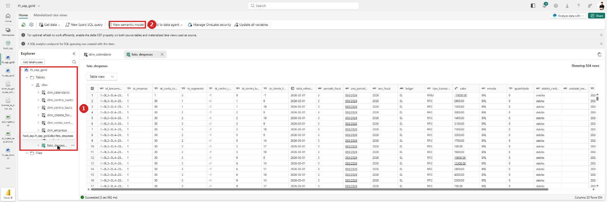

No diálogo *New semantic model*: **1** em **Direct Lake semantic model name**, digite `mdl_sap_despesas`. **2** Confirme o **Workspace** de destino. **3** Marque **Select all** para pegar as 8 tabelas. **4** Clique em **Confirm**.

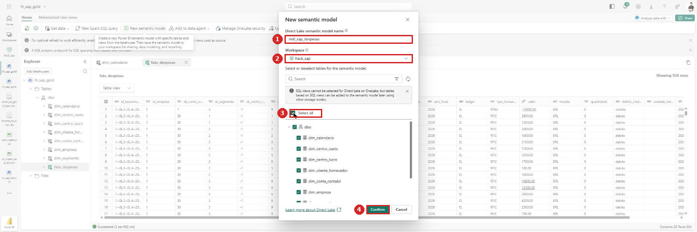

> ℹ️ O modelo nasce em **Direct Lake**: consulta os arquivos Delta da Gold direto, sem importar nem agendar refresh. Se alguma tabela não aparecer na lista, ela não é Delta ou está fora do schema `dbo`.
>
> ℹ️ O aviso *"SQL views cannot be selected for Direct Lake on OneLake"* no diálogo é esperado — a Gold só tem tabelas Delta, nenhuma view.
>
> ⚠️ **Não inclua** as tabelas de controle de Data Quality (`ctrl_dq_nulos`, `ctrl_dq_resumo`) — elas vivem na Silver e não fazem parte do modelo analítico. Se aparecerem, desmarque.
>
> ⏱️ Depois do **Confirm** o Fabric mostra *"Please wait…"* por até um minuto. Pode acontecer de o editor abrir com *"Sorry, we couldn't find that semantic model"* — é uma corrida entre a criação e a abertura, **não** um erro real. Recarregue a página e o modelo aparece.

O editor abre no **Model view** com as 8 tabelas. **1** No painel **Data**, à direita, estão as tabelas do modelo. **2** Na faixa, o grupo **Relationships** traz o **Manage relationships**, usado no passo seguinte.

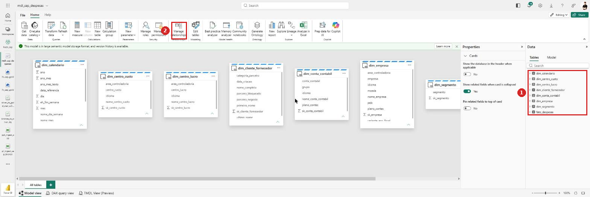

### 1.2 — Definir os relacionamentos

### 1.2.a — Antes de ligar: organize o diagrama

O modelo nasce com as 8 tabelas **em fila**, na ordem alfabética, e a `fato_despesas` fica na ponta direita — fora da tela. Ligar as coisas nesse estado é sofrimento: você não vê as duas pontas ao mesmo tempo.

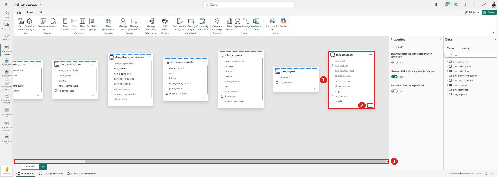

**1** A `fato_despesas` está no fim da fila. **2** O chevron no pé de cada card **colapsa** a tabela. **3** A barra de rolagem horizontal mostra o quanto o diagrama passa da tela.

Faça nesta ordem:

1. **Colapse as 7 dimensões.** Clique no chevron **⌄** no pé de cada card. O card encolhe para só o título, e a tela passa a caber tudo. Deixe **só a `fato_despesas` expandida** — é nela que você vai procurar as colunas `sk_*`.
2. **Arraste a `fato_despesas` para o centro.** Pegue o card pela **barra de título** e solte no meio da área livre, mais abaixo.
3. **Distribua as dimensões em volta**, arrastando uma por uma pelo título:

```
        dim_calendario    dim_empresa    dim_segmento
                  ╲            │            ╱
   dim_conta_contabil ──  fato_despesas  ── dim_centro_custo
                  ╱            │            ╲
    dim_centro_lucro   dim_cliente_fornecedor
```

4. Use o **zoom** no canto inferior direito (ou `Ctrl` + roda do mouse) para enquadrar tudo.

Resultado — a **1** `fato_despesas` no centro, com as dimensões distribuídas em volta, e o **2** zoom reduzido para **80%** para caber tudo:

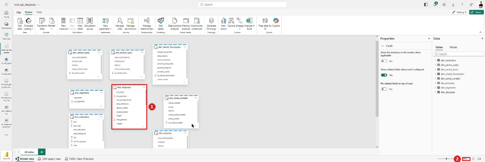

> 🔎 **Repare: ainda não há nenhuma linha entre os cards.** É exatamente esse o ponto de partida do próximo passo — e é a prova visual de que o Fabric não criou relacionamento algum sozinho.

> 💡 **Por que gastar tempo nisso.** O diagrama organizado é a sua conferência visual: com a fato no centro, um relacionamento faltando aparece como uma dimensão **solta**, sem linha. Na fila alfabética original, esse erro passa batido — e você só descobre quando um visual mostra o mesmo total para todas as categorias.
>
> 💡 Se preferir não arrastar nada, dá para criar os relacionamentos direto pelo **Manage relationships** (é o caminho abaixo) e organizar o diagrama depois. Só não pule a conferência visual no final.

### 1.2.b — Criar os relacionamentos

> ⚠️ **O Fabric não cria nenhum relacionamento sozinho.** Ao abrir **Manage relationships** logo depois de criar o modelo, a lista vem com *"There are no relationships defined yet"* — mesmo com as colunas `sk_*` tendo nomes idênticos nas duas pontas. Os 7 são todos manuais.

> 🚨 **Leia isto antes de criar o primeiro.** A tela tem um defeito que morde: ao trocar a **From table** para o próximo relacionamento, a coluna já escolhida na **To table permanece selecionada**. Na montagem deste guia isso aconteceu em **2 dos 4** primeiros relacionamentos — não é descuido de quem clica, é comportamento da tela. Então a regra é: **antes de cada Save, olhe as duas faixas de colunas e confirme que a coluna destacada é a mesma nos dois lados.** O Fabric aceita o par errado sem nenhum aviso.

### Faça o primeiro com calma — os outros 6 são repetição

O caminho recomendado é o **Manage relationships**, porque ele lista o que já existe e deixa conferir tudo no final. Arrastar no diagrama é mais rápido, mas erra coluna com facilidade.

1. Faixa **Home** → grupo *Relationships* → **Manage relationships**.
2. Clique em **+ New relationship**. Abre o diálogo *New relationship*.
3. **1** Em **From table**, escolha a **dimensão** (ex. `dim_centro_lucro`). A faixa de colunas aparece abaixo.
4. **2** Clique no **cabeçalho da coluna** `sk_centro_lucro`. É assim que se escolhe a coluna — não há um segundo dropdown. Role a faixa para a direita se a coluna não estiver visível.
5. **3** Em **To table**, escolha **`fato_despesas`**.
6. **4** Clique no cabeçalho de `sk_centro_lucro` na faixa de baixo.
7. **5** **Cardinality** = **One to many (1:\*)**.
8. **6** **Cross-filter direction** = **Single**.
9. Deixe **Make this relationship active** marcado e **Assume referential integrity** desmarcado.
10. **7** **Save**.

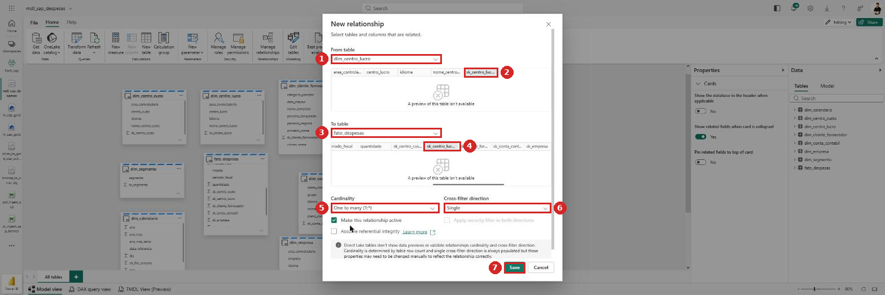

> ✅ **Confira a coluna em destaque antes de salvar.** É o único retorno visual que o diálogo dá: a coluna escolhida fica com o **fundo destacado** na faixa de colunas (marcas **2** e **4** no print). Como os nomes aparecem **truncados** — `sk_centro_luc…` serve tanto para `sk_centro_lucro` quanto para `sk_centro_custo` —, passe o mouse em cima para ver o nome completo e confirme que **as duas pontas são a mesma coluna**. Um relacionamento entre `sk_centro_lucro` e `sk_centro_custo` é aceito sem reclamação e devolve números errados.
>
> 🚨 **A armadilha real, flagrada durante a montagem.** Ao trocar a **From table** para criar o relacionamento seguinte, o Fabric **mantém a coluna que você já tinha escolhido na To table**. O resultado é este:
>
> 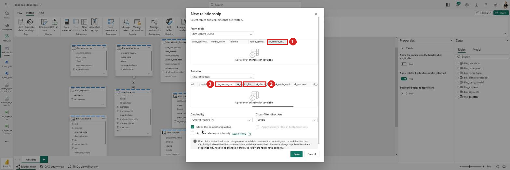
>
> **1** *From* é `dim_centro_custo[sk_centro_custo]`, correto. **2** Mas na *To* continuou selecionado o `sk_centro_lucro`, herdado do relacionamento anterior. **3** O `sk_centro_custo` está ali do lado, sem seleção. Salvar assim cria um relacionamento entre **centro de custo e centro de lucro** — aceito sem nenhum aviso, e todo relatório sai errado.
>
> Por isso: **a cada novo relacionamento, confira as duas pontas**, mesmo as que você não tocou.
>
> Compare com o estado **correto** — o `dim_cliente_fornecedor`:
>
> 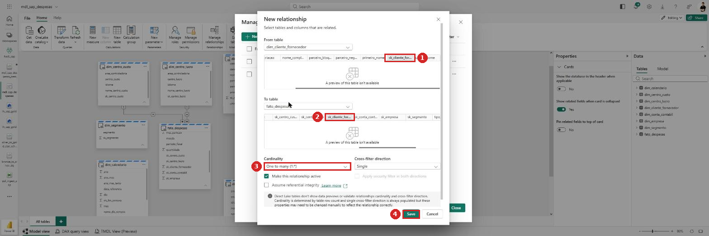
>
> **1** e **2** são a **mesma coluna**, `sk_cliente_for…`, nos dois lados. **3** Cardinalidade `One to many (1:*)`, com o `1` na dimensão. **4** Só agora vale clicar em **Save**. Repare também que as duas faixas estão roladas até o fim: as colunas `sk_*` ficam sempre nas últimas posições, porque a faixa segue a ordem alfabética.

> ✅ **E não esqueça do Save.** Fechar o diálogo no **X** ou clicar fora descarta tudo, sem aviso. Depois de salvar, o relacionamento aparece na lista do *Manage relationships* e uma linha nova liga os dois cards no diagrama — se a linha não apareceu, não salvou.

**Sobre o sentido: `1:*` ou `*:1`?** São a mesma coisa, o que muda é de onde você partiu:

| Se **From table** for… | Então **Cardinality** é… |
|---|---|
| a **dimensão** (`dim_centro_lucro`) → To = fato | **One to many (`1:*`)** |
| a **fato** (`fato_despesas`) → To = dimensão | **Many to one (`*:1`)** |

O que precisa ser verdade nos dois casos: o lado **`1`** é sempre a **dimensão** e o lado **`*`** é sempre a **fato**. Se aparecer `1:1` ou `*:*`, algo está errado — provavelmente a coluna escolhida não é a chave.

> 🚨 **A segunda armadilha: a cardinalidade vem errada quando a dimensão é grande.** Flagrado no `dim_conta_contabil`:
>
> 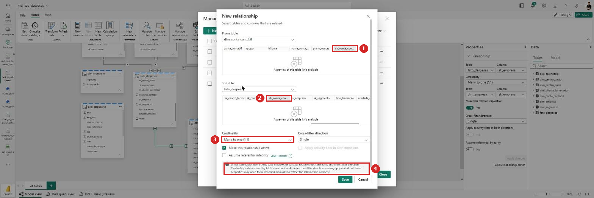
>
> **1** e **2** mostram `sk_conta_contabil` corretamente nas duas pontas. Mas **3** o **Cardinality** veio **`Many to one (*:1)`** — invertido: com a dimensão na *From table*, o correto é **`One to many (1:*)`**. Salvar assim declara que *muitas contas contábeis correspondem a um lançamento*.
>
> A causa está em **4**, o aviso do próprio Fabric: em Direct Lake a cardinalidade é **deduzida pela contagem de linhas**. A `fato_despesas` tem apenas ~500 linhas; quando a dimensão tem mais linhas que a fato — o caso da `dim_conta_contabil`, que vem da *view* de textos do SAP — o palpite se inverte. Nas dimensões menores ele acerta, e é justamente isso que faz o erro passar: você confere as primeiras, vê que está certo, e para de olhar.
>
> **Confira o campo Cardinality em todos os 7.** Regra única: o lado **`1`** é sempre a dimensão.

> ⚠️ **O aviso do Direct Lake no pé do diálogo merece leitura.** O Fabric avisa que, em tabelas Direct Lake, ele **não valida** a cardinalidade nem a direção do filtro: *deduz* a cardinalidade pela contagem de linhas e **sempre** preenche a direção como *Single*. Ou seja, o valor que aparece nesses dois campos é um **chute**, não uma verificação. Você é quem garante que está certo — mais um motivo para conferir a coluna em destaque.

Repita os passos 2 a 10 trocando a dimensão e a coluna, seguindo a tabela acima. No fim, o **Manage relationships** deve listar **7 linhas**.

> 💡 **Sobre o *Assume referential integrity*:** deixe desmarcado. Ele promete ao motor que toda chave da fato existe na dimensão, permitindo um join mais rápido em Direct Lake. Como a Gold usa membro desconhecido, a promessa vale — mas se um dia não valer, o resultado é *silenciosamente errado* (linhas desaparecem). Ganho pequeno, risco alto.

### O resultado: as 7 linhas

Com tudo criado, o **Manage relationships** fica assim:

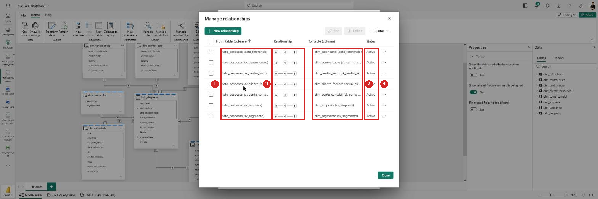

**1** A coluna *From: table (column)* mostra sempre a `fato_despesas` — o Fabric **normaliza** o sentido na listagem, colocando a fato como origem, mesmo você tendo criado partindo da dimensão. **2** *To: table (column)* traz a dimensão. Confira que o nome da coluna **repete** nas duas colunas em cada linha. **3** O ícone de cardinalidade tem o `*` do lado da fato e o `1` do lado da dimensão. **4** Todos com *Status* = **Active**.

Confira linha por linha:

| From (fato) | To (dimensão) |
|---|---|
| `fato_despesas (data_referencia)` | `dim_calendario (data_referencia)` |
| `fato_despesas (sk_centro_custo)` | `dim_centro_custo (sk_centro_custo)` |
| `fato_despesas (sk_centro_lucro)` | `dim_centro_lucro (sk_centro_lucro)` |
| `fato_despesas (sk_cliente_fornecedor)` | `dim_cliente_fornecedor (sk_cliente_fornecedor)` |
| `fato_despesas (sk_conta_contabil)` | `dim_conta_contabil (sk_conta_contabil)` |
| `fato_despesas (sk_empresa)` | `dim_empresa (sk_empresa)` |
| `fato_despesas (sk_segmento)` | `dim_segmento (sk_segmento)` |

> 💡 **Esta tela é a sua rede de proteção.** É aqui que a coluna trocada aparece: numa linha errada, o nome dentro dos parênteses **não bate** entre as duas colunas — por exemplo `fato_despesas (sk_centro_lucro)` apontando para `dim_centro_custo`. Bate o olho nas 7 linhas antes de seguir.

### Como saber que deu certo

- **Reabra cada um dos 7** no *Manage relationships* (**⋯ → Edit**) e confira **duas coisas**: o par de colunas e a **cardinalidade**. Sim, todos — as duas armadilhas acima são silenciosas e um relacionamento pode estar salvo errado sem nenhum sinal na tela. É a conferência mais importante desta seção.
- O **Manage relationships** lista **7** relacionamentos, todos com *Status* = **Active**.
- No **Model view**, cada dimensão tem **uma** linha ligando à fato, com `1` do lado da dimensão e `*` do lado da fato.
- Nenhuma linha **pontilhada** (seria relacionamento inativo) e nenhuma **seta dupla** (seria filtro bidirecional).
- Teste rápido: crie um visual de tabela com `dim_empresa[empresa]` e uma contagem de `fato_despesas`. Se todas as empresas mostrarem o **mesmo** número, o relacionamento não está filtrando — algo está errado.

São **7 relacionamentos**, todos com a mesma configuração:

Partindo sempre da **dimensão** como *From table* e da **fato** como *To table*:

| # | From table (dimensão) | Coluna | To table | Coluna | Cardinalidade | Filtro |
|---|---|---|---|---|---|---|
| 1 | `dim_empresa` | `sk_empresa` | `fato_despesas` | `sk_empresa` | `1:*` | Single |
| 2 | `dim_conta_contabil` | `sk_conta_contabil` | `fato_despesas` | `sk_conta_contabil` | `1:*` | Single |
| 3 | `dim_segmento` | `sk_segmento` | `fato_despesas` | `sk_segmento` | `1:*` | Single |
| 4 | `dim_centro_custo` | `sk_centro_custo` | `fato_despesas` | `sk_centro_custo` | `1:*` | Single |
| 5 | `dim_centro_lucro` | `sk_centro_lucro` | `fato_despesas` | `sk_centro_lucro` | `1:*` | Single |
| 6 | `dim_cliente_fornecedor` | `sk_cliente_fornecedor` | `fato_despesas` | `sk_cliente_fornecedor` | `1:*` | Single |
| 7 | `dim_calendario` | `data_referencia` | `fato_despesas` | `data_referencia` | `1:*` | Single |

> ⚠️ **Cuidado com os dois pares que se parecem:** `sk_centro_custo` × `sk_centro_lucro` e `dim_conta_contabil` × `dim_cliente_fornecedor`. Na faixa de colunas os nomes aparecem truncados e é fácil pegar o vizinho errado.

`[print pendente]`

> 🔎 **A `dim_calendario` tem uma `sk_data`, mas o relacionamento de tempo não usa ela.** A `fato_despesas` não carrega `sk_data` — a coluna de ligação é a própria `data_referencia`, do tipo data, nas duas tabelas. É a única exceção ao padrão "ligar sempre por SK" deste modelo. Se você tentar ligar por `sk_data`, não vai achar a coluna na fato.

> ⚠️ **Direção do filtro: sempre Única.** A tentação é marcar *Ambas* para "funcionar melhor" — não faça. Filtro cruzado bidirecional num esquema estrela abre caminhos ambíguos entre dimensões, deixa o resultado dependente da ordem de avaliação e derruba a performance. A regra é: dimensão filtra fato, nunca o contrário.
>
> ⚠️ **Nunca relacione pela chave de negócio.** Existe a tentação de ligar `fato_despesas` a `dim_empresa` por `empresa` em vez de `sk_empresa`. As SKs existem exatamente para isso — e a chave de negócio pode repetir (as dimensões de texto do SAP vinham com uma linha por idioma antes do filtro `Language = "PT"`).
>
> 🔎 **Como conferir se ficou certo:** o diagrama deve ter a fato no centro e as 7 dimensões ao redor, cada seta com `1` no lado da dimensão e `*` no lado da fato. Nenhuma linha pontilhada (relacionamento inativo) e nenhuma seta dupla.

### 1.3 — Marcar a dimensão de tempo

**1** No **Model view**, clique no menu **⋯** do card da tabela **`dim_calendario`**. **2** Escolha **Mark as date table**.

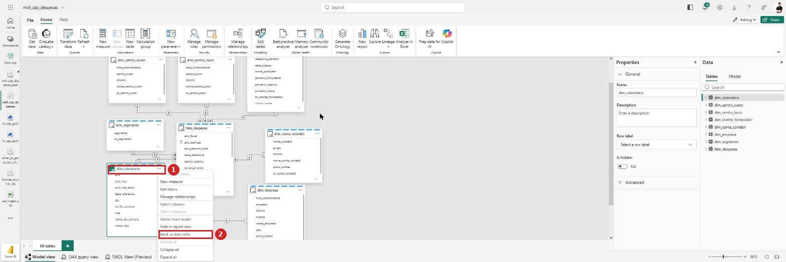

> 🔎 Repare no diagrama atrás do menu: as **7 linhas** já ligam as dimensões à fato, com o `1` e o `*` nas pontas. É a confirmação visual que o arranjo em estrela da seção 1.2.a permite.

No painel que abre: **1** o botão **Mark as a date table** vem **On**. **2** Em **Choose a date column**, selecione **`data_referencia`**. **3** Aguarde o **Validated successfully** em verde. **4** **Save**.

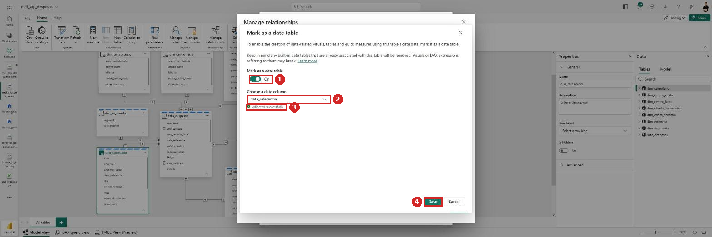

Sem isso, `SAMEPERIODLASTYEAR`, `TOTALYTD` e `DATEADD` não funcionam de forma confiável — e o Copilot gera medidas que retornam em branco.

> ✅ **O `Validated successfully` é o que importa.** O Fabric checa se a coluna não tem nulos, não tem datas repetidas e não tem lacunas no período. Se ele **recusar**, o problema está na `dim_calendario` gerada no Lab 1 — o notebook a cria contínua de 01/01/2026 até 31/12 do ano corrente, então uma recusa indica que a geração foi alterada ou não cobre o período dos lançamentos.
>
> ⚠️ **Leia o aviso do painel:** *"any built-in date tables that are already associated with this table will be removed"*. O Power BI cria hierarquias de data automáticas por trás dos panos; marcar a tabela de data **remove** essas hierarquias. Se algum visual ou medida já usava a hierarquia automática, ele quebra. Num modelo novo como o nosso não há nada a perder — por isso este é o momento certo de fazer, **antes** de criar medidas e visuais.

### 1.4 — Tipos, formatos e categorias

**Como chegar nos campos:** no painel **Data**, à direita, expanda a tabela pelo chevron e **clique na coluna**. O painel **Properties**, ao lado, passa a mostrar a coluna selecionada. Role até a seção **Formatting**, que traz nesta ordem: **Data type**, **Format**, **Percentage format**, **Thousands separator**, **Decimal places** e **Currency format**. Abaixo dela, o expander **Advanced** traz **Sort by column**, **Data category** e **Summarize by**.

> ⚠️ **Não existe campo de *format string* customizado** no editor web do modelo semântico. O `Advanced` só tem os três campos citados. Então o símbolo da moeda tem que sair da lista de **Currency format** — não dá para digitar `"R$" #,##0.00` à mão como no Power BI Desktop.
>
> ⚠️ **Achar o R$ dá trabalho.** A lista de *Currency format* abre com um grupo **Common currency symbols** que traz só `Currency General`, `¥ Chinese (PRC)`, `£ British English`, `$ American English`, `fr. Swiss French` e dois de Euro. O real está no grupo **All currency symbols**, ordenado por idioma, em **Portuguese (Brazil)** — é preciso rolar bastante, e a lista **não aceita type-ahead**: digitar "Portuguese" não pula para lá.
>
> 💡 **Alternativa aceitável:** deixar `Currency General`, que exibe o símbolo conforme a localidade de quem abre o relatório. Para um laboratório é suficiente e evita a rolagem. O que **não** serve é deixar `$ American English` — os dados são em BRL (a `fato_despesas` tem uma coluna `moeda` com `BRL`), e um `$` na frente do valor engana quem lê.

A `fato_despesas[valor]` configurada: **1** a coluna selecionada no painel **Data**, **2** `Data type = Decimal number`, **3** `Format = Currency`, **4** `Thousands separator = Yes`, **5** `Decimal places`, **6** `Currency format`.

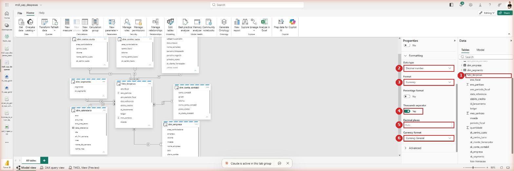

> 🚨 **Os campos `Decimal places` e `Currency format` se atropelam.** Comportamento reproduzido várias vezes:
>
> - escolher um **Currency format** zera o `Decimal places` para **`Auto`**;
> - digitar um **Decimal places** força o `Currency format` de volta para o padrão da **cultura do modelo** — que aqui é **en-US**, ou seja **`$ American English`**.
>
> Resultado: você não consegue ter `Currency General` **e** 2 decimais fixos ao mesmo tempo pelo editor web. Escolha um dos dois:
>
> | Se quiser… | Configure | Consequência |
> |---|---|---|
> | símbolo neutro, que respeita a localidade de quem lê | `Currency General` + `Decimal places = Auto` | decimais variam conforme o valor |
> | 2 decimais fixos | `Decimal places = 2` | o símbolo vira **`$`**, porque a cultura do modelo é en-US |
> | `R$` **e** 2 decimais | selecionar **Portuguese (Brazil)** na lista de *Currency format* | única forma de fixar os dois; exige rolar a lista longa |
>
> No modelo de referência ficou `Currency General` + `Auto`, que é o suficiente para o laboratório e não engana com um `$` indevido.
>
> 💡 **Atalho:** o **Copilot consegue** escrever um format string customizado com `R$` e 2 decimais, o que a interface não permite. Se o `R$` for importante, peça a ele — veja a seção 2.0.b.

Selecione cada coluna e ajuste no painel **Properties**:

| Coluna | Tipo de dado | Formato | Observação |
|---|---|---|---|
| `fato_despesas[valor]` | Decimal number | **Currency** `R$ #.##0,00` | Defina também *Casas decimais* = 2 |
| `fato_despesas[ano_particao]` | Whole number | — | **Ocultar** — é coluna de particionamento físico, não análise |
| `fato_despesas[data_referencia]` | Date | `dd/MM/yyyy` | Não use Date/time — não há hora nos dados |
| `dim_calendario[data_referencia]` | Date | `dd/MM/yyyy` | — |
| `dim_calendario[ano]`, `[mes]`, `[trimestre]` | Whole number | `0` | **Desmarque *Summarize*** (senão o Power BI soma anos) |
| `dim_calendario[nome_mes]` | Text | — | Ordene por `mes` em **Sort by column** |
| `dim_calendario[nome_dia_semana]` | Text | — | Ordene por `dia_semana` |
| `sk_*` (em todas as tabelas) | Whole number | — | **Ocultar** (ver 3.3) |

**Categoria de dados** (*Data category*): este modelo **não tem geografia**. `dim_empresa` traz país/região apenas em algumas extrações — se existir uma coluna de país, marque‑a como **Country/Region** para habilitar o visual de mapa. Não invente categoria onde não há: marcar um código de centro de custo como *City* faz o mapa plotar lugares aleatórios.

> ⚠️ **`nome_mes` sem *Sort by column* ordena alfabeticamente** — Abril, Agosto, Dezembro… É o erro de formatação mais comum e mais difícil de notar num gráfico de linha.

`[print pendente]`

---

## 2. Criar medidas via Copilot

### 2.0 — O caminho que funciona

Existem duas portas para o Copilot no editor do modelo, e **só uma funciona bem**:

| Caminho | Veredito |
|---|---|
| **New measure** → painel *Properties* → botão **Create with Copilot** | ❌ Na montagem deste guia, cada clique nesse botão **descartava a medida pendente** em vez de abrir o fluxo |
| **Painel do Copilot**, à direita, conversando em linguagem natural | ✅ É o caminho usado aqui |

Para abrir o painel: faixa **Home** → grupo **Copilot**. O painel abre à direita com sugestões (*Suggest improvements to this semantic model*) e uma caixa de texto: *"Ask a question about your semantic model, or get help with modeling"*.

**Escreva em português mesmo.** O Copilot entende e responde em português.

```
Crie uma medida chamada Total Despesas que some a coluna valor
da tabela fato_despesas, formatada como moeda.
```

### 2.0.a — A tela de consentimento

Na primeira solicitação que **altera** o modelo, o Copilot pede autorização:

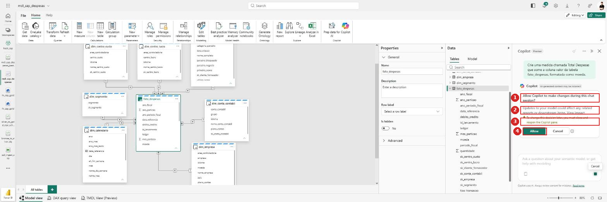

**1** *"Allow Copilot to make changes during this chat session?"* **2** O aviso de que alterações no modelo podem afetar relatórios e itens dependentes, com um link **View impact**. **3** O alerta de que, para mudar essa decisão depois, é preciso **fechar e reabrir** o painel do Copilot. **4** Os botões **Allow** e **Cancel**.

> 🔐 **Pare e pense antes do Allow.** Você está dando ao Copilot permissão de **escrita no modelo** por toda a sessão de chat. Num modelo de laboratório, recém-criado e sem relatórios pendurados, o risco é baixo. Num modelo em produção, clique em **View impact** primeiro e veja o que depende dele. Se preferir revisar o DAX antes de qualquer gravação, use **Cancel** — o Copilot ainda responde com a expressão sugerida, só não aplica.

### 2.0.b — A resposta

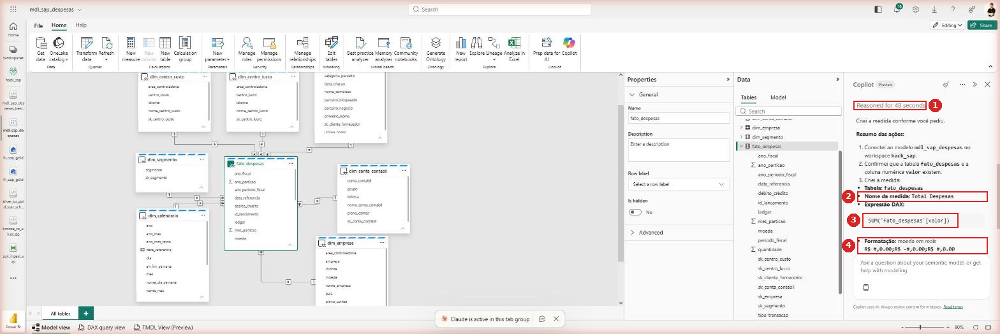

**1** O tempo de raciocínio (*"Reasoned for 48 seconds"* — não é instantâneo). **2** O nome da medida criada. **3** A **expressão DAX**. **4** A formatação aplicada.

O resultado desta execução:

```dax
Total Despesas = SUM('fato_despesas'[valor])
```

E a formatação, com o format string completo:

```
R$ #,0.00;R$ -#,0.00;R$ #,0.00
```

> 💡 **Descoberta útil: o Copilot resolve o problema do `R$` da seção 1.4.** Ele escreveu um **format string customizado** com `R$` e os três ramos (positivo; negativo; zero) — exatamente o que o painel *Properties* **não** permite fazer pela interface. Se você quer `R$` com 2 decimais fixos sem caçar *Portuguese (Brazil)* na lista, pedir ao Copilot é o caminho mais curto. Vale até para a formatação da coluna: peça a ele.
>
> 📋 **Confira o resumo das ações.** O Copilot lista o que fez — a qual modelo se conectou, que validou a existência da tabela e da coluna, e o que criou. É por aí que você confirma que ele mexeu no modelo certo, e não em outro do workspace.

### 2.1 — Abrir o Copilot no editor do modelo

Na faixa **Home** do editor do modelo, grupo **Copilot**, clique em **Prep data for Copilot** para revisar o que o Copilot vai enxergar, e use o painel do **Copilot** para conversar. O painel abre à direita.

`[print pendente]`

> 💡 **Faça o refino da seção 3 antes de pedir medidas complexas.** O Copilot lê nomes, descrições e sinônimos do modelo. Num modelo cru — colunas `sk_*` visíveis, tabelas com nome técnico — ele chuta mais. Se tiver pouco tempo, ao menos oculte as `sk_*` (seção 3.3) antes de começar a pedir.

### 2.2 — Pedir as medidas em linguagem natural

Escreva o pedido **em português**, citando os nomes reais das tabelas e colunas. Pedidos vagos geram DAX que não compila ou que soma a coluna errada.

Prompts sugeridos, um por vez:

```
Crie uma medida que some o valor dos lançamentos da tabela fato_despesas
e chame de Total Despesas, formatada como moeda em reais.
```

```
Crie uma medida que conte as linhas de fato_despesas e chame de Qtd Lançamentos.
```

```
Crie uma medida de despesa média por lançamento usando Total Despesas
e Qtd Lançamentos, protegida contra divisão por zero.
```

```
Crie uma medida com o Total Despesas do mesmo período do ano anterior,
usando a dim_calendario, e outra com a variação percentual entre os dois.
```

O resultado esperado, para você comparar com o que o Copilot devolver:

```dax
Total Despesas = SUM ( fato_despesas[valor] )

Qtd Lançamentos = COUNTROWS ( fato_despesas )

Despesa Média = DIVIDE ( [Total Despesas], [Qtd Lançamentos] )

Total Despesas AA =
CALCULATE ( [Total Despesas], SAMEPERIODLASTYEAR ( dim_calendario[data_referencia] ) )

Variação % AA =
DIVIDE ( [Total Despesas] - [Total Despesas AA], [Total Despesas AA] )
```

### 2.3 — Revisar o DAX antes de aceitar

O Copilot acerta a maior parte, mas erra de formas específicas. Checklist antes de clicar em **Aceitar**:

| O que conferir | Por que |
|---|---|
| Usou `DIVIDE` e não `/` | `DIVIDE` trata divisão por zero; `/` retorna erro/infinito |
| Somou a coluna certa | Há mais de uma coluna numérica na fato (`ano_fiscal`, `periodo_fiscal`); somar `ano_fiscal` não dá erro, dá um número absurdo |
| Não somou SK | `SUM(fato_despesas[sk_empresa])` compila e não significa nada |
| Reaproveitou medidas | `DIVIDE([Total Despesas],[Qtd Lançamentos])` é melhor que repetir os `SUM`/`COUNTROWS` |
| Tempo veio da `dim_calendario` | Se usar `fato_despesas[data_referencia]`, a inteligência temporal fica frágil |
| Formato aplicado | Moeda em `R$`, percentual com 1–2 decimais |

> ⚠️ **Teste cada medida com um valor conhecido.** Uma medida errada que *parece* certa é o defeito mais caro deste laboratório — ela se propaga para todos os visuais e para o Lab 3.

**O número de referência.** Abra o **SQL analytics endpoint** do `lh_sap_gold` e rode:

```sql
SELECT SUM(valor) AS total, COUNT(*) AS linhas
FROM dbo.fato_despesas;
```

Coloque `Total Despesas` e `Qtd Lançamentos` em dois cartões no relatório. Os dois pares de números têm que ser **idênticos**. Se o total do cartão for maior, quase sempre é relacionamento com filtro bidirecional inflando a soma.
>
> ⚠️ Se `Total Despesas AA` voltar em branco, quase sempre é a `dim_calendario` **não marcada como tabela de data** (passo 1.3) ou o calendário **não cobrindo o período da fato** — o notebook gera de 01/01/2026 até o fim do ano corrente.

### 2.4 — Uma tabela só para as medidas (`_medidas`)

Por padrão toda medida nasce grudada numa tabela — as nossas foram para a `fato_despesas`. Isso mistura, no painel de campos, **colunas** (o que se arrasta para eixos e filtros) com **medidas** (o que se arrasta para valores). A prática consagrada é criar uma tabela **só de medidas**.

**Por que vale a pena:**

- As medidas ficam **num só lugar**, no topo da lista, em vez de espalhadas dentro das tabelas de dados.
- Some a tentação de arrastar `fato_despesas[valor]` (a coluna crua) quando o certo é `Total Despesas` (a medida).
- O nome com **underscore na frente** (`_medidas`) faz a tabela subir para o topo do painel, antes das dimensões.

**O caminho passa pela aba Model do painel Data.** **1** No painel **Data**, à direita, troque da aba *Tables* para a aba **Model**. **2** Clique nos **três pontos** ao lado de **Tables**. **3** Escolha **New calculated table**. **4** De passagem, repare que a árvore mostra as contagens do modelo — aqui, `Measures (5)`, `Relationships (7)` e `Tables (9)`.

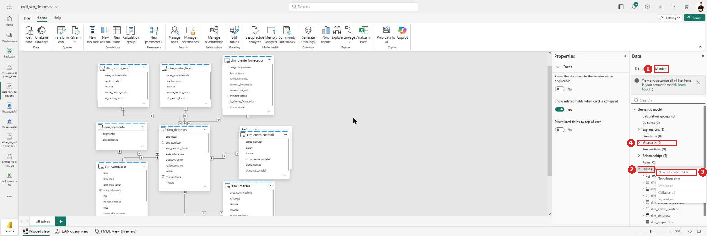

> 💡 **A aba Model é o mapa do modelo.** Ela lista *Calculation groups*, *Cultures*, *Expressions*, *Functions*, *Measures*, *Perspectives*, *Relationships*, *Roles* e *Tables*, cada um com a contagem ao lado. É a forma mais rápida de responder "quantas medidas eu já tenho?" e "os 7 relacionamentos estão todos lá?" sem abrir diálogo nenhum.

**Passo a passo:**

1. Aba **Model** → **⋯** em *Tables* → **New calculated table**.
2. No editor de DAX, crie uma tabela de uma linha só:

   ```dax
   _medidas = ROW("placeholder", BLANK())
   ```

3. Confirme. A tabela `_medidas` aparece no painel com uma coluna `placeholder`.
4. Selecione a coluna `placeholder` e marque **Is hidden = Yes**. Ela existe só para a tabela poder existir; ninguém deve vê-la.
5. Agora mova cada medida: selecione a medida no painel **Data** e, no painel **Properties**, troque o campo **Home table** de `fato_despesas` para **`_medidas`**.
6. Repita para as cinco medidas.

Resultado: **1** o campo **Home table** da medida selecionada aponta para `_medidas`. **2** No painel **Data**, a `_medidas` agora concentra as cinco medidas — e sobe para o topo da lista, antes das dimensões, por causa do `_`. **3** No diagrama, a `_medidas` aparece como um card só de medidas. **4** A barra de fórmula mostra o DAX da medida selecionada.

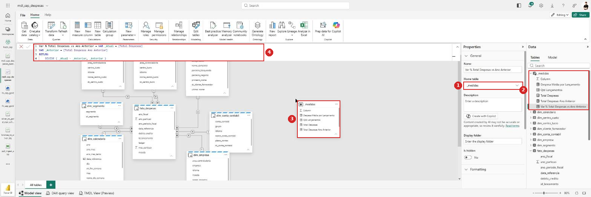

As cinco medidas do modelo de referência, com os nomes que o Copilot gerou:

| Medida | Pasta sugerida |
|---|---|
| `Total Despesas` | `01 Valores` |
| `Despesa Média por Lançamento` | `01 Valores` |
| `Qtd Lançamentos` | `02 Contagens` |
| `Total Despesas Ano Anterior` | `03 Comparativos` |
| `Var % Total Despesas vs Ano Anterior` | `03 Comparativos` |

E o DAX que o Copilot escreveu para a variação — vale reparar na qualidade:

```dax
Var % Total Despesas vs Ano Anterior =
VAR _Atual = [Total Despesas]
VAR _Anterior = [Total Despesas Ano Anterior]
RETURN
    DIVIDE ( _Atual - _Anterior, _Anterior )
```

> ✅ **Isso é DAX bem escrito.** Usa `VAR` para nomear as duas pontas em vez de repetir as medidas, referencia as outras medidas por `[Nome]` em vez de recalcular a soma, e fecha com `DIVIDE` em vez de `/`. É exatamente o que o checklist da seção 2.3 pede — e é um bom exemplo para mostrar à turma de que o Copilot, quando o prompt é específico, entrega código idiomático.

> ⚠️ **Oculte a coluna `Column`.** A tabela calculada nasce com uma coluna (aqui chamada `Column`, com ícone de somatório) que é só andaime. Ela aparece no print ainda **visível** — selecione‑a e marque **Is hidden = Yes**, senão alguém vai arrastá‑la para um visual e somar nada.

> ✅ **Direct Lake aceita tabela calculada.** O menu traz **New calculated table** habilitado — então o `_medidas` funciona sem precisar criar nada no lakehouse. Vale saber que é uma tabela **calculada**, avaliada pelo motor e não lida da Gold: é exatamente o que se quer aqui, já que ela não guarda dado nenhum.
>
> 💡 **O campo `Home table` é o que move a medida.** Ele aparece no painel *Properties* quando você seleciona uma medida — no momento da criação ele vem preenchido e travado com a tabela de origem, mas depois de criada a medida o campo fica editável. Mover a medida **não** muda o DAX nem quebra visual nenhum: a referência a uma medida em DAX é sempre `[Nome da Medida]`, sem o nome da tabela.

### 2.5 — Organizar em display folders

Selecione a medida → painel **Properties** → campo **Display folder**. Estrutura sugerida:

| Display folder | Medidas |
|---|---|
| `01 Valores` | `Total Despesas`, `Despesa Média por Lançamento` |
| `02 Contagens` | `Qtd Lançamentos` |
| `03 Comparativos` | `Total Despesas Ano Anterior`, `Var % Total Despesas vs Ano Anterior` |

O prefixo numérico existe porque as pastas são ordenadas alfabeticamente. Sem ele, "Comparativos" aparece antes de "Valores".

`[print pendente]`

---

## 3. Refinar o modelo via Copilot

### 3.1 — Hierarquias

Peça ao Copilot:

```
Sugira hierarquias para este modelo considerando a dim_calendario
e as dimensões organizacionais.
```

Hierarquias que fazem sentido aqui:

| Hierarquia | Em | Níveis |
|---|---|---|
| `Calendário` | `dim_calendario` | Ano → Trimestre → Mês |
| `Organização` | — | Empresa → Centro de Custo *(exige as duas dimensões; monte no relatório via drill, não como hierarquia numa tabela só)* |
| `Plano de Contas` | `dim_conta_contabil` | Conta → *(descrição)* |

> ⚠️ **Não crie hierarquia com nível de dia.** A `data_referencia` é sempre dia `01`; um nível "Dia" mostraria só o dia 1 de cada mês e passaria a impressão de dado faltando.
>
> ⚠️ Hierarquia **não atravessa tabelas**. Se o Copilot sugerir "Empresa → Centro de Custo" como uma hierarquia única, ele está errado — são duas dimensões diferentes. Isso se resolve no relatório, com drill‑through ou dois campos no mesmo eixo.

### 3.2 — Sinônimos e descrições

```
Sugira sinônimos e descrições para as tabelas e colunas deste modelo,
pensando em quem vai perguntar em português.
```

Os sinônimos alimentam o **Q&A** e o Copilot do relatório. Vale revisar e completar com o vocabulário de quem usa:

| Objeto | Sinônimos úteis |
|---|---|
| `Total Despesas` | gasto, custo, despesa total, valor gasto |
| `dim_centro_custo` | CC, centro de custo, cost center |
| `dim_cliente_fornecedor` | parceiro, business partner, BP, cliente, fornecedor |
| `dim_conta_contabil` | conta, conta contábil, GL, razão |
| `dim_calendario` | data, período, competência |

As **descrições** aparecem como tooltip no painel de campos. Duas que valem escrever à mão, porque o Copilot não tem como saber:

- `fato_despesas[data_referencia]` → *"Primeiro dia do mês do período fiscal. A granularidade do modelo é mensal."*
- Membro `N/A` nas dimensões → *"Lançamento sem correspondência na dimensão (membro desconhecido, SK = -1)."*

### 3.3 — Ocultar chaves técnicas e nomear de forma amigável

```
Revise os relacionamentos deste modelo e aponte ambiguidades
ou colunas que deveriam estar ocultas.
```

O que fazer com o que ele apontar:

| Ação | Onde |
|---|---|
| **Ocultar** todas as colunas `sk_*` | Nas 7 dimensões **e** na fato — o usuário nunca deve arrastar uma SK para um visual |
| **Ocultar** `id_lancamento` | Chave técnica; serve à contagem, não à análise |
| **Ocultar** a `fato_despesas[data_referencia]` | Deixe visível só a da `dim_calendario`, para não haver dois campos "data" |
| **Renomear** para nomes de negócio | `dim_centro_custo` → `Centro de Custo`; `nome_centro_custo` → `Centro de Custo (Nome)` |

> 🔁 **Ambiguidade que o Copilot deve apontar — e a resposta certa.** `dim_cliente_fornecedor` é uma *role-playing dimension*: a mesma tabela serve para o papel de Cliente e de Fornecedor. Nesta extração a fato só carrega o papel de **Cliente** (`parceiro_negocio`, vindo de `cliente`/Customer), então existe **uma única** FK. Se um dia a fato trouxer Supplier, o padrão é **não duplicar a tabela**: cria‑se um segundo relacionamento inativo e ativa‑se com `USERELATIONSHIP` dentro da medida.

---

## 4. Criar o relatório via Copilot

### 4.1 — Gerar o rascunho

No workspace, abra o `mdl_sap_despesas` → **New report**, ou vá direto em **Copilot → Create a report**. Descreva o **objetivo analítico**, não os visuais:

```
Monte um relatório de acompanhamento de despesas com:
- um cartão com o Total Despesas e outro com a Variação % AA
- a evolução mensal do Total Despesas ao longo do ano
- as 10 maiores despesas por Centro de Custo
- a distribuição por Segmento
- uma tabela detalhada por Conta Contábil
Use filtros de Ano e Empresa.
```

`[print pendente]`

> 💡 Descrever o **objetivo** dá resultado melhor que pedir "um gráfico de barras". O Copilot escolhe o visual adequado ao tipo de dado — e você ajusta depois.

### 4.2 — Ajustar layout, visuais e formatação

O rascunho do Copilot resolve uns 70%. O que costuma faltar:

| Ajuste | Onde |
|---|---|
| Eixo de tempo ordenado | Confirme que o mês usa `nome_mes` com *Sort by column* = `mes` |
| Formato dos valores | Moeda `R$` nos eixos e rótulos; unidade em milhares/milhões se os números forem grandes |
| Ordenação do Top 10 | Ordenar por Total Despesas decrescente, com filtro **Top N** no visual |
| Membro `N/A` | Decida: exibir (mostra a lacuna) ou filtrar (limpa o visual). Exibir é mais honesto num painel de qualidade |
| Títulos | Trocar os títulos automáticos por linguagem de negócio |
| Tema e alinhamento | Aplicar tema, alinhar visuais na grade |

### 4.3 — Publicar no workspace

Clique em **Save** e escolha o workspace e o nome (ex. `rpt_despesas_sap`). O relatório fica ao lado do modelo e da Gold, disponível para a equipe.

Para compartilhar de fato, use **Manage access** no workspace ou publique um **App**. Lembre que o modelo é **Direct Lake**: quem abrir o relatório precisa de permissão de leitura no lakehouse ou o modelo precisa estar configurado com credencial fixa.

`[print pendente]`

---

## Dicas e problemas comuns

- **O painel do Copilot não aparece:** capacidade sem Copilot ou switch de tenant desligado (**Admin portal → Copilot and Azure OpenAI Service**). Não é problema do modelo.
- **Medida de ano anterior em branco:** `dim_calendario` não marcada como tabela de data, ou o calendário não cobre o período da fato.
- **Meses fora de ordem:** falta *Sort by column* em `nome_mes`.
- **Totais que não batem entre visuais:** quase sempre filtro cruzado **Ambas** em algum relacionamento. Volte todos para **Única**.
- **Uma categoria aparece como `N/A` com valor alto:** é o membro desconhecido (`SK = -1`) — muitos lançamentos sem correspondência na dimensão. Investigue no Lab 1, seção "checagem final" do Passo 11.
- **Total de despesas parece dobrado:** verifique se o Lab 1 filtrou `Ledger = "0L"`. Sem esse filtro, o ACDOCA traz o mesmo lançamento em ledgers paralelos.
- **Soma de anos no visual:** a coluna `ano` está com *Summarize* ativo. Desmarque.
- **O item não abre / "capacity is currently not available":** a capacidade Fabric está pausada. Nada do laboratório funciona até ela voltar.
- **"Error Applying Change" ao mudar uma propriedade:** a capacidade caiu no meio da edição. A alteração **não** foi salva — o painel continua mostrando o valor antigo. Espere a capacidade voltar e refaça. Confira também as alterações imediatamente anteriores, que podem ter ficado pela metade.
- **"Sorry, we couldn't find that semantic model" logo depois de criar:** corrida entre criação e abertura. Recarregue a página.
- **O diálogo *New relationship* fecha sozinho:** aconteceu de forma reprodutível na montagem deste guia. Feche o *Manage relationships*, reabra e refaça o relacionamento sem trocar de aba nem redimensionar a janela no meio.
- **Coluna `sk_*` não aparece na grade do *New relationship*:** role a grade na horizontal — as colunas seguem a ordem alfabética da tabela, e as `sk_*` ficam no fim.
- **Todas as empresas mostram o mesmo total:** o relacionamento não está filtrando. Confira se ele existe, está **Active** e se a direção é da dimensão para a fato.
- **Um total sai muito maior que o do SQL:** cardinalidade invertida em algum relacionamento (`*:1` onde devia ser `1:*`). O lado `1` é sempre a dimensão.

---

## Glossário rápido

| Termo | O que é, em uma linha |
|---|---|
| **Modelo semântico** | A camada que traduz tabelas em conceitos de negócio: relacionamentos, medidas, hierarquias e nomes amigáveis |
| **Direct Lake** | Modo em que o modelo lê os arquivos Delta do lakehouse direto, sem importar dados nem agendar refresh |
| **Surrogate key (SK)** | Chave inteira criada pelo ETL para ligar fato e dimensão, em vez do código do sistema de origem |
| **Membro desconhecido** | Linha artificial na dimensão (`SK = -1`, textos `"N/A"`) que recebe os lançamentos sem correspondência |
| **Cardinalidade `*:1`** | Muitos para um: muitas linhas da fato apontam para uma linha da dimensão |
| **Direção do filtro** | Por onde o filtro se propaga. *Única* = só da dimensão para a fato |
| **Medida** | Cálculo em DAX avaliado no contexto do visual (ex. soma que respeita os filtros aplicados) |
| **Display folder** | Pasta que organiza medidas e colunas no painel de campos |
| **Role-playing dimension** | Uma dimensão usada em mais de um papel (ex. o mesmo parceiro como Cliente e como Fornecedor) |

---

## Prints a capturar

| # | Tela | Situação |
|---|---|---|
| 1 | `lh_sap_gold` → faixa **Home** → **New semantic model** | ✅ `lab2-01.png` |
| 2 | Diálogo *New semantic model* com nome, workspace e Select all | ✅ `lab2-02.png` |
| 3 | **Model view** com as 8 tabelas | ✅ `lab2-03.png` |
| 4 | Canvas recém-criado, com a fato na ponta da fila | ✅ `lab2-04.png` |
| 5 | Diagrama organizado: fato ao centro, dimensões em volta | ✅ `lab2-05.png` |
| 6 | Diálogo *New relationship* preenchido, com as colunas em destaque | ✅ `lab2-06.png` |
| 7 | Colunas incompatíveis — a armadilha da seleção herdada | ✅ `lab2-07.png` |
| 7b | Colunas compatíveis — o estado correto antes do Save | ✅ `lab2-08.png` |
| 7c | Cardinalidade invertida na dimensão grande | ✅ `lab2-09.png` |
| 8 | **Manage relationships** com os 7 relacionamentos listados | ✅ `lab2-10.png` |
| 9 | Menu da `dim_calendario` → **Mark as date table** | ✅ `lab2-11.png` |
| 9b | Painel *Mark as a date table* validado | ✅ `lab2-12.png` |
| 10 | Painel **Properties** da coluna `valor` com Format = Currency | ✅ `lab2-13.png` |
| 11 | Tela de consentimento *Allow Copilot to make changes* | ✅ `lab2-14.png` |
| 12 | Copilot devolvendo a medida DAX + formatação R$ | ✅ `lab2-15.png` |
| 13 | Aba **Model** → ⋯ em *Tables* → **New calculated table** | ✅ `lab2-16.png` |
| 13b | Tabela `_medidas` com as 5 medidas e o campo **Home table** | ✅ `lab2-17.png` |
| 13c | **Display folders** organizadas no painel de campos | pendente |
| 14 | Copilot sugerindo hierarquias / sinônimos | pendente |
| 15 | Colunas `sk_*` ocultas no painel de campos | pendente |
| 16 | Copilot gerando o rascunho do relatório | pendente |
| 17 | Relatório ajustado | pendente |
| 18 | **Save** / relatório publicado no workspace | pendente |

> 🚧 **O que travou a captura dos pendentes.** No editor do modelo semântico, a automação só consegue **capturar tela** de forma confiável. O padrão observado: logo após recarregar a página os cliques funcionam por alguns minutos e depois **param de registrar** — painel *Data* não seleciona coluna, caixa do Copilot não recebe foco, botões do ribbon não respondem. Também falharam de forma reprodutível: o diálogo *New relationship* (fecha sozinho), **arrastar cards** no diagrama, os **controles de zoom**, o botão **Create with Copilot** (descarta a medida pendente) e o **TMDL View** (congela o renderizador). Os prints 13 a 18 precisam de alguém clicando.

---

## Estado atual no tenant

| Item | Onde | Situação |
|---|---|---|
| `mdl_sap_despesas` | `hack_sap` | ✅ **criado** em Direct Lake com as 8 tabelas da Gold |
| Relacionamentos | `mdl_sap_despesas` | ✅ **7 de 7 criados**, todos Active, pares de coluna e cardinalidade conferidos |
| `dim_calendario` como tabela de data | `mdl_sap_despesas` | ✅ marcada em `data_referencia`, *Validated successfully* |
| Tipos, formatos e categorias | `mdl_sap_despesas` | 🟡 `valor` pronto: **Currency** + **Currency General** + decimais `Auto`. Faltam as demais colunas da tabela de 1.4 (datas, inteiros sem *Summarize*, `nome_mes` com *Sort by column*) |
| Medidas | `mdl_sap_despesas` | ✅ **5 medidas** no modelo (confirmado na aba *Model*: `Measures (5)`). A primeira, `Total Despesas` = `SUM('fato_despesas'[valor])`, formatada em `R$`, foi criada pelo Copilot |
| Tabela `_medidas` | `mdl_sap_despesas` | ✅ criada e com as **5 medidas movidas**. Falta ocultar a coluna andaime `Column` |
| Refino e relatório | — | ⏳ pendente (seções 3 e 4) |

> ℹ️ Já existe também um **`Modelo Despesas`** na pasta `004 Modelo Semantico` do `hack_sap`, criado antes por outra pessoa. O `mdl_sap_despesas` é o do laboratório, do zero — não confunda os dois.

*Documento gerado para a equipe do hackathon — Lab 2.*
