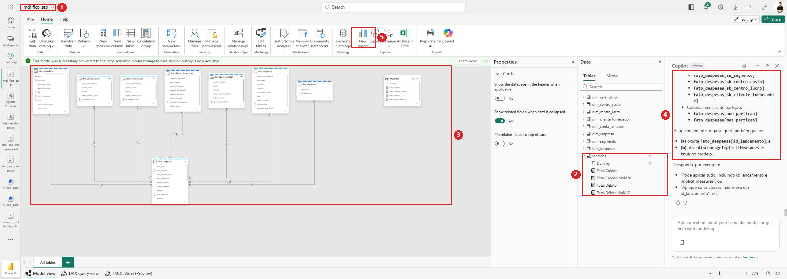
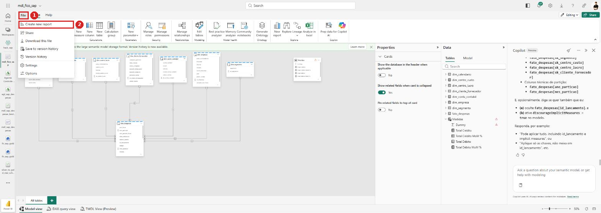
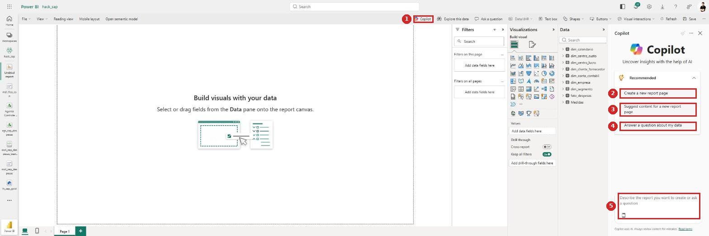
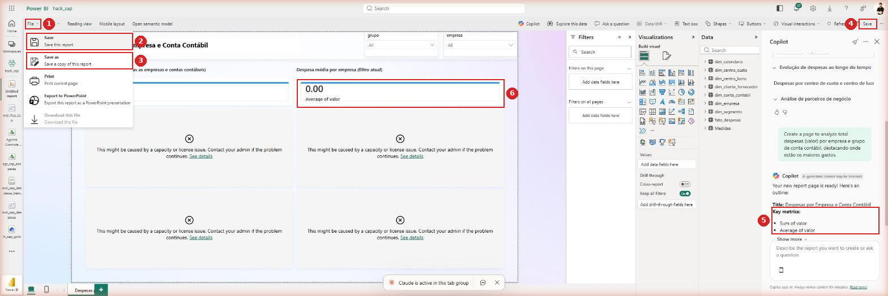

# Guia passo a passo — Hackathon SAP → Microsoft Fabric

## Lab 2 — Modelo Semântico a partir da Gold + relatórios com Copilot

Neste laboratório você constrói o **modelo semântico** sobre a camada Gold criada no Lab 1 e produz **medidas e um relatório** com apoio do **Copilot**.

> **Como ler os prints:** cada ação está marcada com um **círculo vermelho** e um **número** (1, 2, 3…) que corresponde à ordem do clique dentro daquele passo. **Caixas vermelhas** destacam campos a preencher ou resultados a conferir.

> 🚧 **Status dos prints.** 16 prints reais, capturados na construção do **`mdl_sap_despesas`** no workspace `hack_sap` — incluindo as três armadilhas flagradas ao vivo (coluna herdada, cardinalidade invertida e o conflito de formato de moeda). Os pontos marcados com **`[print pendente]`** são os das telas do Copilot em sequência e do relatório.

---

## Roteiro do laboratório


| Seção                             | O que você entrega                                                                 | Tempo   |
| ----------------------------------- | ----------------------------------------------------------------------------------- | ------- |
| **1** Criar o modelo                | `mdl_sap_despesas` em Direct Lake, com as 8 tabelas da Gold                         | ~10 min |
| **Parte 1** Construir com o Copilot | relacionamentos, tabela de data, tabela de medidas e 6 medidas — via**10 prompts** | ~25 min |
| **Parte 1b** Conferir               | as três conferências que pegam o que o Copilot erra em silêncio                  | ~15 min |
| **Parte 2** Relatório via Copilot  | relatório gerado por sugestão e publicado no workspace                            | ~20 min |

> 🎯 **A mudança de papel neste laboratório.** O modelo é construído **conversando**, não preenchendo formulários. O trabalho de vocês vira **revisão**: o Copilot acerta a maior parte, mas erra em silêncio — e a Parte 1b é onde esses erros aparecem.

**Checklist antes de começar** — se algum item falhar, resolva antes de seguir:

- [ ]  O `lh_sap_gold` tem as **8 tabelas** (`fato_despesas`, `dim_calendario` e 6 dimensões)
- [ ]  A `fato_despesas` tem linhas (deve ter ~500)
- [ ]  Você é **Admin/Member/Contributor** no workspace
- [ ]  A capacidade Fabric está **ativa** (se algum item não abre, é isso)
- [ ]  O ícone do **Copilot** aparece na barra lateral esquerda

---

## Pré-requisitos

- **Lab 1 concluído**: a camada Gold precisa existir e ter dados. Confira no `lh_sap_gold` as tabelas `fato_despesas`, `dim_calendario` e as seis dimensões.
- Papel de **Admin/Member/Contributor** no workspace.
- **Copilot habilitado**: exige capacidade **paga** (não Trial em alguns tenants) e o switch de tenant ligado em **Admin portal → Tenant settings → Copilot and Azure OpenAI Service**. Se o painel do Copilot não aparecer, é aqui que se resolve — não é problema do seu modelo.

### O modelo que veio da Gold

O notebook `silver_to_gold_star_schema` (Passo 11 do Lab 1) entrega um **esquema estrela**:


| Tabela                   | Papel                                                      | Chave primária                 |
| ------------------------ | ---------------------------------------------------------- | ------------------------------- |
| `fato_despesas`          | Fato — 1 linha por item de lançamento contábil (ACDOCA) | `id_lancamento` + as FKs `sk_*` |
| `dim_empresa`            | Dimensão                                                  | `sk_empresa`                    |
| `dim_conta_contabil`     | Dimensão                                                  | `sk_conta_contabil`             |
| `dim_segmento`           | Dimensão                                                  | `sk_segmento`                   |
| `dim_centro_custo`       | Dimensão                                                  | `sk_centro_custo`               |
| `dim_centro_lucro`       | Dimensão                                                  | `sk_centro_lucro`               |
| `dim_cliente_fornecedor` | Dimensão (papéis: Cliente/Fornecedor)                    | `sk_cliente_fornecedor`         |
| `dim_calendario`         | Dimensão de tempo                                         | `data_referencia`               |

```
                    dim_calendario
                          │  data_referencia
   dim_empresa ───┐       │       ┌─── dim_segmento
                  │       │       │
dim_conta_contabil├──►  fato_despesas  ◄──┤ dim_centro_custo
                  │    (504 linhas)    │
dim_centro_lucro ─┘       │       └─── dim_cliente_fornecedor
                          │
                    todas as ligações: *:1, filtro Único
```

> 🔑 **Duas heranças do Lab 1 que mudam o que você faz aqui:**
>
> 1. **Toda dimensão tem uma linha com `SK = -1`** (o *membro desconhecido*, com textos `"N/A"`). Na fato, nenhuma FK é nula. Consequência prática: os relacionamentos **não vão acusar valores em branco**, e um total "sem categoria" aparece rotulado como `N/A` em vez de vazio.
> 2. **A `data_referencia` tem sempre dia `01`.** A granularidade real é **mensal**. Não crie visuais nem medidas diárias — e explique isso ao Copilot, senão ele sugere métricas por dia que não fazem sentido.

---

## 1. Criar o Modelo Semântico

### 1.1 — Criar o modelo a partir do lakehouse

**1** Abra o **`lh_sap_gold`** e confirme em **Tables › dbo** que as 8 tabelas estão lá. **2** Na faixa **Home**, clique em **New semantic model**.


No diálogo *New semantic model*: **1** em **Direct Lake semantic model name**, digite `mdl_sap_despesas`. **2** Confirme o **Workspace** de destino. **3** Marque **Select all** para pegar as 8 tabelas. **4** Clique em **Confirm**.


> ℹ️ O modelo nasce em **Direct Lake**: consulta os arquivos Delta da Gold direto, sem importar nem agendar refresh. Se alguma tabela não aparecer na lista, ela não é Delta ou está fora do schema `dbo`.
>
> ℹ️ O aviso *"SQL views cannot be selected for Direct Lake on OneLake"* no diálogo é esperado — a Gold só tem tabelas Delta, nenhuma view.
>
> ⚠️ **Não inclua** as tabelas de controle de Data Quality (`ctrl_dq_nulos`, `ctrl_dq_resumo`) — elas vivem na Silver e não fazem parte do modelo analítico. Se aparecerem, desmarque.
>
> ⏱️ Depois do **Confirm** o Fabric mostra *"Please wait…"* por até um minuto. Pode acontecer de o editor abrir com *"Sorry, we couldn't find that semantic model"* — é uma corrida entre a criação e a abertura, **não** um erro real. Recarregue a página e o modelo aparece.

O editor abre no **Model view** com as 8 tabelas. **1** No painel **Data**, à direita, estão as tabelas do modelo. **2** Na faixa, o grupo **Relationships** traz o **Manage relationships**, usado no passo seguinte.


---

## Parte 1 — Construir o modelo com o Copilot

A partir daqui o modelo é construído **conversando com o Copilot**, não clicando campo a campo. São **10 prompts**, na ordem. O papel de vocês muda: em vez de preencher formulários, **revisar o que o Copilot fez**.

### Como abrir o Copilot

Na faixa **Home** do editor do modelo, grupo **Copilot**. O painel abre à direita, com uma caixa de texto: *"Ask a question about your semantic model, or get help with modeling"*. Escreva **em português** — ele entende e responde em português.

### A tela de consentimento, no primeiro prompt

Na primeira solicitação que **altera** o modelo, o Copilot pede autorização:


**1** *"Allow Copilot to make changes during this chat session?"* **2** O aviso de que alterações podem afetar relatórios e itens dependentes, com link **View impact**. **3** O alerta de que, para mudar a decisão depois, é preciso **fechar e reabrir** o painel. **4** Os botões **Allow** e **Cancel**.

> 🔐 **Pare e leia antes do Allow.** Você concede ao Copilot permissão de **escrita no modelo** por toda a sessão de chat. Num modelo de laboratório, recém-criado e sem relatórios pendurados, o risco é baixo. Num modelo em produção, clique em **View impact** primeiro.
>
> ⚠️ **A decisão é da sessão inteira, e é grudada.** Para revogar, feche e reabra o painel do Copilot.

### Os 10 prompts

Rode um por vez e confira o resultado antes de seguir. A coluna da direita é o que você valida.


| #  | Prompt                                                                                                        | O que conferir                                                                   |
| -- | ------------------------------------------------------------------------------------------------------------- | -------------------------------------------------------------------------------- |
| 1  | *Crie os relacionamentos em fato e dimensões*                                                                | **7 relacionamentos**, todos `Active`, cada um ligando a SK certa dos dois lados |
| 2  | *Marque a tabela dim_calendario com a tabela de data*                                                         | O**`Validated successfully`** verde, na coluna `data_referencia`                 |
| 3  | *Crie uma tabela calculada com nome de Medidas*                                                               | A tabela aparece no painel; oculte a coluna andaime que vier com ela             |
| 4  | *Crie uma medida com total valor*                                                                             | `SUM` sobre `fato_despesas[valor]`                                               |
| 5  | *Crie a medida total credito com base na coluna valor, filtrado pela coluna debito_credito igual a "credito"* | `CALCULATE` com o filtro em `debito_credito`                                     |
| 6  | *Crie a medida total debito com base na coluna valor, filtrado pela coluna debito_credito igual a "debito"*   | Mesmo padrão do anterior, com`"debito"`                                         |
| 7  | *Crie variação % MoM para total credito*                                                                   | Usa a`dim_calendario` e `DIVIDE`                                                 |
| 8  | *Crie variação % MoM para total debito*                                                                     | Formatada como**percentual**                                                     |
| 9  | *Crie medidas de total e variação de Mês sobre Mês*                                                       | Complementa o conjunto; confira se não duplicou o que já existe                |
| 10 | *Otimize o modelo e Oculte colunas desnecessárias*                                                           | As`sk_*` e as chaves técnicas ficam **ocultas**                                 |

> 🔑 **Os prompts 5 e 6 são o coração deste modelo.** A coluna `valor` da `fato_despesas` guarda **débitos e créditos juntos**, e o ACDOCA registra as duas pontas de cada lançamento. Um `SUM(valor)` cru **se anula perto de zero** — foi exatamente o que aconteceu no Lab 3, onde o agente respondeu `R$ 0,00`. As medidas separadas de débito e crédito são o que torna o modelo utilizável.
>
> 💡 **Por isso o prompt 4 vem antes.** Ele cria o "total valor" bruto, que serve de referência e deixa visível o problema: comparando o total valor com débito + crédito, a diferença fica óbvia para a turma.
>
> ⚠️ **O prompt 9 pode duplicar.** Ele é genérico ("medidas de total e variação") e pode recriar algo que os prompts 4 a 8 já fizeram. Confira a lista de medidas depois e apague repetição.

`[print pendente]`

### Como o Copilot responde

Cada resposta traz o **resumo das ações**, o **DAX gerado** e a **formatação aplicada**:


**1** O tempo de raciocínio — não é instantâneo. **2** O nome da medida criada. **3** A **expressão DAX**. **4** A formatação.

Exemplo real desta execução:

```dax
Total Despesas = SUM('fato_despesas'[valor])
```

com o format string `R$ #,0.00;R$ -#,0.00;R$ #,0.00`.

E um exemplo do DAX que ele escreve para variação — vale reparar na qualidade:

```dax
Var % Total Despesas vs Ano Anterior =
VAR _Atual = [Total Despesas]
VAR _Anterior = [Total Despesas Ano Anterior]
RETURN
    DIVIDE ( _Atual - _Anterior, _Anterior )
```

> ✅ **Isso é DAX idiomático.** `VAR` para nomear as pontas, referência por `[Nome]` em vez de recalcular, e `DIVIDE` em vez de `/`. Quando o prompt é específico, o Copilot entrega código bom.
>
> 💡 **O Copilot resolve o `R$` que a interface não resolve.** Ele escreve **format string customizado** com `R$` e os três ramos (positivo; negativo; zero) — algo que o painel *Properties* não permite digitar. Se quiser `R$` com 2 decimais fixos, peça a ele.
>
> 📋 **Leia o resumo das ações.** Ele diz a qual modelo se conectou e que validou tabela e coluna antes de criar. É por aí que você confirma que ele mexeu no modelo certo — o `hack_sap` tem **dois** modelos semânticos.

---

## Parte 1 — Conferir o que o Copilot fez

Esta é a parte que não se delega. O Copilot acerta muito, mas erra em silêncio — e as três conferências abaixo pegam os erros que aparecem na prática.

### Conferência 1 — Os 7 relacionamentos

Abra **Manage relationships** (faixa **Home** → grupo *Relationships*):


**1** A coluna *From* mostra sempre a `fato_despesas` — o Fabric **normaliza** o sentido na listagem. **2** *To* traz a dimensão. **3** O ícone de cardinalidade, com `*` na fato e `1` na dimensão. **4** *Status* = **Active** em todas.

Confira linha por linha:


| From (fato)                             | To (dimensão)                                   |
| --------------------------------------- | ------------------------------------------------ |
| `fato_despesas (data_referencia)`       | `dim_calendario (data_referencia)`               |
| `fato_despesas (sk_centro_custo)`       | `dim_centro_custo (sk_centro_custo)`             |
| `fato_despesas (sk_centro_lucro)`       | `dim_centro_lucro (sk_centro_lucro)`             |
| `fato_despesas (sk_cliente_fornecedor)` | `dim_cliente_fornecedor (sk_cliente_fornecedor)` |
| `fato_despesas (sk_conta_contabil)`     | `dim_conta_contabil (sk_conta_contabil)`         |
| `fato_despesas (sk_empresa)`            | `dim_empresa (sk_empresa)`                       |
| `fato_despesas (sk_segmento)`           | `dim_segmento (sk_segmento)`                     |

> 🔎 **O teste rápido:** numa linha errada, o nome dentro dos parênteses **não bate** entre as duas colunas — por exemplo `fato_despesas (sk_centro_lucro)` apontando para `dim_centro_custo`. Bata o olho nas 7 antes de seguir.
>
> ⚠️ **A `dim_calendario` é a exceção ao padrão.** Ela liga por **`data_referencia`**, não por SK. A tabela tem uma coluna `sk_data`, mas a `fato_despesas` não carrega — se procurar SK ali, não acha.
>
> 🚨 **Confira a cardinalidade também, não só as colunas.** Em Direct Lake o Fabric **não valida** cardinalidade: ele *deduz* pela contagem de linhas. Quando a dimensão tem mais linhas que a fato — o caso da `dim_conta_contabil`, que vem da *view* de textos do SAP — o palpite **se inverte**. A regra única: o lado **`1`** é sempre a dimensão.

Se precisar corrigir algum, abra pelo **⋯ → Edit**. É esta tela:


**1** e **2** são a **mesma coluna** nos dois lados. **3** Cardinalidade `1:*` com o `1` na dimensão. **4** Só então **Save**.

E o erro que essa tela produz com facilidade:


**1** *From* é `dim_centro_custo[sk_centro_custo]`, correto. **2** Mas na *To* continuou selecionado o `sk_centro_lucro`, **herdado do relacionamento anterior**. **3** O `sk_centro_custo` está ali do lado, sem seleção.

> 🚨 **Ao trocar a tabela, a coluna da outra ponta fica presa na anterior.** Reproduzido em **2 de 4** relacionamentos feitos à mão. Salvar assim cria uma ligação entre centro de custo e centro de lucro — aceita sem nenhum aviso, e todo relatório sai errado. Os nomes aparecem **truncados** (`sk_centro_luc…` serve para lucro e custo), então passe o mouse para ver o nome completo.

E a cardinalidade invertida, flagrada na `dim_conta_contabil`:


**1** e **2** com as colunas certas, mas **3** o Cardinality veio **`Many to one (*:1)`** — invertido, com a dimensão na *From table*. **4** O aviso do Fabric explicando que a cardinalidade é deduzida pela contagem de linhas.

### Conferência 2 — A tabela de data

Selecione a **`dim_calendario`** e confirme a marcação. Se precisar refazer: **⋯** no card → **Mark as date table**.


No painel: **1** o botão **Mark as a date table** em **On**. **2** **Choose a date column** = **`data_referencia`**. **3** O **`Validated successfully`** em verde. **4** **Save**.


> ✅ **O `Validated successfully` é o que importa.** O Fabric checa nulos, datas repetidas e lacunas no período. Uma recusa indica problema na `dim_calendario` gerada no Lab 1.
>
> ⚠️ **Isso remove as hierarquias de data automáticas** do Power BI. Num modelo novo não há nada a perder — e é por isso que se faz **antes** de criar visuais.
>
> 🚨 **A `dim_calendario` começa em 01/01/2026.** Não existe 2025 no modelo. Qualquer medida de ano anterior vai voltar **vazia** — e isso é ausência de base de comparação, não zero. As variações **MoM** dos prompts 7 a 9 funcionam; as **YoY**, não.


## O modelo depois dos 10 prompts

Antes de partir para o relatório, este é o resultado esperado:



**1** O modelo — nesta execução, **`mdl_fico_sap`**. **2** A tabela **`Medidas`** no painel Data, com **`Total Credito`**, **`Total Crédito MoM %`**, **`Total Debito`** e **`Total Debito MoM %`** — exatamente o que os prompts 3 a 9 produzem. **3** O diagrama com as tabelas ligadas à fato. **4** A resposta do Copilot ao prompt 10, listando as colunas técnicas a ocultar. **5** O **New report**, que abre a Parte 2.

> ✅ **As quatro medidas são o entregável desta parte.** `Total Debito` e `Total Credito` separam as duas naturezas do lançamento; as duas de `MoM %` dão a variação mês a mês. É esse conjunto que o roteiro de 11 prompts do Lab 3 exercita.
>
> 💡 **Repare no `Dummy` na tabela `Medidas`.** É a coluna andaime da tabela calculada, com um triângulo de aviso ao lado. Oculte-a (**Is hidden = Yes**) — ela existe só para a tabela poder existir.
>
> ℹ️ **O prompt 10 devolve uma lista, não uma ação pronta.** Na resposta capturada, o Copilot listou as `sk_*` e as colunas de partição (`ano_particao`, `mes_particao`) e ofereceu duas opções: ocultar também o `id_lancamento`, ou ativar `discourageImplicitMeasures = true` no modelo. Ou seja, ele **propõe** e espera sua confirmação — leia antes de responder "pode aplicar tudo".
>
> ⚠️ **Confira o nome do seu modelo.** Este guia usa `mdl_fico_sap` nos prints; se você nomeou diferente, os prompts funcionam igual — só o nome na tela muda.

---

## Parte 2 — Relatório via Copilot

Com o modelo pronto e conferido, o relatório sai em poucos cliques.

**1** No editor do modelo, abra o menu **File**. **2** Clique em **Create new report**.



> 💡 **Dois caminhos para o mesmo lugar.** Existe um **New report** na faixa **Home** (grupo *Explore*) e o **Create new report** no menu **File**. Levam ao mesmo editor. O do menu File é mais confiável quando o botão da faixa não responde.
>
> ℹ️ **Abre numa aba nova.** O editor do modelo fica aberto atrás, o que é útil: se faltar uma medida, você volta, cria e recarrega o relatório.

O editor de relatório abre com o **Copilot já aberto** à direita:



**1** O botão **Copilot** na faixa, para reabrir o painel se você fechar. **2** **Create a new report page** — monta uma página inteira. **3** **Suggest content for a new report page** — é o *Suggest a New Content*, o caminho deste laboratório. **4** **Answer a question about my data** — responde sem criar visual. **5** A caixa *"Describe the report you want to create or ask a question"*.

Clique em **Suggest content for a new report page**, escolha uma das sugestões e pressione **Create**.


### Salvar o dashboard depois de criado

O relatório gerado pelo Copilot **não está salvo**. **1** Abra o menu **File**. **2** **Save — Save this report**, para salvar no lugar. **3** Ou **Save as — Save a copy of this report**, para guardar uma versão e continuar experimentando na outra. **4** Há também o botão **Save** direto na faixa, no canto superior direito.



O menu traz ainda **Print** (imprime a página atual) e **Export to PowerPoint** — este último útil para levar o resultado do laboratório a uma apresentação.

> ⚠️ **Salve antes de fechar a aba.** O relatório aparece como **`Untitled report`** na barra lateral até o primeiro Save. Fechar a aba antes disso perde tudo o que o Copilot gerou.
>
> 💡 **Use `Save as` para versionar.** Antes de mexer no rascunho do Copilot, salve uma cópia com o nome original. Se os ajustes piorarem o resultado, você tem de onde voltar.


## Dicas e problemas comuns

- **O painel do Copilot não aparece:** capacidade sem Copilot ou switch de tenant desligado (**Admin portal → Copilot and Azure OpenAI Service**). Não é problema do modelo.
- **Medida de ano anterior em branco:** `dim_calendario` não marcada como tabela de data, ou o calendário não cobre o período da fato.
- **Meses fora de ordem:** falta *Sort by column* em `nome_mes`.
- **Totais que não batem entre visuais:** quase sempre filtro cruzado **Ambas** em algum relacionamento. Volte todos para **Única**.
- **Uma categoria aparece como `N/A` com valor alto:** é o membro desconhecido (`SK = -1`) — muitos lançamentos sem correspondência na dimensão. Investigue no Lab 1, seção "checagem final" do Passo 11.
- **Total de despesas parece dobrado:** verifique se o Lab 1 filtrou `Ledger = "0L"`. Sem esse filtro, o ACDOCA traz o mesmo lançamento em ledgers paralelos.
- **Soma de anos no visual:** a coluna `ano` está com *Summarize* ativo. Desmarque.
- **O Copilot gera visuais com `Sum of valor` e o total dá zero:** ele usou **medida implícita** sobre a coluna crua, e débitos e créditos se anulam. Ative **`discourageImplicitMeasures = true`** no modelo (opção que o prompt 10 oferece) e gere o relatório de novo.
- **Visual com *"This might be caused by a capacity or license issue"*:** é capacidade ou licença, não modelagem. Confira o estado da capacidade Fabric.
- **O item não abre / "capacity is currently not available":** a capacidade Fabric está pausada. Nada do laboratório funciona até ela voltar.
- **"Error Applying Change" ao mudar uma propriedade:** a capacidade caiu no meio da edição. A alteração **não** foi salva — o painel continua mostrando o valor antigo. Espere a capacidade voltar e refaça. Confira também as alterações imediatamente anteriores, que podem ter ficado pela metade.
- **"Sorry, we couldn't find that semantic model" logo depois de criar:** corrida entre criação e abertura. Recarregue a página.
- **O diálogo *New relationship* fecha sozinho:** aconteceu de forma reprodutível na montagem deste guia. Feche o *Manage relationships*, reabra e refaça o relacionamento sem trocar de aba nem redimensionar a janela no meio.
- **Coluna `sk_*` não aparece na grade do *New relationship*:** role a grade na horizontal — as colunas seguem a ordem alfabética da tabela, e as `sk_*` ficam no fim.
- **Todas as empresas mostram o mesmo total:** o relacionamento não está filtrando. Confira se ele existe, está **Active** e se a direção é da dimensão para a fato.
- **Um total sai muito maior que o do SQL:** cardinalidade invertida em algum relacionamento (`*:1` onde devia ser `1:*`). O lado `1` é sempre a dimensão.

---

## Glossário rápido


| Termo                      | O que é, em uma linha                                                                                         |
| -------------------------- | -------------------------------------------------------------------------------------------------------------- |
| **Modelo semântico**      | A camada que traduz tabelas em conceitos de negócio: relacionamentos, medidas, hierarquias e nomes amigáveis |
| **Direct Lake**            | Modo em que o modelo lê os arquivos Delta do lakehouse direto, sem importar dados nem agendar refresh         |
| **Surrogate key (SK)**     | Chave inteira criada pelo ETL para ligar fato e dimensão, em vez do código do sistema de origem              |
| **Membro desconhecido**    | Linha artificial na dimensão (`SK = -1`, textos `"N/A"`) que recebe os lançamentos sem correspondência      |
| **Cardinalidade `*:1`**    | Muitos para um: muitas linhas da fato apontam para uma linha da dimensão                                      |
| **Direção do filtro**    | Por onde o filtro se propaga.*Única* = só da dimensão para a fato                                           |
| **Medida**                 | Cálculo em DAX avaliado no contexto do visual (ex. soma que respeita os filtros aplicados)                    |
| **Display folder**         | Pasta que organiza medidas e colunas no painel de campos                                                       |
| **Role-playing dimension** | Uma dimensão usada em mais de um papel (ex. o mesmo parceiro como Cliente e como Fornecedor)                  |

*Documento gerado para a equipe do hackathon — Lab 2.*
