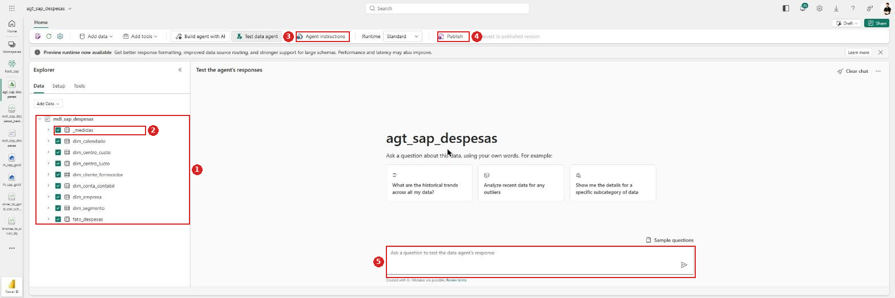
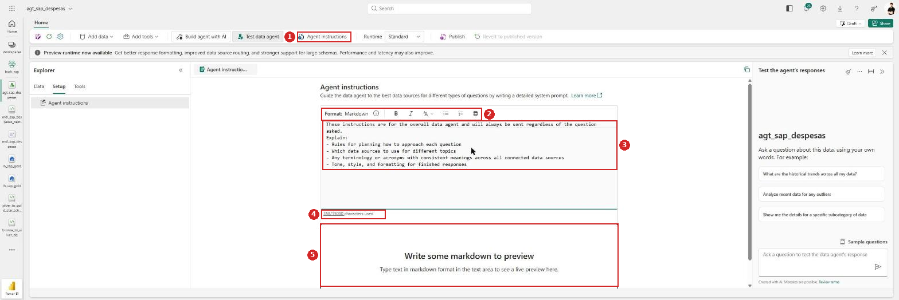
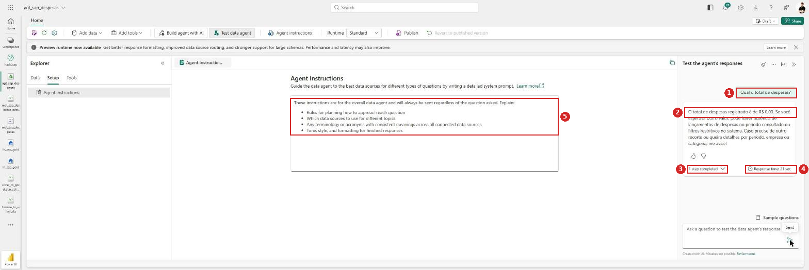

# Guia passo a passo — Hackathon SAP → Microsoft Fabric

## Lab 3 — Agente de Dados sobre o modelo semântico, publicado no Teams

Neste laboratório você cria um **Data Agent** (Agente de Dados) sobre o modelo semântico do Lab 2 e o publica para uso no **Microsoft Teams**, onde a equipe pergunta em linguagem natural e recebe respostas apoiadas nos dados do `lh_sap_gold`.

> **Como ler os prints:** cada ação está marcada com um **círculo vermelho** e um **número** (1, 2, 3…) que corresponde à ordem do clique dentro daquele passo. **Caixas vermelhas** destacam campos a preencher ou resultados a conferir.

> 🚧 **Status dos prints.** As seções **1.1 a 1.3** têm prints reais, capturados no `hack_sap`. A **seção 1 está completa**; da **seção 2.1 em diante** os pontos estão marcados com **`[print pendente]`** — o passo a passo em texto está completo.

---

## Roteiro do laboratório


| Seção                         | O que você entrega                                                                 | Tempo   |
| ------------------------------- | ----------------------------------------------------------------------------------- | ------- |
| **1** Criar o agente            | `agt_sap_despesas` ligado ao `mdl_sap_despesas`, com tabelas e medidas selecionadas | ~15 min |
| **2** Instruções              | escopo, exemplos de perguntas e limites de uso                                      | ~20 min |
| **3** Publicar no Microsoft 365 | agente no catálogo do M365 Copilot, com permissões definidas                      | ~15 min |
| **4** Usar no Teams             | app no canal da equipe, com perguntas validadas                                     | ~15 min |

**Checklist antes de começar:**

- [ ]  **Lab 2 concluído**: o `mdl_sap_despesas` existe, com os 7 relacionamentos e as 5 medidas
- [ ]  A `dim_calendario` está marcada como **tabela de data**
- [ ]  Capacidade Fabric **ativa**
- [ ]  Papel de **Admin/Member/Contributor** no `hack_sap`
- [ ]  Para as seções 3 e 4: permissão para **publicar apps** no tenant e acesso ao **Teams** da equipe

> 🔐 **Três telas deste laboratório pedem decisão humana** e não devem ser clicadas no automático: a autorização do agente para consultar os dados, a **publicação no catálogo do Microsoft 365** e a **instalação do app no Teams**. Todas expõem o agente a outras pessoas — leia o que cada uma concede antes de confirmar.

---

## Por que apontar para o modelo semântico, e não para o lakehouse

O Data Agent aceita **lakehouse**, **warehouse**, **KQL database** e **semantic model** como fonte. Aqui usamos o **modelo semântico** do Lab 2, e a diferença é grande:


| Fonte                                  | O que o agente enxerga                                                                                                              |
| -------------------------------------- | ----------------------------------------------------------------------------------------------------------------------------------- |
| `lh_sap_gold` (lakehouse)              | tabelas cruas. Para "qual o total de despesas?" ele precisa**inventar** a agregação, somando a coluna `valor` por conta própria  |
| `mdl_sap_despesas` (modelo semântico) | tabelas**mais** as medidas. Ele usa a medida **`Total Despesas`** que você validou, com a formatação em `R$` e a lógica correta |

Ou seja: a curadoria que você fez no Lab 2 — relacionamentos, medidas, nomes amigáveis, sinônimos — é justamente o que faz o agente responder certo. **Um modelo mal refinado gera um agente que erra com confiança.**

---

## 1. Criar o Agente de Dados

### 1.1 — Encontrar o item Data agent

No workspace `hack_sap`, abra a pasta **`005 Agente`** e clique em **+ New item** de dentro dela — assim o agente já nasce organizado, sem precisar mover depois.

No painel *New item*: **1** troque para a aba **All items** (o card **não** aparece em *Favorites*). **2** Role até a categoria **Analyze and train data**. **3** Clique no card **Data agent**.


> ⚠️ **É aqui que a maioria se perde.** O card fica fora da aba *Favorites*, numa categoria bem abaixo na lista — é preciso rolar bastante. O campo *Filter by keyword* do painel existe, mas na prática é mais rápido rolar até **Analyze and train data**, que reúne *Data agent*, *Environment*, *Experiment*, *Graph model*, *ML model* e *Neo4j Graph Dataset*.
>
> ℹ️ A descrição do card confirma o escopo: *"Build a generative AI agent that understands your data and can answer complex questions in a variety of conversational interfaces."* O "variety of conversational interfaces" é o que viabiliza as seções 3 e 4.
>
> 🔍 **Se o card não existir**, o Data agent não está habilitado no tenant. Verifique em **Admin portal → Tenant settings** as chaves de Copilot/AI e o SKU da capacidade. Sem ele, o Lab 3 não sai do lugar — e é problema de administração, não do seu workspace.

### 1.2 — Nomear e criar

Abre o diálogo **Create data agent** com um único campo. **1** Digite o nome em **Input a data agent name**. **2** Clique em **Create** — ele só habilita depois que há texto no campo.


| Campo    | Valor              |
| -------- | ------------------ |
| **Nome** | `agt_sap_despesas` |

> 💡 **Pense no nome duas vezes.** Diferente dos outros itens (`lh_`, `ppl_`, `nb_`, `mdl_`), o nome do agente **aparece para o usuário final** no Teams e no catálogo do Microsoft 365. Um `agt_sap_despesas` é coerente com a convenção técnica; um **`Agente Despesas SAP`** é o que a equipe vai conseguir chamar numa conversa. Se o agente vai ser usado por gente de negócio, prefira o segundo.
>
> ⚠️ Se você clicou **New item** na raiz do workspace em vez de dentro da pasta, o agente nasce na raiz. Corrija depois com **⋯ → Move to → 005 Agente** na lista do workspace.

### 1.3 — Conhecer o editor do agente

Depois do **Create**, o editor abre em **Build your data agent**. Vale se orientar antes de clicar:


**1** O nome do agente no topo. **2** O painel **Explorer**, com as abas **Data**, **Setup** e **Tools** — ainda em *"No data added"*. **3** Os três cartões de partida: **Add a data source**, **Extend functionality** e **Enable AI Search**. **4** O botão **Agent instructions**, que fica **desabilitado** até existir fonte de dados. **5** O selo **Draft** e o **Share**, no canto superior direito.


| Elemento                             | Para quê                                                   |
| ------------------------------------ | ----------------------------------------------------------- |
| **Add data** / **Add a data source** | escolher a fonte — é o próximo passo                     |
| **Add tools**                        | funções e ferramentas extras (não necessário neste lab) |
| **Build agent with AI**              | assistente que monta o agente conversando                   |
| **Test data agent**                  | painel de conversa para testar antes de publicar            |
| **Agent instructions**               | o prompt de sistema da seção 2                            |
| **Runtime**                          | `Standard` ou `Preview`                                     |
| **Draft**                            | estado de publicação — vira publicado na seção 3       |

> ⚠️ **Ordem obrigatória: fonte de dados antes das instruções.** O botão **Agent instructions** aparece esmaecido enquanto o Explorer diz *"No data added"*. Não dá para escrever as instruções primeiro.
>
> 💡 **Sobre o Runtime:** o Fabric oferece um **Preview runtime** com a promessa de *"better response formatting, improved data source routing, and stronger support for large schemas"*. Para um modelo pequeno como o nosso o `Standard` dá conta; se as respostas vierem mal formatadas ou o agente errar a fonte, experimente o `Preview`.
>
> ℹ️ **`Draft` é o estado inicial e importa.** Enquanto estiver como *Draft*, o agente existe só para você. A seção 3 é o que o torna consumível pelos outros.

### 1.4 — Ligar ao modelo semântico

Clique em **Add a data source** (ou **Add data** na faixa). Abre o seletor **Add a data source**, que é o **OneLake catalog**: **1** use a busca para filtrar (digitar `mdl` já basta). **2** Selecione a linha do **`mdl_sap_despesas`**, com *Type* = **Semantic model**. **3** Clique em **Add**.


**4** Repare que o seletor é o **OneLake catalog**, não uma lista do workspace: ele varre todos os itens a que você tem acesso, com as abas **All**, **My data**, **Endorsed in your org** e **Favorites**, além de filtro por **domínio**.


| Coluna        | O que conferir                                                                    |
| ------------- | --------------------------------------------------------------------------------- |
| **Name**      | `mdl_sap_despesas` — o modelo do Lab 2, não o `Modelo Despesas` que já existia |
| **Type**      | **Semantic model** (é isso que garante o acesso às medidas)                     |
| **Owner**     | seu usuário                                                                      |
| **Refreshed** | data/hora da última atualização do modelo                                      |

> ⚠️ **Cuidado ao escolher.** O `hack_sap` tem **dois** modelos semânticos: o **`mdl_sap_despesas`** do Lab 2 e um **`Modelo Despesas`** anterior, de outra pessoa. Filtrar por `mdl` resolve, porque só o do Lab 2 tem esse prefixo. Escolher o errado faz o agente responder sobre um modelo que você não curou.
>
> 💡 **A coluna `Type` é a sua confirmação.** Como o catálogo mostra lakehouses, warehouses e modelos juntos, é o `Type = Semantic model` que garante que você está pegando a camada com as medidas, e não o lakehouse cru. Se aparecer `Lakehouse`, é o `lh_sap_gold` — não é o que queremos aqui (veja a comparação no início deste guia).
>
> ℹ️ Dá para selecionar **mais de uma fonte**. Para este laboratório, só o modelo semântico basta.

### 1.5 — Selecionar tabelas e medidas

O agente só consulta o que você liberar. Seleção recomendada:


| Objeto                                                                                                                | Incluir? | Por quê                                                   |
| --------------------------------------------------------------------------------------------------------------------- | -------- | ---------------------------------------------------------- |
| `fato_despesas`                                                                                                       | ✅       | é a fato; sem ela não há o que somar                    |
| `dim_calendario`                                                                                                      | ✅       | habilita perguntas por período                            |
| `dim_empresa`, `dim_centro_custo`, `dim_centro_lucro`, `dim_conta_contabil`, `dim_segmento`, `dim_cliente_fornecedor` | ✅       | são os cortes de análise                                 |
| `_medidas` (as 5 medidas)                                                                                             | ✅       | **o mais importante** — é o que garante o cálculo certo |
| Colunas`sk_*`                                                                                                         | ❌       | chaves técnicas; já ocultas no Lab 2                     |
| `id_lancamento`, `ano_particao`                                                                                       | ❌       | chave técnica e coluna de partição                      |

Depois do **Add**, o Explorer passa a mostrar a árvore do modelo com as tabelas **marcadas**:



**1** A aba **Data** do Explorer, com o `mdl_sap_despesas` e as **9 tabelas** marcadas por padrão. **2** A **`_medidas`** entre elas — é a que carrega as cinco medidas do Lab 2. **3** O **Agent instructions** agora está **habilitado** (estava esmaecido antes de haver fonte). **4** Surgiram **Publish** e **Revert to published version** na faixa. **5** O painel **Test the agent's responses**, com a caixa de pergunta e três cartões de exemplo.

> ✅ **Tudo vem marcado por padrão.** O Fabric libera as 9 tabelas automaticamente. Para este laboratório isso está bom — inclusive porque a `_medidas` já entra junto. Se quisesse restringir, é aqui que se desmarca; use o chevron **›** de cada tabela para descer ao nível de coluna.
>
> 💡 **Confirme a `_medidas` antes de seguir.** É o item que faz o agente responder com `Total Despesas` em vez de tentar somar a coluna `valor` na mão. Se ela estiver desmarcada, o agente perde exatamente a curadoria do Lab 2.
>
> ℹ️ **Dois botões novos, um deles útil desde já.** O **Revert to published version** permite voltar ao último estado publicado se você estragar a configuração. Como ainda estamos em `Draft` e nada foi publicado, ele não tem efeito agora — mas depois da seção 3 é a sua rede de segurança.
>
> 🎯 **O painel de teste já funciona.** Não é preciso publicar para conversar com o agente: a caixa *"Ask a question to test the data agent's response"* responde no estado `Draft`. É o que usamos na seção 2.5.

> 💡 **Menos é mais.** Cada tabela e coluna liberada aumenta o espaço de busca do agente e a chance de ele escolher o caminho errado. Libere o que responde às perguntas que você espera, e nada além.
>
> ✅ **O trabalho do Lab 2 paga aqui.** Se você ocultou as `sk_*`, renomeou para nomes de negócio e escreveu sinônimos e descrições, o agente já herda tudo isso — não precisa refazer.

---

## 2. Criar as instruções do agente

As instruções são o **prompt de sistema** do agente: definem o que ele é, o que responde e onde para. É a parte que mais afeta a qualidade das respostas.

### 2.0 — O editor de instruções

**1** Clique em **Agent instructions** na faixa. O Explorer muda para a aba **Setup**, com o item *Agent instructions*.



**2** A barra de formatação, com **Format: Markdown** e botões de negrito, itálico, listas e tabela. **3** A caixa de texto, que já vem com um **template de exemplo**. **4** O contador — **`358/15000 characters used`**. **5** O painel de **preview** abaixo: *"Write some markdown to preview"*.


| Elemento    | Detalhe                                                                           |
| ----------- | --------------------------------------------------------------------------------- |
| **Formato** | **Markdown** — dá para usar títulos, listas e negrito para organizar as regras |
| **Limite**  | **15.000 caracteres**, folgado para o que precisamos                              |
| **Preview** | renderiza ao vivo o markdown digitado, abaixo da caixa                            |

> ⚠️ **A caixa não está vazia: vem com um template de 358 caracteres.** O texto inicial (*"These instructions are for the overall data agent and will always be sent regardless of the question asked. Explain: Rules for planning… Which data sources… Any terminology or acronyms… Tone, style, and formatting…"*) é um **roteiro do que escrever**, não instrução válida. **Apague antes de colar o seu** — se você só adicionar por cima, o agente recebe as duas coisas misturadas.
>
> 💡 **O template é um bom checklist, aliás.** Os quatro tópicos que ele sugere — regras de planejamento, qual fonte usar por assunto, terminologia e acrônimos, e tom/formatação — são exatamente as lacunas que costumam sobrar. Vale reler depois de escrever as suas instruções e conferir se cobriu os quatro.
>
> ℹ️ **As instruções valem para toda pergunta.** O próprio texto do Fabric avisa: *"will always be sent regardless of the question asked"*. Ou seja, elas entram em todo prompt — o que reforça manter tudo enxuto e sem contradição.

### 2.1 — Propósito e escopo

Copie e cole esse texto nas instrucoes:

```
# Agente Financeiro de Despesas

## Objetivo

Você é um especialista financeiro responsável por responder perguntas relacionadas a despesas corporativas, análises contábeis, débitos, créditos, centros de custo, centros de lucro, clientes, fornecedores, segmentos e desempenho financeiro.

Seu objetivo é permitir que usuários obtenham insights financeiros utilizando linguagem natural, sempre retornando respostas claras, objetivas e orientadas à tomada de decisão.

---

## Fonte de Dados

### Prioridade 1

- Modelo Semântico Financeiro de Despesas

---

## Medidas Financeiras Oficiais

Utilize sempre as medidas oficiais existentes no modelo semântico.

### Medidas Principais

- Total Débito
- Total Crédito

### Medidas de Tendência

Para análises temporais e variações utilize:

- Total Débito MoM %
- Total Crédito MoM %

### Regras de Utilização

- Quando o usuário perguntar sobre gastos, despesas, desembolsos ou pagamentos, utilize prioritariamente a medida **Total Débito**.
- Quando o usuário perguntar sobre créditos ou movimentações credoras, utilize prioritariamente a medida **Total Crédito**.
- Quando o usuário solicitar crescimento, redução, evolução, tendência ou comparação temporal, utilize as medidas **Total Débito MoM %** e **Total Crédito MoM %**.
- Sempre apresente o valor absoluto juntamente com a variação percentual quando disponível.
- Destaque os principais fatores que contribuíram para aumentos ou reduções.
- Nunca recrie cálculos que já existam como medidas no modelo semântico.

---

## Terminologia de Negócio

### Despesas

Valores financeiros registrados na tabela fato_despesas.

### Conta Contábil

Classificação utilizada para registrar movimentações financeiras.

### Centro de Custo

Unidade organizacional responsável pelo consumo dos recursos.

### Centro de Lucro

Unidade organizacional responsável pela geração de resultados.

### Cliente / Fornecedor

Representados por uma única dimensão:


dim_cliente_fornecedor


Esta dimensão contém clientes, fornecedores ou entidades que exercem ambos os papéis.

### Ledger

Livro contábil utilizado para registro das movimentações financeiras.

### Empresa

Entidade legal responsável pelo lançamento financeiro.

### Plano de Contas

Estrutura contábil utilizada para classificação das movimentações.

### Área de Controladoria

Agrupamento gerencial utilizado para análises financeiras.

### Ano Fiscal

Período fiscal adotado pela organização.

### Mês Fiscal

Competência fiscal utilizada para análises temporais.

---

## Diretrizes de Resposta

- Responda sempre em português.
- Utilize linguagem executiva e orientada ao negócio.
- Apresente valores monetários formatados conforme a moeda da empresa.
- Sempre informe os filtros utilizados nos cálculos.
- Em rankings, ordene do maior para o menor valor.
- Utilize a dimensão calendário para análises temporais.
- Para análises de tendência utilize prioritariamente as medidas:
  - Total Débito MoM %
  - Total Crédito MoM %
- Sempre explique os principais drivers das variações identificadas.
- Apresente conclusões e recomendações quando houver padrões relevantes.

---

## Cliente e Fornecedor

Existe apenas uma dimensão para parceiros comerciais:


dim_cliente_fornecedor


### Colunas Principais

- codigo_cliente_fornecedor
- nome_completo
- indicador_cliente
- indicador_fornecedor

### Regras para Fornecedor

Quando a pergunta mencionar:

- fornecedor
- fornecedores
- pagamentos
- despesas por fornecedor
- gastos por fornecedor
- maiores fornecedores

Utilize:


dim_cliente_fornecedor[nome_completo]


Aplicando filtro:


indicador_fornecedor = verdadeiro


### Regras para Cliente

Quando a pergunta mencionar:

- cliente
- clientes
- recebimentos
- movimentações por cliente
- análises por cliente
- maiores clientes

Utilize:


dim_cliente_fornecedor[nome_completo]


Aplicando filtro:


indicador_cliente = verdadeiro


### Entidades com Dupla Classificação

Uma mesma entidade pode ser simultaneamente cliente e fornecedor.

Nesses casos, respeite sempre os filtros aplicados pelo usuário e utilize a classificação correspondente ao contexto da pergunta.

---

## Tratamento de Perguntas Frequentes

### Gastos e Despesas

Quando perguntado sobre:

- gastos
- despesas
- desembolsos
- pagamentos

Utilize:


fato_despesas


Métrica principal:


Total Débito


Permita segmentação por:

- Conta Contábil
- Empresa
- Centro de Custo
- Centro de Lucro
- Cliente
- Fornecedor
- Ledger
- Período

---

### Débitos

Quando perguntado sobre:

- débitos
- despesas
- pagamentos
- valores debitados

Utilize prioritariamente:


Total Débito


---

### Créditos

Quando perguntado sobre:

- créditos
- valores creditados
- movimentações credoras

Utilize prioritariamente:


Total Crédito


---

### Tendência e Evolução

Quando perguntado sobre:

- crescimento
- redução
- aumento
- queda
- evolução
- tendência
- comparação mensal

Utilize prioritariamente:


Total Débito MoM %
Total Crédito MoM %


Sempre informe:

- Valor atual
- Valor do período anterior (quando disponível)
- Variação percentual
- Principais responsáveis pela variação

---

### Conta Contábil

Quando perguntado sobre categorias de despesa ou movimentações financeiras:

Utilize:


dim_conta_contabil


Agrupe preferencialmente por:

- grupo
- nome_conta_contabil

---

### Centros de Custo

Quando perguntado sobre consumo de recursos:

Utilize:


dim_centro_custo


Identifique:

- Maiores centros de custo
- Participação percentual
- Evolução temporal
- Principais aumentos e reduções

---

### Centros de Lucro

Quando perguntado sobre desempenho por área:

Utilize:


dim_centro_lucro


Agrupe por:


nome_centro_lucro


---

### Empresas

Quando perguntado sobre desempenho financeiro:

Utilize:


dim_empresa


Permita comparações por:

- Empresa
- País
- Moeda
- Grupo empresarial

---

## Prioridade de Métricas

Quando o usuário não especificar a métrica desejada, utilize a seguinte ordem de prioridade:

1. Total Débito
2. Total Crédito
3. Total Débito MoM %
4. Total Crédito MoM %

Para análises de despesas e gastos, considere **Total Débito** como métrica padrão.
Para análises de tendência, considere **Total Débito MoM %** e **Total Crédito MoM %** como métricas padrão.


```

### 2.5 — Testar antes de publicar

O editor do agente tem um painel de conversa e ele **funciona em `Draft`** — não precisa publicar para testar. Faça isso **antes** da seção 3, porque depois de publicado o erro é público.

Os 11 prompts abaixo são o roteiro oficial de validação. Eles vão de agregado simples até gráfico com eixo definido, e cobrem débito, crédito e comparação entre os dois.

| # | Prompt | O que validar na resposta |
|---|---|---|
| 1 | *Qual foi o valor total de débitos em 2026?* | O número bate com a fonte. **É o teste-base**: se este falhar, pare e corrija antes de seguir |
| 2 | *Como evoluiu o Total Débito ao longo dos meses de 2026?* | 12 meses (ou os meses com dado), em ordem cronológica — não alfabética |
| 3 | *Detalhar débitos de fevereiro por conta contábil* | Filtro de mês aplicado + nomes de conta legíveis, não códigos |
| 4 | *Analisar débitos por centro de custo em fevereiro* | Mesmo filtro do anterior, agora por centro de custo |
| 5 | *Detalhe mês a mês os débitos do centro de custo Back Office-(BR) no ano 2026* | Ele encontra o centro de custo **pelo nome**, com parêntese e hífen |
| 6 | *Gere um gráfico de linha do tempo até Julho de 2026* | Produz **visual**, respeita o corte em julho e entende o "até" |
| 7 | *Compare o Total Débito e o Total Crédito por centro de lucro em 2026.* | **As duas medidas na mesma resposta**, por centro de lucro |
| 8 | *Detalhar créditos por centro de lucro em 2026* | Só créditos — confirma que ele separa as duas naturezas |
| 9 | *Gere um gráfico de colunas com a informação* | Entende **"a informação"** como o resultado anterior — testa memória de contexto |
| 10 | *Gere um gráfico de linha. Detalhe mês a mês como aconteceram os créditos no centro de custo Servs.compartilhados (YB600) no ano de 2026, com valor crédito no eixo x e valor crédito acumulado no eixo y* | O mais exigente: identifica o centro pelo **código YB600**, calcula **acumulado** e respeita os eixos pedidos |
| 11 | *Resuma os principais insights financeiros de 2026 considerando Total Débito, Total Crédito e suas variações MoM.* | Texto analítico com números que **batem** com os prompts anteriores, e MoM (mês a mês) coerente |

**Como ler esse roteiro.** Os prompts sobem de dificuldade de propósito:

| Prompts | O que testam |
|---|---|
| 1 a 4 | agregação e filtro — o básico tem que estar certo |
| 5 e 10 | localizar dimensão por **nome** (`Back Office-(BR)`) e por **código** (`YB600`) |
| 6, 9 e 10 | geração de **visual**, incluindo eixos definidos pelo usuário |
| 7 e 8 | separar e comparar **débito × crédito** |
| 9 | **memória de contexto** — "a informação" se refere à resposta anterior |
| 11 | síntese, e consistência com tudo o que veio antes |

> 🎯 **O prompt 1 é o portão.** Se o total de débitos de 2026 não bater com a fonte, os outros dez não importam. Confira antes de tudo:
>
> ```sql
> SELECT debito_credito, SUM(valor) AS total, COUNT(*) AS linhas
> FROM dbo.fato_despesas
> GROUP BY debito_credito;
> ```
>
> ⚠️ **Os prompts assumem medidas de `Total Débito` e `Total Crédito`.** O Lab 2 criou `Total Despesas`, que soma a coluna `valor` inteira — débitos **e** créditos juntos. Para este roteiro funcionar, o modelo precisa das duas medidas separadas:
>
> ```dax
> Total Débito = CALCULATE ( SUM ( fato_despesas[valor] ), fato_despesas[debito_credito] = "debito" )
> Total Crédito = CALCULATE ( SUM ( fato_despesas[valor] ), fato_despesas[debito_credito] = "credito" )
> ```
>
> Crie‑as no Lab 2 (o Copilot faz, veja a seção 2 daquele guia) **antes** de rodar os testes. Sem elas, o agente vai tentar improvisar o filtro de débito/crédito por conta própria — e o prompt 7, que pede as duas lado a lado, não tem como funcionar.
>
> 💡 **Rode na ordem.** Os prompts 9 e 10 dependem do contexto que os anteriores criaram; o 9 explicitamente se refere a "a informação" do prompt 8. Pular a ordem invalida o teste.
>
> ✅ **Guarde os números do prompt 1 e do 7.** São eles que você compara depois, no Teams, na seção 4.2 — se o valor mudar entre o editor e o Teams, o problema é permissão de dados, não o agente.

### O primeiro teste desta execução falhou — e é por isso que a seção existe



**1** A pergunta: *"Qual o total de despesas?"*. **2** A resposta: **`O total de despesas registrado é de R$ 0,00`**, seguida de um texto plausível sobre "ausência de lançamentos no período" ou "filtros restritivos". **3** O expansor **`1 step completed`**. **4** O **`Response time: 21 sec`**. **5** As instruções ainda com o **template padrão** — não foram substituídas.

**A resposta está errada.** A `fato_despesas` tem ~504 linhas com valores. E repare na gravidade: o agente não disse "não sei" — ele deu um número, com uma justificativa convincente. É o modo de falha mais perigoso.

**Como diagnosticar, em ordem:**

1. **Abra o `1 step completed`.** Ele mostra a consulta que o agente montou. É a ferramenta de depuração mais direta que o editor oferece — compare o que ele executou com o que você esperava.
2. **Compare com a fonte.** No SQL analytics endpoint do `lh_sap_gold`:

   ```sql
   SELECT SUM(valor) AS total, COUNT(*) AS linhas FROM dbo.fato_despesas;
   ```
3. **Suspeite de débito × crédito.** A `fato_despesas` tem uma coluna **`debito_credito`**, e o ACDOCA registra as duas pontas do lançamento. Se os créditos são negativos e os débitos positivos, **um `SUM(valor)` cru se anula perto de zero** — o que explicaria bem um `R$ 0,00`. Se for isso, o problema não é do agente: é a medida `Total Despesas` do Lab 2 que precisa filtrar por `debito_credito`, algo como `CALCULATE([Total Despesas], fato_despesas[debito_credito] = "debito")`.
4. **Confirme que as instruções foram salvas.** Neste teste elas ainda estavam no template — sem elas o agente não foi orientado a usar as medidas.

> 🚨 **Este print é o argumento da seção 2.5.** Um agente publicado que responde `R$ 0,00` com explicação convincente é pior que um agente que não existe: a equipe toma decisão com número errado e não desconfia. **Teste antes de publicar** não é formalidade.
>
> 💡 **O `Response time: 21 sec` também informa.** O agente não é instantâneo — no Teams, a equipe vai esperar. Vale avisar, senão as pessoas reenviam a pergunta achando que travou.
>
> ⚠️ **Se o total der zero, o problema pode estar dois labs atrás.** Este é o valor de fechar o ciclo: o teste do Lab 3 é o que revela um defeito na medida do Lab 2 ou na modelagem do Lab 1. Corrija na origem, não com instrução no agente.

> ✅ **Os dois testes negativos valem mais que os positivos.** Um agente que responde bonito às perguntas fáceis e inventa nas difíceis é pior que um que recusa. Se ele não recusar a pergunta por dia nem a de fora do escopo, volte às instruções.

---

## 3. Publicar no Microsoft 365

### 3.1 — Publicar o agente

No editor do agente, use a opção de **publicar**. O Fabric gera uma versão publicada e a disponibiliza para os canais de consumo, incluindo o catálogo do **Microsoft 365 Copilot**.

`[print pendente]`

> 🔐 **Esta tela expõe o agente para outras pessoas.** Antes de confirmar, entenda que a publicação torna o agente descobrível no catálogo do M365 para quem tiver permissão. Leia o que a tela concede.
>
> ⚠️ **Publicação e rascunho são coisas diferentes.** Alterações feitas depois no editor **não** chegam a quem usa até você publicar de novo. Se alguém reclamar que o agente respondeu de um jeito antigo, é isso.

### 3.2 — Permissões de acesso

Quem pode usar o agente é definido por duas camadas, e as duas precisam estar certas:


| Camada                   | Onde                                           | O que controla                           |
| ------------------------ | ---------------------------------------------- | ---------------------------------------- |
| **Permissão no agente** | compartilhamento do item no Fabric             | quem pode invocar o agente               |
| **Permissão nos dados** | acesso ao`mdl_sap_despesas` e ao `lh_sap_gold` | o que cada pessoa pode ver através dele |

`[print pendente]`

> 🚨 **O agente não contorna a segurança dos dados — e é bom que não contorne.** Se alguém não tem acesso ao modelo semântico, as perguntas dela vão falhar ou voltar vazias, mesmo com permissão no agente. Ao publicar para um grupo, confirme que o grupo também tem leitura no modelo.
>
> 💡 Para o hackathon, o caminho mais simples é dar acesso ao **grupo da equipe** e não a pessoas individuais — some manutenção e evita esquecer alguém de fora.

---

## 4. Usar no Microsoft Teams

### 4.1 — Adicionar o agente ao canal

No Teams, no canal da equipe: **+** para adicionar uma aba/app → procure o agente pelo nome → adicione.

`[print pendente]`

> 🔐 **Instalar app num canal afeta todo o canal.** Todos os membros passam a ver e poder usar o agente. Confirme com a equipe antes.
>
> ⏱️ **Pode levar alguns minutos** para o agente aparecer no catálogo do Teams depois de publicado no Fabric. Se não achar de imediato, não é erro — aguarde e procure de novo.

### 4.2 — Validar as respostas com os dados reais

Pergunte no canal e **compare com a fonte**. É esta validação que fecha o laboratório:


| Pergunta no Teams               | Como conferir                                                               |
| ------------------------------- | --------------------------------------------------------------------------- |
| "Qual o total de despesas?"     | `SELECT SUM(valor) FROM dbo.fato_despesas` no SQL endpoint do `lh_sap_gold` |
| "Quantos lançamentos existem?" | `SELECT COUNT(*) FROM dbo.fato_despesas` — deve dar ~504                   |
| "Top 5 centros de custo"        | Compare com o visual do relatório do Lab 2                                 |

`[print pendente]`

> ✅ **Feche o ciclo com um número que você já conhece.** A contagem de linhas da fato é a checagem mais rápida: se o agente disser algo diferente de ~504 lançamentos, alguma coisa está filtrando sem você saber.

---

## Dicas e problemas comuns

- **O card *Data agent* não aparece em New item:** recurso não habilitado no tenant, ou SKU de capacidade sem suporte. É configuração de administrador.
- **O agente responde "não encontrei dados":** normalmente falta permissão de quem perguntou no `mdl_sap_despesas`, não problema no agente.
- **Os números não batem com o relatório:** confira se o agente está usando as **medidas** e não somando colunas cruas. Reforce isso nas instruções.
- **O total volta `R$ 0,00`:** aconteceu nesta execução. Provável soma de débitos com créditos se anulando — a coluna `debito_credito` da `fato_despesas` guarda as duas pontas do lançamento. Conserte a **medida no Lab 2**, filtrando por `debito_credito`, não com instrução no agente.
- **Como ver o que o agente executou:** expanda o **`N step(s) completed`** abaixo da resposta. Mostra a consulta que ele montou — é a ferramenta de depuração do editor.
- **Ele responde sobre dias:** as instruções da seção 2.2 não entraram, ou a `data_referencia` foi liberada sem o aviso da granularidade mensal.
- **Ele reporta zero para o ano anterior:** o calendário começa em 2026. Isso é ausência de base, não zero — corrija nas instruções.
- **Muito "N/A" nas respostas:** é herança do Lab 1, onde vários lançamentos não casaram com as dimensões (a `sk_segmento` em especial). Investigue a Gold, não o agente.
- **Alterações não chegam ao Teams:** falta publicar de novo. Editor é rascunho; consumo usa a versão publicada.
- **O agente aparece no Fabric mas não no Teams:** aguarde a propagação, e confirme que a publicação para o Microsoft 365 foi concluída, não só salva.

---

## Prints a capturar


| #  | Tela                                                               | Situação      |
| -- | ------------------------------------------------------------------ | --------------- |
| 1  | **New item → All items → Analyze and train data → Data agent**  | ✅`lab3-01.png` |
| 2  | Diálogo**Create data agent** com o nome preenchido                | ✅`lab3-02.png` |
| 3  | Editor do agente —**Build your data agent**                       | ✅`lab3-03.png` |
| 3b | **Add a data source** → OneLake catalog → `mdl_sap_despesas`     | ✅`lab3-04.png` |
| 4  | Explorer com as 9 tabelas marcadas + painel de teste               | ✅`lab3-05.png` |
| 5  | Editor**Agent instructions** — barra Markdown, contador e preview | ✅`lab3-06.png` |
| 5b | Instruções preenchidas com o texto final                         | pendente        |
| 6  | Teste no painel — resposta**incorreta** (`R$ 0,00`)               | ✅`lab3-07.png` |
| 6b | Teste com resposta correta, após corrigir                         | pendente        |
| 7  | Teste negativo — agente recusando pergunta fora do escopo         | pendente        |
| 8  | Tela de**publicação** do agente                                  | pendente        |
| 9  | **Permissões de acesso** definidas                                | pendente        |
| 10 | Agente adicionado como app no**canal do Teams**                    | pendente        |
| 11 | Pergunta em linguagem natural respondida no Teams                  | pendente        |

---

## Estado atual no tenant


| Item                   | Onde               | Situação                                                                                                                             |
| ---------------------- | ------------------ | -------------------------------------------------------------------------------------------------------------------------------------- |
| Recurso**Data agent**  | tenant             | ✅ disponível em*Analyze and train data*                                                                                              |
| `agt_sap_despesas`     | `hack_sap` (raiz)  | ✅**criado** e ligado ao `mdl_sap_despesas`, com as 9 tabelas liberadas. Estado `Draft`. Mover para `005 Agente` com **⋯ → Move to** |
| Instruções do agente | `agt_sap_despesas` | 🟡 editor aberto; caixa ainda com o**template de 358 caracteres** que precisa ser substituído                                         |
| Primeiro teste         | `agt_sap_despesas` | ⚠️ respondeu**`R$ 0,00`** — investigar `debito_credito` e a medida `Total Despesas`                                                 |
| Publicação e Teams   | —                 | ⏳ pendente (seções 3 e 4)                                                                                                           |

*Documento gerado para a equipe do hackathon — Lab 3.*
