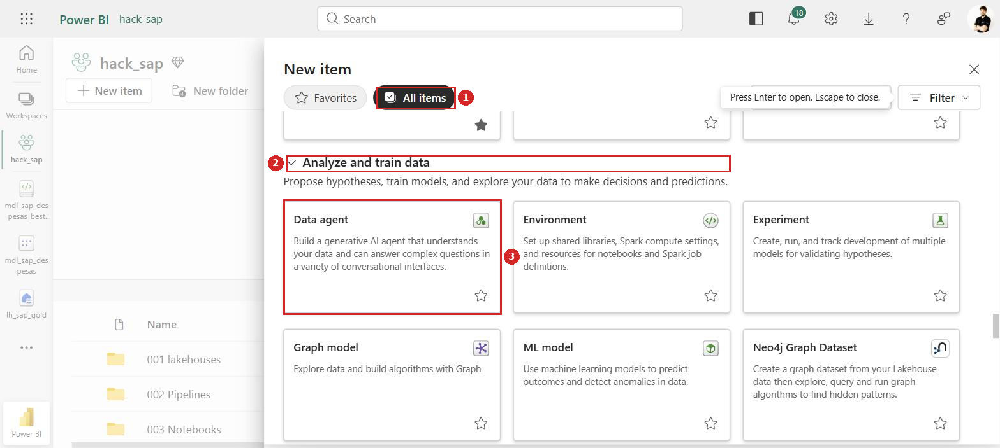
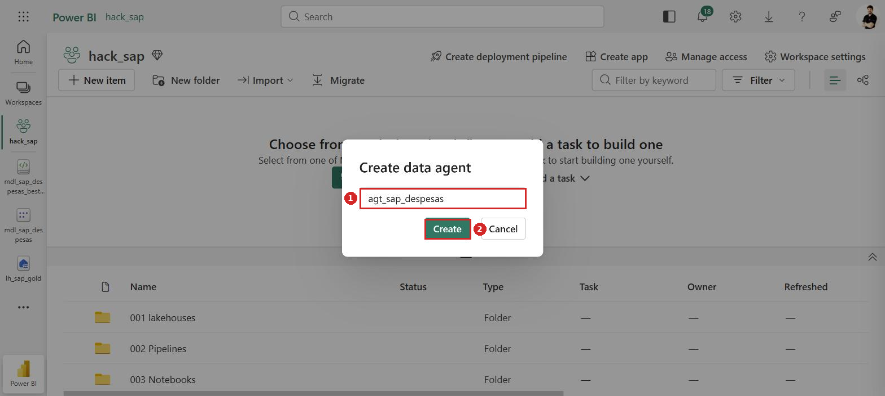
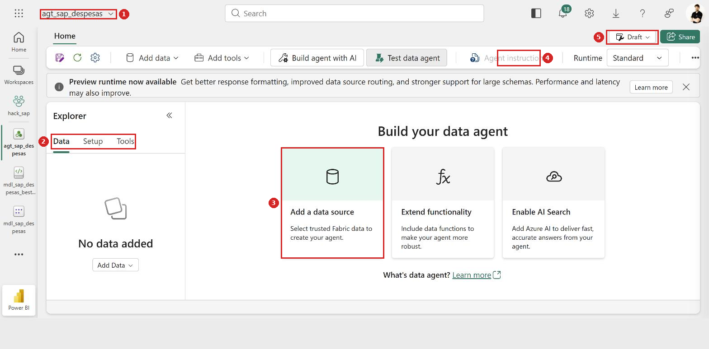
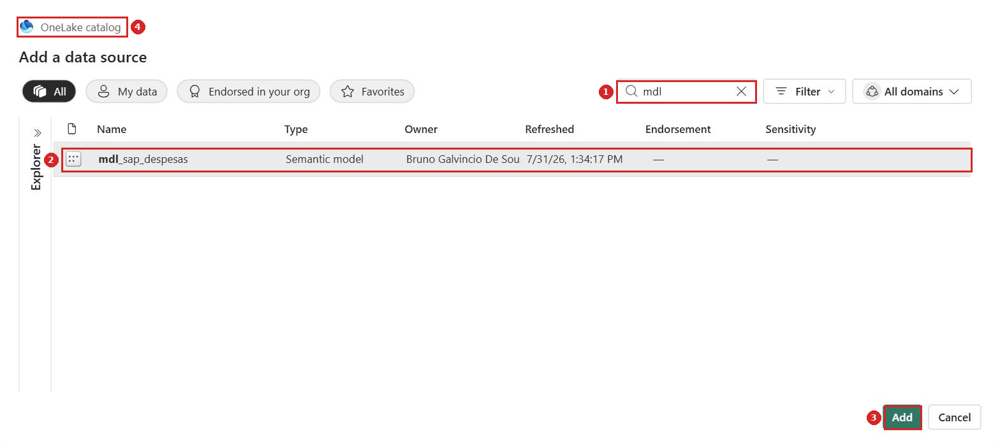

# Guia passo a passo — Hackathon SAP → Microsoft Fabric
## Lab 3 — Agente de Dados sobre o modelo semântico, publicado no Teams

Neste laboratório você cria um **Data Agent** (Agente de Dados) sobre o modelo semântico do Lab 2 e o publica para uso no **Microsoft Teams**, onde a equipe pergunta em linguagem natural e recebe respostas apoiadas nos dados do `lh_sap_gold`.

> **Como ler os prints:** cada ação está marcada com um **círculo vermelho** e um **número** (1, 2, 3…) que corresponde à ordem do clique dentro daquele passo. **Caixas vermelhas** destacam campos a preencher ou resultados a conferir.

> 🚧 **Status dos prints.** As seções **1.1 a 1.3** têm prints reais, capturados no `hack_sap`. Da **1.5 em diante** os pontos estão marcados com **`[print pendente]`** — o passo a passo em texto está completo.

---

## Roteiro do laboratório

| Seção | O que você entrega | Tempo |
|---|---|---|
| **1** Criar o agente | `agt_sap_despesas` ligado ao `mdl_sap_despesas`, com tabelas e medidas selecionadas | ~15 min |
| **2** Instruções | escopo, exemplos de perguntas e limites de uso | ~20 min |
| **3** Publicar no Microsoft 365 | agente no catálogo do M365 Copilot, com permissões definidas | ~15 min |
| **4** Usar no Teams | app no canal da equipe, com perguntas validadas | ~15 min |

**Checklist antes de começar:**

- [ ] **Lab 2 concluído**: o `mdl_sap_despesas` existe, com os 7 relacionamentos e as 5 medidas
- [ ] A `dim_calendario` está marcada como **tabela de data**
- [ ] Capacidade Fabric **ativa**
- [ ] Papel de **Admin/Member/Contributor** no `hack_sap`
- [ ] Para as seções 3 e 4: permissão para **publicar apps** no tenant e acesso ao **Teams** da equipe

> 🔐 **Três telas deste laboratório pedem decisão humana** e não devem ser clicadas no automático: a autorização do agente para consultar os dados, a **publicação no catálogo do Microsoft 365** e a **instalação do app no Teams**. Todas expõem o agente a outras pessoas — leia o que cada uma concede antes de confirmar.

---

## Por que apontar para o modelo semântico, e não para o lakehouse

O Data Agent aceita **lakehouse**, **warehouse**, **KQL database** e **semantic model** como fonte. Aqui usamos o **modelo semântico** do Lab 2, e a diferença é grande:

| Fonte | O que o agente enxerga |
|---|---|
| `lh_sap_gold` (lakehouse) | tabelas cruas. Para "qual o total de despesas?" ele precisa **inventar** a agregação, somando a coluna `valor` por conta própria |
| `mdl_sap_despesas` (modelo semântico) | tabelas **mais** as medidas. Ele usa a medida **`Total Despesas`** que você validou, com a formatação em `R$` e a lógica correta |

Ou seja: a curadoria que você fez no Lab 2 — relacionamentos, medidas, nomes amigáveis, sinônimos — é justamente o que faz o agente responder certo. **Um modelo mal refinado gera um agente que erra com confiança.**

---

## 1. Criar o Agente de Dados

### 1.1 — Encontrar o item Data agent

No workspace `hack_sap`, abra a pasta **`005 Agente`** e clique em **+ New item** de dentro dela — assim o agente já nasce organizado, sem precisar mover depois.

No painel *New item*: **1** troque para a aba **All items** (o card **não** aparece em *Favorites*). **2** Role até a categoria **Analyze and train data**. **3** Clique no card **Data agent**.



> ⚠️ **É aqui que a maioria se perde.** O card fica fora da aba *Favorites*, numa categoria bem abaixo na lista — é preciso rolar bastante. O campo *Filter by keyword* do painel existe, mas na prática é mais rápido rolar até **Analyze and train data**, que reúne *Data agent*, *Environment*, *Experiment*, *Graph model*, *ML model* e *Neo4j Graph Dataset*.
>
> ℹ️ A descrição do card confirma o escopo: *"Build a generative AI agent that understands your data and can answer complex questions in a variety of conversational interfaces."* O "variety of conversational interfaces" é o que viabiliza as seções 3 e 4.
>
> 🔍 **Se o card não existir**, o Data agent não está habilitado no tenant. Verifique em **Admin portal → Tenant settings** as chaves de Copilot/AI e o SKU da capacidade. Sem ele, o Lab 3 não sai do lugar — e é problema de administração, não do seu workspace.

### 1.2 — Nomear e criar

Abre o diálogo **Create data agent** com um único campo. **1** Digite o nome em **Input a data agent name**. **2** Clique em **Create** — ele só habilita depois que há texto no campo.



| Campo | Valor |
|---|---|
| **Nome** | `agt_sap_despesas` |

> 💡 **Pense no nome duas vezes.** Diferente dos outros itens (`lh_`, `ppl_`, `nb_`, `mdl_`), o nome do agente **aparece para o usuário final** no Teams e no catálogo do Microsoft 365. Um `agt_sap_despesas` é coerente com a convenção técnica; um **`Agente Despesas SAP`** é o que a equipe vai conseguir chamar numa conversa. Se o agente vai ser usado por gente de negócio, prefira o segundo.
>
> ⚠️ Se você clicou **New item** na raiz do workspace em vez de dentro da pasta, o agente nasce na raiz. Corrija depois com **⋯ → Move to → 005 Agente** na lista do workspace.

### 1.3 — Conhecer o editor do agente

Depois do **Create**, o editor abre em **Build your data agent**. Vale se orientar antes de clicar:



**1** O nome do agente no topo. **2** O painel **Explorer**, com as abas **Data**, **Setup** e **Tools** — ainda em *"No data added"*. **3** Os três cartões de partida: **Add a data source**, **Extend functionality** e **Enable AI Search**. **4** O botão **Agent instructions**, que fica **desabilitado** até existir fonte de dados. **5** O selo **Draft** e o **Share**, no canto superior direito.

| Elemento | Para quê |
|---|---|
| **Add data** / **Add a data source** | escolher a fonte — é o próximo passo |
| **Add tools** | funções e ferramentas extras (não necessário neste lab) |
| **Build agent with AI** | assistente que monta o agente conversando |
| **Test data agent** | painel de conversa para testar antes de publicar |
| **Agent instructions** | o prompt de sistema da seção 2 |
| **Runtime** | `Standard` ou `Preview` |
| **Draft** | estado de publicação — vira publicado na seção 3 |

> ⚠️ **Ordem obrigatória: fonte de dados antes das instruções.** O botão **Agent instructions** aparece esmaecido enquanto o Explorer diz *"No data added"*. Não dá para escrever as instruções primeiro.
>
> 💡 **Sobre o Runtime:** o Fabric oferece um **Preview runtime** com a promessa de *"better response formatting, improved data source routing, and stronger support for large schemas"*. Para um modelo pequeno como o nosso o `Standard` dá conta; se as respostas vierem mal formatadas ou o agente errar a fonte, experimente o `Preview`.
>
> ℹ️ **`Draft` é o estado inicial e importa.** Enquanto estiver como *Draft*, o agente existe só para você. A seção 3 é o que o torna consumível pelos outros.

### 1.4 — Ligar ao modelo semântico

Clique em **Add a data source** (ou **Add data** na faixa). Abre o seletor **Add a data source**, que é o **OneLake catalog**: **1** use a busca para filtrar (digitar `mdl` já basta). **2** Selecione a linha do **`mdl_sap_despesas`**, com *Type* = **Semantic model**. **3** Clique em **Add**.



**4** Repare que o seletor é o **OneLake catalog**, não uma lista do workspace: ele varre todos os itens a que você tem acesso, com as abas **All**, **My data**, **Endorsed in your org** e **Favorites**, além de filtro por **domínio**.

| Coluna | O que conferir |
|---|---|
| **Name** | `mdl_sap_despesas` — o modelo do Lab 2, não o `Modelo Despesas` que já existia |
| **Type** | **Semantic model** (é isso que garante o acesso às medidas) |
| **Owner** | seu usuário |
| **Refreshed** | data/hora da última atualização do modelo |

> ⚠️ **Cuidado ao escolher.** O `hack_sap` tem **dois** modelos semânticos: o **`mdl_sap_despesas`** do Lab 2 e um **`Modelo Despesas`** anterior, de outra pessoa. Filtrar por `mdl` resolve, porque só o do Lab 2 tem esse prefixo. Escolher o errado faz o agente responder sobre um modelo que você não curou.
>
> 💡 **A coluna `Type` é a sua confirmação.** Como o catálogo mostra lakehouses, warehouses e modelos juntos, é o `Type = Semantic model` que garante que você está pegando a camada com as medidas, e não o lakehouse cru. Se aparecer `Lakehouse`, é o `lh_sap_gold` — não é o que queremos aqui (veja a comparação no início deste guia).
>
> ℹ️ Dá para selecionar **mais de uma fonte**. Para este laboratório, só o modelo semântico basta.

### 1.5 — Selecionar tabelas e medidas

O agente só consulta o que você liberar. Seleção recomendada:

| Objeto | Incluir? | Por quê |
|---|---|---|
| `fato_despesas` | ✅ | é a fato; sem ela não há o que somar |
| `dim_calendario` | ✅ | habilita perguntas por período |
| `dim_empresa`, `dim_centro_custo`, `dim_centro_lucro`, `dim_conta_contabil`, `dim_segmento`, `dim_cliente_fornecedor` | ✅ | são os cortes de análise |
| `_medidas` (as 5 medidas) | ✅ | **o mais importante** — é o que garante o cálculo certo |
| Colunas `sk_*` | ❌ | chaves técnicas; já ocultas no Lab 2 |
| `id_lancamento`, `ano_particao` | ❌ | chave técnica e coluna de partição |

`[print pendente]`

> 💡 **Menos é mais.** Cada tabela e coluna liberada aumenta o espaço de busca do agente e a chance de ele escolher o caminho errado. Libere o que responde às perguntas que você espera, e nada além.
>
> ✅ **O trabalho do Lab 2 paga aqui.** Se você ocultou as `sk_*`, renomeou para nomes de negócio e escreveu sinônimos e descrições, o agente já herda tudo isso — não precisa refazer.

---

## 2. Criar as instruções do agente

As instruções são o **prompt de sistema** do agente: definem o que ele é, o que responde e onde para. É a parte que mais afeta a qualidade das respostas.

`[print pendente]`

### 2.1 — Propósito e escopo

Sugestão, para colar e ajustar:

```
Você é um assistente de análise de despesas da empresa, com acesso ao modelo
semântico mdl_sap_despesas, construído sobre dados contábeis do SAP S/4HANA
(lançamentos do ACDOCA) organizados em esquema estrela.

Responda perguntas sobre despesas usando SEMPRE as medidas do modelo:
- Total Despesas
- Qtd Lançamentos
- Despesa Média por Lançamento
- Total Despesas Ano Anterior
- Var % Total Despesas vs Ano Anterior

Nunca some colunas cruas quando existir uma medida equivalente.

Dimensões disponíveis para segmentar: Empresa, Centro de Custo, Centro de Lucro,
Conta Contábil, Segmento, Cliente/Fornecedor e Calendário.
```

### 2.2 — As particularidades destes dados

Este bloco é o que evita as respostas erradas mais comuns deste modelo. Todas vêm de decisões dos Labs 1 e 2:

```
Regras sobre os dados:

1. A granularidade é MENSAL. A coluna data_referencia usa sempre o dia 01 do mês.
   Nunca responda sobre despesas por dia — não existe esse nível de detalhe.

2. O calendário cobre de 01/01/2026 em diante. Comparações com anos anteriores
   podem não ter dados. Se a medida de ano anterior vier vazia, diga que não há
   base de comparação no período, em vez de reportar zero.

3. Lançamentos sem correspondência na dimensão aparecem como "N/A". Isso significa
   dado incompleto na origem, não uma categoria de negócio. Sinalize quando o "N/A"
   for relevante no resultado.

4. Os valores estão em reais (BRL).
```

### 2.3 — Exemplos de perguntas

Exemplos calibram o agente. Inclua os que representam o uso real:

```
Exemplos de perguntas que você deve responder:
- Qual o total de despesas do ano?
- Quais os 10 centros de custo com maior despesa?
- Como as despesas evoluíram mês a mês?
- Qual a despesa média por lançamento por empresa?
- Qual a distribuição de despesas por segmento?
- Quais contas contábeis concentram os maiores gastos?
```

### 2.4 — Limites de uso

```
Limites:

- Responda apenas sobre os dados de despesas deste modelo semântico.
- Se a pergunta for sobre outro assunto, sobre dados que você não tem acesso,
  ou sobre períodos fora do calendário, diga isso claramente e não especule.
- Não invente números. Se não conseguir calcular, explique o motivo.
- Não faça recomendações de investimento, jurídicas ou de pessoal.
- Ao apresentar um número, diga de qual medida ele veio e qual filtro foi aplicado.
```

> 💡 **A última regra é a mais útil na prática.** Um agente que diz *"R$ 1,2 mi, da medida Total Despesas, filtrado por 2026"* permite auditar a resposta. Um que responde só *"R$ 1,2 mi"* obriga a confiar às cegas.

### 2.5 — Testar antes de publicar

O editor do agente tem um painel de conversa. Teste **antes** da seção 3, porque depois de publicado o erro é público.

Roteiro mínimo de teste:

| Pergunta | O que validar |
|---|---|
| "Qual o total de despesas?" | Bate com `SELECT SUM(valor) FROM dbo.fato_despesas` no SQL endpoint da Gold |
| "Quais os 5 maiores centros de custo?" | Os nomes são de negócio, não SKs |
| "Despesas por dia em março" | Ele deve **recusar** e explicar que a granularidade é mensal |
| "Qual a variação sobre o ano anterior?" | Ele deve dizer que não há base de comparação, não retornar zero |
| "Qual a previsão do tempo amanhã?" | Ele deve recusar por estar fora do escopo |

`[print pendente]`

> ✅ **Os dois testes negativos valem mais que os positivos.** Um agente que responde bonito às perguntas fáceis e inventa nas difíceis é pior que um que recusa. Se ele não recusar a pergunta por dia nem a de fora do escopo, volte às instruções.

---

## 3. Publicar no Microsoft 365

### 3.1 — Publicar o agente

No editor do agente, use a opção de **publicar**. O Fabric gera uma versão publicada e a disponibiliza para os canais de consumo, incluindo o catálogo do **Microsoft 365 Copilot**.

`[print pendente]`

> 🔐 **Esta tela expõe o agente para outras pessoas.** Antes de confirmar, entenda que a publicação torna o agente descobrível no catálogo do M365 para quem tiver permissão. Leia o que a tela concede.
>
> ⚠️ **Publicação e rascunho são coisas diferentes.** Alterações feitas depois no editor **não** chegam a quem usa até você publicar de novo. Se alguém reclamar que o agente respondeu de um jeito antigo, é isso.

### 3.2 — Permissões de acesso

Quem pode usar o agente é definido por duas camadas, e as duas precisam estar certas:

| Camada | Onde | O que controla |
|---|---|---|
| **Permissão no agente** | compartilhamento do item no Fabric | quem pode invocar o agente |
| **Permissão nos dados** | acesso ao `mdl_sap_despesas` e ao `lh_sap_gold` | o que cada pessoa pode ver através dele |

`[print pendente]`

> 🚨 **O agente não contorna a segurança dos dados — e é bom que não contorne.** Se alguém não tem acesso ao modelo semântico, as perguntas dela vão falhar ou voltar vazias, mesmo com permissão no agente. Ao publicar para um grupo, confirme que o grupo também tem leitura no modelo.
>
> 💡 Para o hackathon, o caminho mais simples é dar acesso ao **grupo da equipe** e não a pessoas individuais — some manutenção e evita esquecer alguém de fora.

---

## 4. Usar no Microsoft Teams

### 4.1 — Adicionar o agente ao canal

No Teams, no canal da equipe: **+** para adicionar uma aba/app → procure o agente pelo nome → adicione.

`[print pendente]`

> 🔐 **Instalar app num canal afeta todo o canal.** Todos os membros passam a ver e poder usar o agente. Confirme com a equipe antes.
>
> ⏱️ **Pode levar alguns minutos** para o agente aparecer no catálogo do Teams depois de publicado no Fabric. Se não achar de imediato, não é erro — aguarde e procure de novo.

### 4.2 — Validar as respostas com os dados reais

Pergunte no canal e **compare com a fonte**. É esta validação que fecha o laboratório:

| Pergunta no Teams | Como conferir |
|---|---|
| "Qual o total de despesas?" | `SELECT SUM(valor) FROM dbo.fato_despesas` no SQL endpoint do `lh_sap_gold` |
| "Quantos lançamentos existem?" | `SELECT COUNT(*) FROM dbo.fato_despesas` — deve dar ~504 |
| "Top 5 centros de custo" | Compare com o visual do relatório do Lab 2 |

`[print pendente]`

> ✅ **Feche o ciclo com um número que você já conhece.** A contagem de linhas da fato é a checagem mais rápida: se o agente disser algo diferente de ~504 lançamentos, alguma coisa está filtrando sem você saber.

---

## Dicas e problemas comuns

- **O card *Data agent* não aparece em New item:** recurso não habilitado no tenant, ou SKU de capacidade sem suporte. É configuração de administrador.
- **O agente responde "não encontrei dados":** normalmente falta permissão de quem perguntou no `mdl_sap_despesas`, não problema no agente.
- **Os números não batem com o relatório:** confira se o agente está usando as **medidas** e não somando colunas cruas. Reforce isso nas instruções.
- **Ele responde sobre dias:** as instruções da seção 2.2 não entraram, ou a `data_referencia` foi liberada sem o aviso da granularidade mensal.
- **Ele reporta zero para o ano anterior:** o calendário começa em 2026. Isso é ausência de base, não zero — corrija nas instruções.
- **Muito "N/A" nas respostas:** é herança do Lab 1, onde vários lançamentos não casaram com as dimensões (a `sk_segmento` em especial). Investigue a Gold, não o agente.
- **Alterações não chegam ao Teams:** falta publicar de novo. Editor é rascunho; consumo usa a versão publicada.
- **O agente aparece no Fabric mas não no Teams:** aguarde a propagação, e confirme que a publicação para o Microsoft 365 foi concluída, não só salva.

---

## Prints a capturar

| # | Tela | Situação |
|---|---|---|
| 1 | **New item → All items → Analyze and train data → Data agent** | ✅ `lab3-01.png` |
| 2 | Diálogo **Create data agent** com o nome preenchido | ✅ `lab3-02.png` |
| 3 | Editor do agente — **Build your data agent** | ✅ `lab3-03.png` |
| 3b | **Add a data source** → OneLake catalog → `mdl_sap_despesas` | ✅ `lab3-04.png` |
| 4 | Seleção de tabelas e medidas liberadas ao agente | pendente |
| 5 | Painel de **instruções** do agente preenchido | pendente |
| 6 | Teste no painel de conversa, com resposta correta | pendente |
| 7 | Teste negativo — agente recusando pergunta fora do escopo | pendente |
| 8 | Tela de **publicação** do agente | pendente |
| 9 | **Permissões de acesso** definidas | pendente |
| 10 | Agente adicionado como app no **canal do Teams** | pendente |
| 11 | Pergunta em linguagem natural respondida no Teams | pendente |

---

## Estado atual no tenant

| Item | Onde | Situação |
|---|---|---|
| Recurso **Data agent** | tenant | ✅ disponível em *Analyze and train data* |
| `agt_sap_despesas` | `hack_sap` (raiz) | ✅ **criado**, estado `Draft`, ainda sem fonte de dados. Mover para `005 Agente` com **⋯ → Move to** |
| Instruções, publicação e Teams | — | ⏳ pendente (seções 2 a 4) |

*Documento gerado para a equipe do hackathon — Lab 3.*
